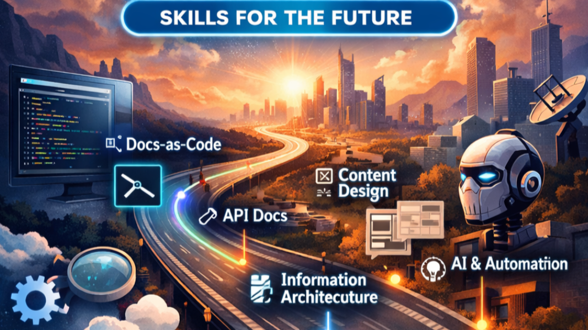

# The Future of Technical Writing: A Roadmap to Becoming a Modern Technical Writer

Technical writing is no longer just about creating manuals or documenting features.

It's evolving—fast.

As someone working at the intersection of documentation, product thinking, AI, and team enablement, I've been asking myself an important question:

> **What does it take to stay relevant as a technical writer over the next 5–10 years?**

The answer isn't a single tool or technology.

It's a mindset of continuous learning.

This roadmap represents the learning journey I've created for myself—and one that I believe can help other technical writers grow into modern, future-ready documentation professionals.

---

# Why the Role Is Changing

Documentation has become much more than product support.

Today's technical writers contribute to:

- Developer experience (DX)
- Product adoption
- AI-powered knowledge systems
- Documentation strategy
- Content architecture
- Customer success

The modern technical writer is becoming a bridge between users, engineers, products, and AI.

That requires a broader skill set than ever before.

---

# Phase 1 — Build the Foundation

Everything starts with understanding modern documentation workflows.

## What I'm Learning

- Markdown & MDX
- Git & GitHub
- Branching strategies
- Pull requests and code reviews
- Static site generators
  - Docusaurus
  - MkDocs

## Why It Matters

Modern documentation lives alongside code.

Technical writers increasingly collaborate with developers using the same tools and workflows.

Understanding Git and Docs-as-Code isn't just a technical skill—it's becoming part of the daily documentation workflow.

## Goal

- Publish a documentation website using Docs-as-Code
- Contribute to (or simulate) a documentation repository

---

# Phase 2 — Expand into Developer Documentation

Developer documentation is one of the fastest-growing areas in technical communication.

## What I'm Learning

- REST APIs
- JSON fundamentals
- OpenAPI / Swagger
- API reference documentation
- Code samples
- Tutorials and Quickstarts

## Why It Matters

Software products increasingly rely on APIs.

Organizations need writers who can explain technical concepts clearly to developers.

Developer documentation has become one of the highest-impact specialties within technical writing.

## Goal

- Document a sample API
- Create tutorials
- Write Quickstart guides
- Build a developer documentation portfolio

---

# Phase 3 — Shift from Writing to Content Design

Creating content is only part of the job.

Designing how users discover and consume information is becoming equally important.

## What I'm Learning

- Content modeling
- Structured content
- Information architecture
- UX writing
- Microcopy
- Accessibility (WCAG)

## Why It Matters

Users rarely read documentation from beginning to end.

They search.

They scan.

They complete tasks.

Designing documentation for usability is just as important as writing accurate content.

## Goal

- Redesign an existing documentation set
- Build reusable content components
- Improve navigation and discoverability

---

# Phase 4 — Embrace AI as a Co-Writer

AI is transforming how documentation is created, maintained, and consumed.

Rather than replacing technical writers, AI is changing how we work.

## What I'm Learning

- Prompt engineering
- AI-assisted documentation workflows
- Reviewing AI-generated content
- AI governance
- Content validation

## Why It Matters

The value of technical writers is shifting from writing every sentence to:

- Curating knowledge
- Structuring information
- Reviewing AI-generated content
- Maintaining quality and consistency

AI accelerates documentation—but human expertise remains essential.

## Goal

- Build an AI-assisted documentation workflow
- Develop AI documentation guidelines
- Establish quality review processes

---

# Phase 5 — Think in Systems, Not Pages

This is the long-term evolution of the profession.

Documentation is becoming part of a larger knowledge ecosystem.

## What I'm Exploring

- Headless CMS platforms
- Knowledge management
- Documentation analytics
- Search optimization
- Developer Experience (DX)
- AI-powered knowledge retrieval

## Why It Matters

Documentation is no longer just a deliverable.

It's a system that supports:

- Customers
- Support teams
- Engineers
- AI assistants

Modern documentation connects people, products, and knowledge.

## Goal

- Design scalable documentation systems
- Improve knowledge discoverability
- Measure documentation effectiveness

---

# My Learning Journey

This roadmap isn't theoretical.

It's the journey I'm actively following.

Current areas of focus include:

- Building a Docs-as-Code learning platform with Docusaurus
- Learning Git and GitHub workflows
- Writing API documentation
- Exploring AI-assisted documentation
- Developing an AI Release Note Generator as a real-world case study

Every new skill builds on the previous one.

---

# Key Takeaways

- Docs-as-Code is becoming a foundational skill.
- Developer documentation continues to grow in importance.
- AI will augment—not replace—technical writers.
- Content design and information architecture are becoming core competencies.
- Documentation is evolving into a knowledge system rather than a collection of documents.

---

# Looking Ahead

The future technical writer isn't simply someone who writes well.

It's someone who can:

- Structure information
- Design user experiences
- Collaborate with engineers
- Build scalable documentation systems
- Work effectively with AI

We're no longer just writing documentation.

We're designing how knowledge works.

The future belongs to technical writers who embrace continuous learning, adapt to emerging technologies, and think beyond individual documents to create knowledge experiences that serve both people and intelligent systems.

---

## Continue the Journey

📚 Continue learning through:

- **Learning Path** – Step-by-step guides to Docs-as-Code.
- **Case Studies** – Real-world AI documentation projects.
- **Insights & Articles** – Thoughts, lessons learned, and best practices.

---

## About This Article

This article is part of the **Start Docs-as-Code with Me** series, where I document my journey in modern technical writing, Docs-as-Code, AI-powered documentation, and knowledge management.

Originally inspired by a LinkedIn article, this edition has been expanded with additional explanations and examples.

🔗 Original LinkedIn post:
[Future of Technical Writing Roadmap](https://www.linkedin.com/pulse/future-technical-writing-roadmap-becoming-modern-writer-riffat-wyne-4wzbe/?trackingId=tJwigM3OQj%2BGREx1ooeilA%3D%3D)