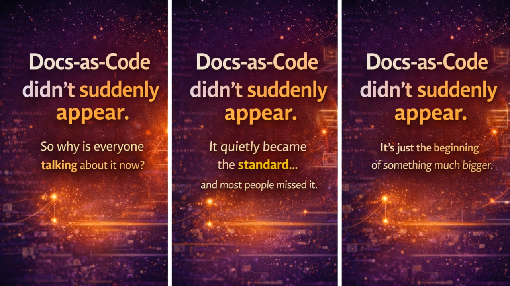

# Docs-as-Code Didn't Suddenly Appear. It Reached a Visibility Threshold.

If you've spent any time on LinkedIn recently, you've probably noticed something.

Everyone seems to be talking about **Docs-as-Code**.

It can feel like it appeared overnight.

But it didn't.

Docs-as-Code isn't a new idea.

It simply crossed a **visibility threshold**.

What we're seeing today isn't the birth of a new practice—it's the result of changes in software engineering, documentation, AI, and the role of technical writers all converging at the same time.

Let's explore why.

---

# 1. Docs-as-Code Was Always There—Just Inside Engineering

Docs-as-Code has existed for years within:

- Open source communities
- Developer-first companies
- API-focused products

For a long time, however, it remained largely invisible to many technical writers because it lived inside engineering workflows.

Documentation teams often worked with:

- Microsoft Word
- Help Authoring Tools (HATs)
- Traditional CMS platforms

Meanwhile, developers worked in:

- Git
- Markdown
- Pull Requests
- CI/CD pipelines

The two worlds rarely overlapped.

As a result, documentation wasn't always treated as part of the product development lifecycle.

---

# 2. Software Complexity Changed Everything

Modern software looks very different from software built ten years ago.

Today's products are increasingly:

- API-first
- Cloud-native
- Built with microservices
- Continuously deployed

The traditional documentation model struggled to keep up.

### The old approach

```text
Develop feature

↓

Release software

↓

Write documentation
```

### Today's reality

Software changes continuously.

Documentation must evolve continuously as well.

There is no longer a clear "after the release."

Documentation has become part of an ongoing delivery process.

Docs-as-Code shifted from being a nice-to-have practice to a practical necessity.

---

# 3. CI/CD Changed Documentation

As organizations adopted:

- Git
- Continuous Integration (CI)
- Continuous Deployment (CD)
- Automated testing

a natural question emerged:

> **Why is documentation the only thing not part of this pipeline?**

Docs-as-Code answered that question by treating documentation like any other software artifact.

Teams could now:

- Version documentation with code
- Review documentation through pull requests
- Validate documentation automatically
- Deploy documentation alongside software

Documentation became part of the delivery pipeline instead of an afterthought.

---

# 4. Developers Became Documentation Contributors

One of the biggest cultural shifts has been developer participation.

Developers already prefer:

- Markdown
- Git
- Code reviews
- Pull Requests

Docs-as-Code removed the friction of asking engineers to use unfamiliar documentation tools.

Instead of switching platforms, developers could contribute documentation within their existing workflow.

The result was significant:

- More documentation updates
- Better collaboration
- Shared ownership
- Faster feedback

Documentation became a team responsibility rather than the sole responsibility of technical writers.

---

# 5. AI Accelerated the Shift

If Docs-as-Code was already gaining momentum, AI dramatically accelerated its adoption.

Modern AI systems work best with content that is:

- Structured
- Modular
- Version controlled
- Machine-readable

These characteristics are fundamental principles of Docs-as-Code.

AI can now:

- Generate documentation from code
- Suggest documentation improvements
- Identify outdated content
- Answer questions using structured knowledge

Suddenly, Docs-as-Code wasn't simply improving documentation workflows.

It was becoming the foundation for AI-powered documentation.

---

# 6. The Role of the Technical Writer Is Evolving

Perhaps the biggest change isn't technological.

It's professional.

Traditionally, technical writers focused primarily on creating content.

Today, the role increasingly includes:

- Designing information architecture
- Collaborating with developers
- Managing knowledge systems
- Supporting AI-powered experiences
- Improving developer experience (DX)

Docs-as-Code encourages technical writers to become active participants in engineering workflows rather than working alongside them.

The role is expanding from content creator to knowledge designer.

---

# 7. The Visibility Effect

So why does Docs-as-Code suddenly seem to be everywhere?

Because enough organizations quietly adopted it.

Now they're sharing:

- Success stories
- Best practices
- Learning journeys
- Migration experiences

The conversation has shifted from implementation to community learning.

Docs-as-Code has become a visible signal of modern documentation practice.

---

# The Bigger Shift

Docs-as-Code isn't the destination.

It's a transition.

We're moving from:

**Documentation as a separate activity**

to

**Documentation as an integrated part of the product system.**

That change is much larger than adopting Git or Markdown.

It's changing how organizations think about knowledge.

---

# Why You're Hearing About Docs-as-Code Now

Several trends have converged at the same time.

- Software systems became increasingly complex.
- Continuous delivery became the norm.
- AI began relying on structured, version-controlled content.
- Technical writers started redefining their role within engineering teams.

Together, these forces pushed Docs-as-Code into the spotlight.

---

# The Insight Many People Miss

Docs-as-Code didn't become popular because it produces better writing.

It became popular because it creates **better documentation systems**.

It enables:

- Faster collaboration
- Better version control
- Automated publishing
- AI-ready knowledge
- Continuous improvement

The technology supports the process—but the real transformation is cultural.

---

# Looking Ahead

We're already seeing the next evolution.

Documentation is becoming:

- Generated
- Embedded
- Continuously updated
- AI-assisted
- Context-aware

Docs-as-Code is laying the foundation for that future.

It's no longer just a methodology.

It's becoming the baseline for modern documentation.

---

# Key Takeaways

- Docs-as-Code has existed for years within engineering communities.
- Modern software development made traditional documentation workflows increasingly difficult to maintain.
- Git, CI/CD, and collaborative engineering practices accelerated adoption.
- AI has made structured, version-controlled documentation strategically important.
- The role of technical writers is evolving from content creators to knowledge architects.
- Docs-as-Code isn't the end goal—it's the foundation for the next generation of documentation systems.

---

## Continue the Journey

📚 Continue learning through:

- **Learning Path** – Step-by-step guides to Docs-as-Code.
- **Case Studies** – Real-world AI documentation projects.
- **Insights & Articles** – Thoughts, lessons learned, and best practices.

---

## About This Article

This article expands on ideas that I originally shared on LinkedIn.

The website edition includes additional context, examples, and practical guidance beyond the original post.

**Original LinkedIn post**

🔗 [Docs-as-Code didn't suddenly appear](https://www.linkedin.com/pulse/docs-as-code-didnt-suddenly-appear-riffat-wyne-pbzfe/?trackingId=tJwigM3OQj%2BGREx1ooeilA%3D%3D)