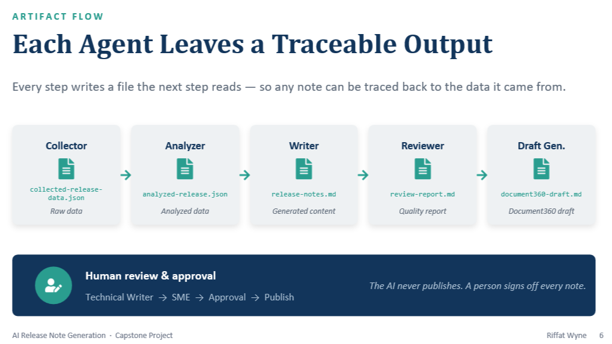

# From Learning AI to Building a Real-World Documentation Automation

Just a few weeks ago, I started learning technologies that were completely new to me.

- Claude Code
- Cursor IDE
- Git
- GitHub
- Markdown
- Model Context Protocol (MCP)
- AI Skills
- Prompt Engineering
- Agentic AI

Like many technical writers, I could have stopped after completing tutorials or watching demonstrations.

Instead, I asked myself a different question:

> **How can I use these technologies to solve a real documentation problem?**

That question became the starting point for building my first AI-powered documentation workflow.

---

# From Learning to Building

Rather than experimenting with isolated prompts, I wanted to create something that reflected a real documentation process.

The result was a working **Proof of Concept (PoC)** that transforms Azure DevOps Work Items and ServiceNow cases into structured, documentation-ready release notes.

Although the current implementation uses mock data, the architecture has been designed with live integrations in mind.

The goal was never simply to generate documentation with AI.

The goal was to redesign the documentation workflow itself.

---

# What the Proof of Concept Does

The workflow currently demonstrates how AI agents can automate repetitive documentation tasks while keeping technical writers in control of the final content.

It can:

- ✅ Collect release information from Azure DevOps and ServiceNow
- ✅ Analyze work items, user stories, and release data
- ✅ Generate structured release notes
- ✅ Produce Markdown-ready documentation for publishing
- ✅ Use AI Skills, Prompt Engineering, and Agentic AI to automate repetitive tasks
- ✅ Generate review-ready documentation artifacts

The workflow is modular by design.

Today it operates with mock data.

Tomorrow the same architecture can connect to live enterprise systems using MCP without redesigning the overall workflow.

---

# A Modular AI Workflow

The solution is built around independent AI agents, each responsible for a specific stage of the documentation process.

The workflow includes:

- **Collector Agent** – Collects release information from multiple systems.
- **Analyzer Agent** – Reviews work items and identifies customer-facing changes.
- **Writer Agent** – Produces structured release notes.
- **Reviewer Agent** – Performs quality checks on generated documentation.
- **Draft Generator Agent** – Creates Markdown-ready content for publication.

Because each agent has a clearly defined responsibility, the workflow is scalable and easy to extend.

---

# What I Learned Along the Way

Building this project taught me far more than any tutorial could.

Some of the most valuable lessons included:

- Designing a complete GitHub repository for an AI documentation project.
- Creating reusable Claude Skills using the **RTCCO framework** (Role, Task, Context, Constraints, and Output).
- Building an end-to-end Agentic AI workflow.
- Exploring the Model Context Protocol (MCP) and external integrations.
- Developing structured prompts and reusable Claude commands.
- Creating modular workflows that can evolve over time.

More importantly, it helped me understand how AI can complement documentation rather than replace it.

---

# AI Doesn't Replace Technical Writers

One of the biggest misconceptions about AI is that it replaces technical writers.

My experience has been the opposite.

AI performs exceptionally well at repetitive, process-driven activities such as:

- Gathering information
- Organizing data
- Creating initial drafts
- Applying consistent formatting

Technical writers remain essential for:

- Understanding customer needs
- Making editorial decisions
- Verifying technical accuracy
- Applying product knowledge
- Ensuring quality and consistency

AI accelerates the workflow.

Technical writers provide the expertise.

---

# Looking Beyond the Proof of Concept

Although this project began as a personal learning exercise, I see significant opportunities for expanding it within enterprise documentation environments.

Potential applications include:

- Reducing manual effort in release documentation.
- Improving consistency and traceability across software releases.
- Accelerating documentation workflows while maintaining human review.
- Supporting scalable Docs-as-Code practices.
- Integrating documentation directly into engineering workflows.

The modular architecture makes these future enhancements possible without rebuilding the solution from scratch.

---

# This Is Only the Beginning

My long-term goal isn't simply to use AI to write documentation.

It's to redesign documentation workflows so that technical writers can spend less time on repetitive tasks and more time creating value for customers.

I see opportunities to expand this foundation into an intelligent documentation ecosystem that supports:

- Release notes
- Documentation updates
- Quality validation
- Knowledge management
- Documentation governance
- AI-assisted review workflows

For me, that's where the future of technical writing becomes truly exciting.

---

# Key Takeaways

- Learning new technologies becomes far more valuable when applied to a real-world problem.
- AI works best as a collaborator rather than a replacement for technical writers.
- Modular AI workflows are easier to maintain and extend.
- Docs-as-Code, AI, and Agentic AI naturally complement one another.
- The future of documentation lies in designing intelligent workflows rather than simply creating documents.

---

# Explore the Project

Interested in seeing the complete implementation?

Visit the project repository to explore the architecture, workflow, prompts, AI agents, and source code.

➡️ [**AI Release Note Generator (GitHub)**](https://github.com/Riffat786/AI-Release-Note-Generator)

---

## Continue Reading

If you enjoyed this article, you may also like:

- **Your Documentation Is Training AI (Whether You Realize It or Not)**
- **Docs-as-Code Didn't Suddenly Appear**
- **The Future of Technical Writing: A Roadmap to Becoming a Modern Technical Writer**

---

## About This Article

This article expands on ideas originally shared on LinkedIn.

The website edition includes additional technical context, architecture details, and lessons learned from building the Proof of Concept.

**Original LinkedIn post**

🔗 [From Learning AI to building real-world automation for Technical Documentation](https://www.linkedin.com/pulse/from-learning-ai-building-real-world-automation-technical-riffat-wyne-h2c1e/?trackingId=tJwigM3OQj%2BGREx1ooeilA%3D%3D)