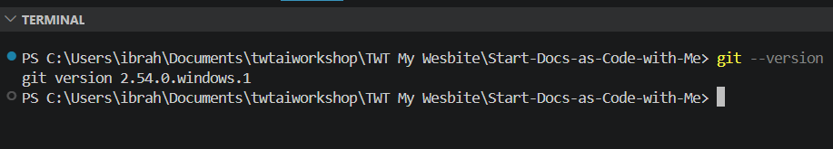
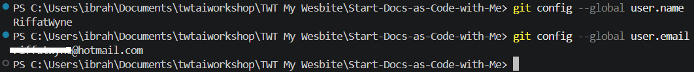
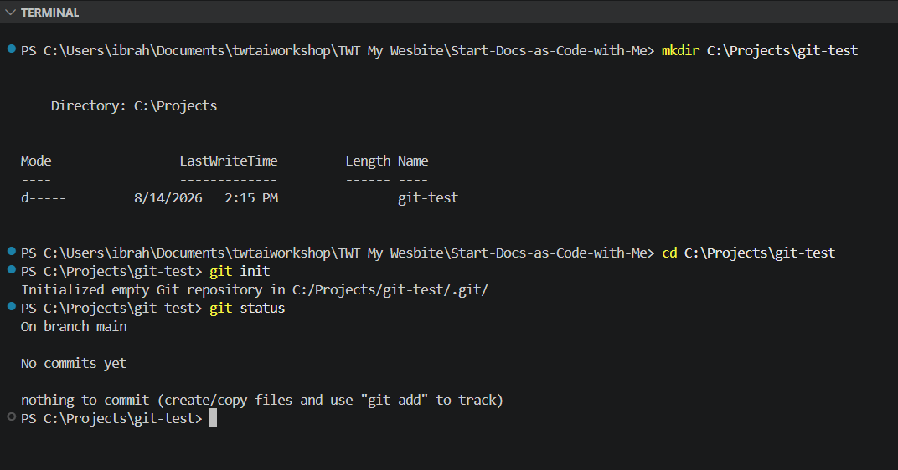
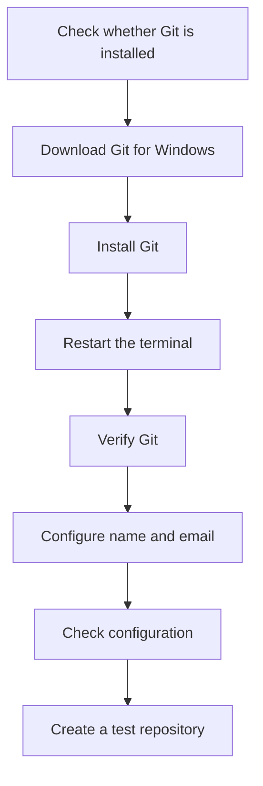

> **Lesson level:** Beginner
>
> **Time to complete:** 20–30 minutes
>
> **Prerequisites:** None

---

## Learning objectives

After you complete this lesson, you will be able to:

- Understand what Git is.
- Understand why technical writers use Git.
- Check whether Git is already installed.
- Install Git on Windows.
- Verify the Git installation.
- Configure your Git name and email address.
- Check your Git configuration.
- Understand where Git stores configuration information.
- Fix common Git installation problems.

---

## What is Git?

Git is a version control system.

It records changes made to files over time. You can use Git to see what changed, restore previous versions, create branches, and work with other people.

For technical writers, Git is particularly useful when documentation is stored as files such as:

```text
.md
.yaml
.json
.html
.css
```

Instead of keeping different copies of a document such as:

```text
guide-final.docx
guide-final-v2.docx
guide-final-v3.docx
guide-final-approved.docx
guide-final-approved-new.docx
```

You can use Git to track changes to the same files.

Git is not only for developers. Technical writers can use the same version control workflow to manage documentation.

---

## Why use Git for documentation?

Git gives documentation teams a structured way to manage changes.

You can use Git to:

- Track changes to documentation.
- See who changed a file.
- Review proposed changes.
- Restore an earlier version.
- Work on different versions of content.
- Create branches for new work.
- Collaborate with developers and other writers.
- Connect documentation changes with software changes.

:::info

Git is also one of the foundations of a Docs-as-Code workflow.

:::

In this learning platform, your documentation files will be stored in a Git repository and published through a documentation toolchain.

```text
Documentation
      │
      ▼
   Markdown
      │
      ▼
     Git
      │
      ▼
   GitHub
      │
      ▼
  Docusaurus
      │
      ▼
Published documentation
```

Git and GitHub are not the same thing

This is one of the first things to understand.

Git is the version control system.

GitHub is a platform that hosts Git repositories and provides collaboration features.

Think of it this way:

| Tool           | Purpose                                           |
| -------------- | ------------------------------------------------- |
| Git            | Tracks changes to files                           |
| GitHub         | Hosts Git repositories and supports collaboration |
| GitHub Actions | Automates tasks in a GitHub repository            |

You can use Git without GitHub.

However, most modern software teams use Git with a platform such as GitHub, GitLab, or Azure DevOps.

In this learning platform, we will use Git and GitHub.

---

## Before you begin

You need:

| Requirement          | Required                                |
| -------------------- | --------------------------------------- |
| Computer             | Yes                                     |
| Internet connection  | Yes                                     |
| Terminal             | Yes                                     |
| Administrator access | Recommended                             |
| Git                  | No — you will install it in this lesson |

Git works on Windows, macOS, and Linux.

This lesson uses Windows for the installation steps.

---

### Step 1 — Check whether Git is already installed

Before installing Git, check whether it is already available on your computer.

Open PowerShell or Command Prompt.

Run:

```bash
git --version
```

Expected result:

If Git is already installed, you should see a version number.

For example:

```text
git version 2.54.0.windows.1
```



:::tip

The version number may be different on your computer.

Git releases new versions over time, so you do not need to have exactly the version shown in this example.

:::

If the command returns a Git version, Git is already installed. You can continue with the configuration steps in this lesson.

If you see an error such as:

```text
git is not recognized as an internal or external command
```

continue with the installation.

### Step 2 — Download Git

The official Git website provides Git for Windows.

Open your browser and go to:

[Git](https://git-scm.com/install/windows)

Download the current Git for Windows installer.

The official Git website also provides installers for different Windows architectures. Choose the installer that matches your computer.

Download Git from the official Git website rather than from an unofficial download site.

### Step 3 — Start the Git installer

After the download finishes:

1. Open the downloaded installer.
2. If Windows displays a security prompt, review the publisher information.
3. Select Yes if you trust the installer.
4. Continue through the Git setup wizard.

The installer contains several configuration options.

If you are new to Git, the default settings are usually a good starting point.

### Step 4 — Choose the installation location

The installer asks where Git should be installed.

You can normally keep the default location.

For example:

```text
C:\Program Files\Git
```

Select Next.

### Step 5 — Select components

The installer displays a list of optional components.

Keep the default selections unless you have a specific reason to change them.

Select Next.

### Step 6 — Choose the Start Menu folder

Git can create shortcuts in the Windows Start Menu.

You can keep the default setting.

Select Next.

### Step 7 — Configure the default editor

Git may ask which text editor you want Git to use.

If you already use Visual Studio Code, you can select Visual Studio Code.

If you are not sure which editor to choose, you can keep the default setting and change it later.

For this learning platform, we will use Visual Studio Code for editing documentation.

### Step 8 — Choose the initial branch name

The installer may ask how Git should name the initial branch when you create a new repository.

If you are given the option, using:

```text
main
```

is a sensible choice for new projects.

Git allows you to configure the default initial branch name with:

```bash
git config --global init.defaultBranch main
```

We will use main throughout this learning platform unless a lesson specifically tells you to use another branch.

### Step 9 — Complete the installation

Continue through the remaining installation screens.

For a beginner setup, you can normally keep the recommended defaults.

- Select Install.

Wait for the installation to complete.

When the installer finishes, select Finish.

### Step 10 — Restart your terminal

If PowerShell or Command Prompt was already open during the installation, close it.

Open a new PowerShell or Command Prompt window.

This gives Windows a fresh environment and ensures that the Git command is available.

### Step 11 — Verify Git

Run:

```bash
git --version
```

Expected result:

You should see a Git version.

For example:

```bash
git version 2.54.0.windows.1
```


Your version may be different.

The important thing is that Git returns a version number instead of an error.

### Step 12 — Configure your Git identity

Before you start creating commits, configure the name and email address that Git will associate with your commits.

Run:

```text
git config --global user.name "Your Name"
```

Replace:

"Your Name" with your name.

For example:

```bash
git config --global user.name "Riffat Wyne"
```

Now configure your email address:

```bash
git config --global user.email "you@example.com"
```

Replace the example address with the email address you want Git to use.

For example:

```bash
git config --global user.email "riffat@example.com"
```

:::tip

Use an email address that you are comfortable associating with your Git commits.

If you plan to use GitHub, consider using an email address that is configured appropriately for your GitHub account.

:::

Git stores this information in your user-level Git configuration.

You normally need to configure it only once on a computer.

### Step 13 — Check your Git identity

Run:

```bash
git config --global user.name
```

You should see your configured name.

For example:

```text
Riffat Wyne
```

Now run:

```bash
git config --global user.email
```

You should see your configured email address.



### Step 14 — Check your Git configuration

You can display your current Git configuration with:

```bash
git config --list
```

You may see output similar to:

```bash
user.name=Riffat Wyne
user.email=riffat@example.com
init.defaultbranch=main
```

The exact output depends on your configuration.

You can also use:

```bash
git config --list --show-origin
```

This command shows where each configuration value comes from.

This can be useful when you are troubleshooting Git configuration later.

---

## Where does Git store configuration?

Git can store configuration at different levels.

The three main levels are:

| Level  | Applies to                                 |
| ------ | ------------------------------------------ |
| System | All users and repositories on the computer |
| Global | Your user account                          |
| Local  | One repository                             |

When you use:

```bash
git config --global
```

you are setting a value for your user account.

When you use:

```bash
git config --local
```

you are setting a value for the current repository.

For example:

```bash
git config --local user.name "Project Name"
```

A repository-specific setting can override a global setting.

You do not need to change local configuration during this lesson.

Understanding the difference becomes useful when you work with multiple projects.

### Step 15 — Create a test repository

Let's make sure Git can work with a project.

Create a test folder.

For example:

```text
C:\Projects\git-test
```

Open PowerShell in that folder.

Run:

```bash
git init
```

Expected result:

Git creates a new repository.

You should see a message similar to:

```text
Initialized empty Git repository
```

The exact wording may vary by Git version.

### Step 16 — Check the repository

Run:

```bash
git status
```

Expected result:

Git displays information about the repository.

You may see:

```text
On branch main

No commits yet
```

The exact output depends on your Git version and configuration.

The important point is that Git recognizes the folder as a repository.



### Step 17 — Understand the .git folder

When you run:

```bash
git init
```

Git creates a hidden .git directory inside the project.

For example:

```text
git-test/
│
├── .git/
└──
```

The ```.git``` directory contains the information Git needs to track the repository.

Do not manually edit or delete files inside .git unless you understand exactly what you are doing.

For normal Git work, you interact with the repository by using Git commands.

### Step 18 — Remove the test repository

The test repository is only for this lesson.

You can delete the test folder after you have verified that Git works.

For example:

```text
C:\Projects\git-test
```

If you want to keep it for practice, you can leave it in place.

We will create and use the actual documentation repository in the following lessons.

---

## Git installation workflow



---

## Common installation problems

<details>
<summary><strong>1. Git is not recognized</strong></summary>

Cause:

Git may not be installed correctly, or the terminal may not have picked up the updated PATH.

Solution:

1. Close PowerShell or Command Prompt.
2. Open a new terminal window.
3. Run:

```bash
git --version
```

If Git is still not recognized:

1. Restart your computer.
2. Try the command again.
3. If the problem continues, reinstall Git.

</details>

<details>
<summary><strong>2. Git was installed but the version command does not work</strong></summary>

Cause:

The terminal may have been open while Git was being installed.

Solution:

1. Close the terminal.
2. Open a new PowerShell or Command Prompt window.
3. Run:

```bash
git --version
```

</details>

<details>
<summary><strong>3. Git asks for my name and email</strong></summary>

Cause:

Git has not been configured with your identity.

Solution:

Run:

```bash
git config --global user.name "Your Name"
```

Then:

```bash
git config --global user.email "you@example.com"
```

Verify the settings:

```bash
git config --global user.name
git config --global user.email
```

</details>

<details>
<summary><strong>4. I entered the wrong name or email address</strong></summary>

Cause:

The Git identity was configured incorrectly.

Solution:

Run the configuration command again.

For example:

```bash
git config --global user.name "Correct Name"
```

Then:

```bash
git config --global user.email "correct@example.com"
```

Check the result:

```bash
git config --global user.name
git config --global user.email
```

</details>

<details>
<summary><strong>5. Git installation is blocked by my organization</strong></summary>

Cause:

Your computer may be managed by your organization and may restrict software installation.

Solution:

Contact your IT team.

Ask whether Git for Windows can be installed on your computer.

Do not bypass your organization's security controls.

</details>

---

## Best practices

- Download Git from the official Git website.
- Keep Git reasonably up to date.
- Use a consistent name and email address for your commits.
- Check your Git configuration if commits show the wrong identity.
- Use git status regularly when working in a repository.
- Do not manually modify the .git directory.
- Do not commit passwords, API keys, or other secrets.
- Review changes before committing them.

Git records your changes, but it does not decide whether those changes are correct.

:::tip

As a technical writer, you are still responsible for reviewing your documentation before you commit and publish it.

:::

## Key terms

| Term              | Definition                                                                    |
| ----------------- | ----------------------------------------------------------------------------- |
| Git               | A distributed version control system used to track changes to files.          |
| Repository        | A project managed by Git.                                                     |
| Commit            | A saved set of changes in a Git repository.                                   |
| Branch            | A separate line of development within a repository.                           |
| Working tree      | The files you currently have checked out and are working on.                  |
| `.git`            | The directory where Git stores repository information.                        |
| Git configuration | Settings that control how Git behaves.                                        |
| GitHub            | A platform for hosting Git repositories and collaborating on projects.        |
| PATH              | An operating system setting that helps the terminal find executable programs. |

---

## Summary

In this lesson, you learned how to:

- Understand what Git is.
- Understand why technical writers use Git.
- Check whether Git is already installed.
- Download Git for Windows.
- Install Git.
- Verify the installation.
- Configure your Git name and email address.
- Check your Git configuration.
- Understand global and local Git configuration.
- Create a test Git repository.
- Check the status of a repository.

You now have a working Git installation and the basic configuration needed for the next lessons.

---

## Knowledge check

<details>
<summary><strong>1. What is Git?</strong></summary>

Git is a version control system that tracks changes to files over time.

</details>

<details>
<summary><strong>2. What is the difference between Git and GitHub?</strong></summary>

Git is the version control system.

GitHub is a platform that hosts Git repositories and provides collaboration features.

</details>

<details>
<summary><strong>3. Which command checks whether Git is installed?</strong></summary>

```bash
git --version
```

</details>

<details>
<summary><strong>4. Which command sets your Git name?</strong></summary>

```bash
git config --global user.name "Your Name"
```

</details>

<details>
<summary><strong>5. Which command sets your Git email address?</strong></summary>

```bash
git config --global user.email "you@example.com"
```

</details>

<details>
<summary><strong>6. What does <code>git init</code> do?</strong></summary>

`git init` creates a new Git repository in the current folder.

</details>

<details>
<summary><strong>7. What does <code>git status</code> show?</strong></summary>

`git status` shows information about the current Git repository, including the current branch and changes in the working tree.

</details>

<details>
<summary><strong>8. Why should you not delete the <code>.git</code> folder?</strong></summary>

The `.git` folder contains the information Git uses to manage the repository. Deleting it can remove the repository's Git history and configuration.

</details>

## Practice exercise

Complete the following tasks:

- Check whether Git is already installed.
- Download Git for Windows if necessary.
- Install Git.
- Open a new PowerShell or Command Prompt window.
- Run:
  
```bash
git --version
```

- Configure your Git name.
- Configure your Git email address.
- Check your Git configuration.
- Create a test folder.
- Run:

```bash
git init
```

- Run:

```bash
git status
```

- Identify the .git folder created by Git.

When you finish, you should have a working Git installation and understand the basic purpose of a Git repository.

## Next lesson

- Install GitHub
