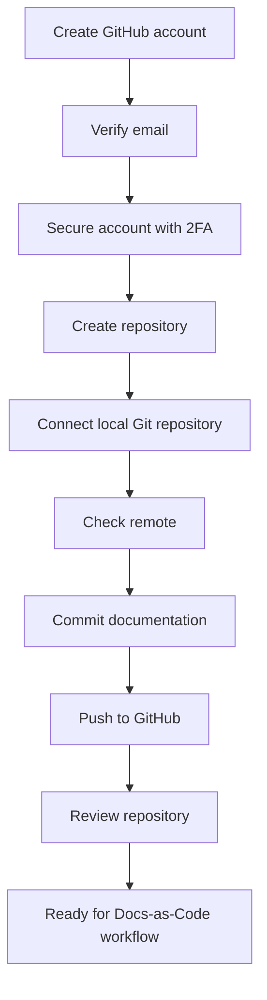

# Set Up GitHub

> **Lesson level:** Beginner
>
> **Time to complete:** 30–45 minutes
>
> **Prerequisites:** Git installed
>
> **Recommended:** Visual Studio Code installed

---

## Learning objectives

After you complete this lesson, you will be able to:

- Understand what GitHub is.
- Understand the difference between Git and GitHub.
- Create a GitHub account.
- Verify your email address.
- Secure your GitHub account.
- Configure two-factor authentication.
- Understand GitHub repositories.
- Create a repository.
- Connect a local Git repository to GitHub.
- Push documentation files to GitHub.
- Understand the relationship between Git, GitHub, and VS Code.
- Understand how GitHub fits into a Docs-as-Code workflow.
- Fix common GitHub setup problems.

---

## What is GitHub?

GitHub is a platform for hosting Git repositories and collaborating on projects.

For technical writers, GitHub can provide a central place to store and manage documentation source files.

A documentation project might contain:

```text
docs/
src/
static/
README.md
sidebars.ts
docusaurus.config.ts
package.json
```

These files can be stored in a GitHub repository.

Git tracks changes to the files.

GitHub provides the remote repository and collaboration features around those files.

---

## Git and GitHub are not the same thing

This distinction is important.

**Git** is the version control system.

**GitHub** is a platform that hosts Git repositories and provides collaboration and automation features.

A simple way to think about it is:

```text
Git
 │
 └── Tracks changes to files

GitHub
 │
 ├── Hosts Git repositories
 ├── Supports collaboration
 ├── Provides Pull Requests
 ├── Provides Issues
 └── Provides GitHub Actions
```

You can use Git without GitHub.

You can also use GitHub with other tools that work with Git.

For this learning platform, Git and GitHub work together.

---

## Why use GitHub for documentation?

GitHub is useful for documentation because documentation can follow many of the same practices used by software teams.

For example, a technical writer can:

- Create a documentation branch.
- Edit Markdown files.
- Review changes.
- Commit changes.
- Open a Pull Request.
- Ask developers or subject matter experts to review content.
- Update the documentation based on feedback.
- Merge approved changes.
- Trigger automated checks.
- Publish the documentation.

This gives documentation a more structured workflow than simply editing files on a shared drive.

---

## GitHub in the Docs-as-Code workflow

The basic workflow looks like this:

```text
Technical Writer
       │
       ▼
Visual Studio Code
       │
       ▼
Markdown / MDX
       │
       ▼
Git
       │
       ▼
GitHub Repository
       │
       ├── Branch
       │
       ├── Commit
       │
       ├── Pull Request
       │
       ├── Review
       │
       └── GitHub Actions
       │
       ▼
Documentation Build
       │
       ▼
Published Documentation
```

As you progress through this course, you will build each part of this workflow.

---

## Before you begin

You need:

| Requirement | Required |
| --- | --- |
| Computer | Yes |
| Internet connection | Yes |
| Git | Yes |
| GitHub account | You will create one |
| Email address | Yes |
| Visual Studio Code | Recommended |
| GitHub Desktop | Optional |

This lesson uses **Windows** for the local Git and GitHub steps.

GitHub itself is a web platform, so you can access it from any supported web browser.

---

### Step 1 — Open GitHub

Open your web browser.

Go to:

https://github.com/

You should see the GitHub home page.

Select **Sign up**.

---

### Step 2 — Create your GitHub account

Follow the instructions to create a personal GitHub account.

You will need:

- An email address.
- A password.
- A GitHub username.

Choose your username carefully.

Your username becomes part of your public GitHub profile URL.

For example:

```text
https://github.com/your-username
```

It may also appear when people view your repositories and contributions.

:::tip

If you are using GitHub as part of your professional portfolio, choose a username that you are comfortable sharing publicly.

:::

---

### Step 3 — Verify your email address

GitHub requires a verified email address for some basic account activities, including creating repositories.

After creating your account, check your email.

Open the verification message from GitHub.

Follow the verification instructions.

Return to GitHub after your email address has been verified.

**Expected result**

Your GitHub account shows your email address as verified.

:::important

If you cannot verify your email address, you may not be able to complete some GitHub tasks.

Check your spam or junk email folder if you do not see the verification message.

:::

---

### Step 4 — Secure your GitHub account

Your GitHub account may contain source code, documentation, project information, and access to repositories.

Treat it as a professional account.

Use a strong and unique password.

GitHub also strongly recommends configuring **two-factor authentication (2FA)**.

2FA provides an additional security factor when you sign in.

---

### Step 5 — Configure two-factor authentication

Sign in to GitHub.

Open your account settings.

Find the security settings for your account.

Select the option to configure **two-factor authentication**.

Follow the instructions provided by GitHub.

Depending on the options available to you, you may be able to use an authenticator application or another supported authentication method.

Follow the instructions shown by GitHub rather than relying on screenshots from older versions of the interface.

**Expected result**

Two-factor authentication is enabled for your GitHub account.

:::important

Store your recovery information securely.

If you lose access to your authentication method, recovery information may be important for regaining access to your account.

:::

---

### Step 6 — View your GitHub profile

Open your GitHub profile.

Your profile contains information about your activity on GitHub.

You can eventually use your profile to showcase documentation projects, contributions, and other work.

For example:

```text
GitHub Profile
      │
      ├── Repositories
      ├── Contributions
      ├── Projects
      └── Profile information
```

For technical writers, a GitHub profile can also become part of a professional portfolio.

---

### Step 7 — Understand repositories

A **repository**, often called a **repo**, is a location where a project and its Git history are stored.

A documentation repository might contain:

```text
my-documentation/
│
├── docs/
├── exercises/
├── assets/
├── README.md
└── package.json
```

The repository can exist:

- On your computer.
- On GitHub.
- In both places.

A common workflow is:

```text
Local repository
       │
       │ push
       ▼
GitHub repository
       │
       │ pull
       ▼
Local repository
```

---

### Step 8 — Create a new repository

Sign in to GitHub.

Select the option to create a new repository.

You can also navigate directly to:

https://github.com/new

Enter a repository name.

For example:

```text
my-documentation-project
```

Add a short description.

For example:

```text
A Docs-as-Code documentation project.
```

Choose whether the repository should be **Public** or **Private**.

For a learning project or portfolio project, a public repository can be useful if you want other people to see your work.

:::important

Do not make a repository public if it contains confidential company information, customer information, passwords, API keys, internal documentation, or other restricted content.

:::

---

### Step 9 — Choose the repository visibility

GitHub provides different repository visibility options.

## Public

A public repository can be viewed by other people.

This is useful for:

- Learning projects.
- Open-source projects.
- Documentation portfolios.
- Public examples.

## Private

A private repository is restricted to the people you authorize.

This is useful for:

- Internal projects.
- Work in progress.
- Private documentation.
- Content that should not be publicly available.

For this learning platform, you can use a public repository if you want to build a visible portfolio.

---

### Step 10 — Create the repository

After entering the repository information, select **Create repository**.

GitHub creates the repository.

You should see the repository page.

For example:

```text
https://github.com/your-username/my-documentation-project
```

At this point, the repository exists on GitHub.

---

### Step 11 — Understand local and remote repositories

You may now have two repositories:

```text
Your computer
└── my-documentation-project

GitHub
└── my-documentation-project
```

The repository on your computer is the **local repository**.

The repository on GitHub is the **remote repository**.

Git allows you to synchronize changes between them.

For example:

```text
Local repository
      │
      │ git push
      ▼
GitHub repository
```

And:

```text
GitHub repository
      │
      │ git pull
      ▼
Local repository
```

---

### Step 12 — Connect your local repository to GitHub

If you already have a Git repository on your computer, you can connect it to GitHub.

Open the terminal in your local project folder.

For example:

```bash
cd C:\Projects\my-documentation-project
```

Check that Git recognizes the repository:

```bash
git status
```

**Expected result**

Git displays information about your repository.

---

### Step 13 — Add the GitHub remote

Git uses a **remote** to identify another repository that your local repository can communicate with.

The standard remote name is:

```text
origin
```

You can add your GitHub repository as the remote:

```bash
git remote add origin https://github.com/your-username/my-documentation-project.git
```

Replace:

```text
your-username
```

and:

```text
my-documentation-project
```

with your GitHub username and repository name.

---

### Step 14 — Check the remote

Run:

```bash
git remote -v
```

You should see output similar to:

```text
origin  https://github.com/your-username/my-documentation-project.git (fetch)
origin  https://github.com/your-username/my-documentation-project.git (push)
```

**Expected result**

Git shows your GitHub repository as the `origin` remote.

---

### Step 15 — Check your current branch

Run:

```bash
git branch
```

You may see:

```text
* main
```

The `*` identifies the branch you are currently using.

For this learning platform, we use `main` as the primary branch.

Some projects may use different branch names.

Always follow the branch strategy defined by the project you are working on.

---

### Step 16 — Create your first commit

If your local project contains files that have not yet been committed, check the status:

```bash
git status
```

Stage the files:

```bash
git add .
```

Then create a commit:

```bash
git commit -m "Initial documentation project"
```

A commit records a set of changes in Git.

The commit message should explain what the change represents.

For example:

```text
Initial documentation project
```

is clearer than:

```text
stuff
```

or:

```text
changes
```

---

### Step 17 — Push your repository to GitHub

If your local branch is called `main`, run:

```bash
git push -u origin main
```

Git sends your local commits to the GitHub repository.

**Expected result**

Your files appear in the GitHub repository.

Refresh the GitHub repository page in your browser.

You should now see your project files.

---

### Step 18 — Understand push and pull

Two Git commands are particularly important when working with GitHub.

#### `git push`

Sends local commits to the remote repository.

```bash
git push
```

Think:

```text
My computer
     │
     │ push
     ▼
GitHub
```

#### `git pull`

Gets changes from the remote repository and updates your local repository.

```bash
git pull
```

Think:

```text
GitHub
     │
     │ pull
     ▼
My computer
```

:::tip

Before starting work, check whether your local repository needs to be updated.

Before finishing work, make sure your changes have been committed and pushed according to your team's workflow.

:::

---

### Step 19 — Connect GitHub to VS Code

Open your documentation repository in VS Code.

You should see the GitHub repository files in the Explorer.

Open the Source Control view.

VS Code should detect the Git repository.

You can now use VS Code and GitHub together:

```text
VS Code
   │
   ▼
Edit documentation
   │
   ▼
Git
   │
   ▼
GitHub
```

This is the basic environment you will use throughout the course.

---

### Step 20 — Sign in to GitHub from VS Code

VS Code can connect to GitHub.

If VS Code asks you to sign in:

1. Follow the sign-in prompt.
2. Allow VS Code to open the browser if requested.
3. Sign in to GitHub.
4. Authorize the requested access.
5. Return to VS Code.

The exact sign-in process can change as GitHub and VS Code update.

:::important

Only authorize applications that you recognize and trust.

Review the permissions requested before approving access.

:::

---

### Step 21 — Understand GitHub authentication

When Git communicates with GitHub, GitHub needs to know that you are authorized to access the repository.

There are several ways to authenticate.

Common approaches include:

- HTTPS with credential management.
- SSH keys.
- GitHub Desktop authentication.

For beginners, you do not need to configure every authentication method at once.

Start with the method that fits your environment and your team's workflow.

---

### Step 22 — HTTPS authentication

A GitHub repository can use an HTTPS remote such as:

```text
https://github.com/your-username/my-documentation-project.git
```

HTTPS is commonly used because it is straightforward to understand and works well with credential management tools.

When Git requires authentication, use the authentication method supported by your GitHub setup.

:::important

Do not put your GitHub password, personal access token, or other secret directly into a Git remote URL.

Never commit credentials to a repository.

:::

---

### Step 23 — SSH authentication

SSH is another way to authenticate Git operations with GitHub.

An SSH remote looks like:

```text
git@github.com:your-username/my-documentation-project.git
```

SSH uses a key pair:

```text
Your computer
     │
     ├── Private key
     │
     └── Public key
             │
             ▼
          GitHub
```

The private key remains on your computer.

The public key can be added to your GitHub account.

You do not need to configure SSH during this lesson unless you want to use it.

We will cover authentication in more detail when we work with Git workflows.

---

### Step 24 — Understand GitHub Desktop

GitHub Desktop is an optional graphical application for working with GitHub repositories.

It can be useful if you are new to Git because it provides a visual interface for common Git operations.

You can use GitHub Desktop to:

- Clone repositories.
- Create branches.
- Review changes.
- Commit changes.
- Push changes.
- Pull changes.
- Work with GitHub repositories.

GitHub Desktop works alongside tools such as VS Code.

A typical workflow can look like:

```text
GitHub Desktop
      │
      ▼
Clone repository
      │
      ▼
Visual Studio Code
      │
      ▼
Edit documentation
      │
      ▼
GitHub Desktop
      │
      ▼
Commit and push
      │
      ▼
GitHub
```

GitHub Desktop is optional.

You can complete this course using Git from the command line and VS Code.

---

### Step 25 — Install GitHub Desktop (optional)

If you want to use GitHub Desktop, download it from:

https://desktop.github.com/

GitHub Desktop is currently supported on Windows and macOS.

For Windows, GitHub documents support for Windows 10 64-bit and later.

Download the installer for your operating system.

Run the installer and follow the prompts.

After installation, start GitHub Desktop.

---

### Step 26 — Sign in to GitHub Desktop

Open GitHub Desktop.

Select the option to sign in to GitHub.com.

Follow the authentication process.

After you authenticate, GitHub Desktop can work with repositories associated with your GitHub account.

**Expected result**

GitHub Desktop shows that you are signed in.

:::tip

If you already use VS Code and Git from the command line, you do not need GitHub Desktop.

Choose the workflow that makes sense for you and your team.

:::

---

### Step 27 — Clone a repository

Cloning means creating a local copy of a remote repository.

You can clone a repository from GitHub using Git:

```bash
git clone https://github.com/your-username/my-documentation-project.git
```

Git creates a local copy of the repository.

For example:

```text
C:\Projects\
└── my-documentation-project\
```

You can then open the folder in VS Code.

---

### Step 28 — Clone using GitHub Desktop

If you use GitHub Desktop:

1. Open GitHub Desktop.
2. Select **Clone a repository**.
3. Select the GitHub repository.
4. Choose the local folder.
5. Select **Clone**.

GitHub Desktop downloads the repository to your computer.

You can then open it in VS Code.

---

### Step 29 — Understand the basic GitHub workflow

A simple documentation workflow looks like this:

```text
Create or clone repository
          │
          ▼
Create branch
          │
          ▼
Edit documentation
          │
          ▼
Review changes
          │
          ▼
Commit changes
          │
          ▼
Push branch
          │
          ▼
Open Pull Request
          │
          ▼
Review
          │
          ▼
Approve
          │
          ▼
Merge
          │
          ▼
Publish
```

This is the workflow you will build on throughout the course.

---

### Step 30 — Understand Pull Requests

A **Pull Request**, often called a **PR**, is a proposal to merge changes from one branch into another.

For documentation teams, Pull Requests provide a structured review point.

For example:

```text
main
 │
 └── documentation-update
          │
          ├── Edit Markdown
          ├── Review changes
          └── Push changes
                    │
                    ▼
              Pull Request
                    │
                    ▼
                 Review
                    │
                    ▼
                  Merge
```

A Pull Request can allow technical writers, developers, subject matter experts, and other reviewers to provide feedback before changes are merged.

---

## Why Pull Requests matter for technical writers

A Pull Request is more than a technical process.

It can provide a documented review point.

For example, a documentation Pull Request can show:

- What changed.
- Who made the change.
- Who reviewed the change.
- What feedback was provided.
- What changes were made in response.
- When the change was merged.

This can support a more controlled documentation workflow.

In regulated environments, the exact approval and audit requirements will depend on your organization's quality system and applicable processes.

GitHub should not automatically be treated as a complete compliance solution.

The documentation workflow and repository controls need to be designed around your organization's requirements.

---

## GitHub and documentation traceability

A Docs-as-Code workflow can create useful links between content changes and software changes.

For example:

```text
Requirement
     │
     ▼
Development work
     │
     ▼
Code change
     │
     ▼
Documentation change
     │
     ▼
Pull Request
     │
     ▼
Review
     │
     ▼
Commit
     │
     ▼
Release
     │
     ▼
Published documentation
```

This does not happen automatically.

The team needs to define conventions for:

- Branch names.
- Commit messages.
- Pull Requests.
- Reviewers.
- Approval rules.
- Versioning.
- Release tags.
- Documentation ownership.
- Change records.

These practices become especially important when documentation needs to be traceable.

---

## GitHub and documentation reviews

GitHub can support a review workflow such as:

```text
Writer
  │
  ▼
Draft documentation
  │
  ▼
Pull Request
  │
  ▼
Technical review
  │
  ▼
Documentation review
  │
  ▼
Approval
  │
  ▼
Merge
```

Different teams may use different review stages.

For example, your organization may require:

- Technical review.
- Editorial review.
- Product review.
- Quality review.
- Regulatory approval.

GitHub provides the collaboration mechanism, but the organization defines the required process.

---

## GitHub and automated documentation workflows

GitHub also provides **GitHub Actions**.

GitHub Actions can automate tasks when changes are made to a repository.

For documentation, an automated workflow might:

```text
Pull Request
     │
     ▼
Check Markdown
     │
     ▼
Check links
     │
     ▼
Build documentation
     │
     ▼
Run tests
     │
     ▼
Report result
```

A successful workflow can provide confidence that documentation meets defined technical checks before it is published.

You will learn more about GitHub Actions later in this course.

---

## GitHub repository structure for this project

Your learning repository contains documentation and project files.

A typical Docusaurus repository looks similar to:

```text
Start-Docs-as-Code-with-Me/
│
├── docs/
│   ├── 00-Welcome/
│   ├── 01-Environment-Setup/
│   ├── 02-Markdown/
│   ├── 03-Git/
│   └── ...
│
├── src/
│
├── static/
│
├── exercises/
│
├── package.json
├── docusaurus.config.ts
├── sidebars.ts
└── README.md
```

Git tracks these files.

GitHub hosts the repository.

Docusaurus uses the documentation source files to build the website.

---

## GitHub installation workflow



---

## Common installation and setup problems

<details>

<summary><strong>1. I cannot create a GitHub account</strong></summary>

**Cause**

The sign-up process may have failed, or the email address may already be associated with another account.

**Solution**

1. Check that you entered the correct email address.
2. Check your internet connection.
3. Follow the instructions shown by GitHub.
4. If you already have a GitHub account, use the existing account instead of creating another one.

If the problem continues, use the GitHub support resources.

</details>

<details>

<summary><strong>2. I did not receive the GitHub verification email</strong></summary>

**Cause**

The message may have been delayed or filtered by your email provider.

**Solution**

Check:

- Inbox
- Spam folder
- Junk folder
- Email filtering rules

Make sure you entered the correct email address.

If the message still does not arrive, use GitHub's email verification troubleshooting guidance.

</details>

<details>

<summary><strong>3. I cannot create a repository</strong></summary>

**Cause**

Your email address may not be verified, or your organization may restrict repository creation.

**Solution**

Check that your GitHub email address is verified.

If you are using an organization-managed GitHub account, contact your GitHub or organization administrator if repository creation is restricted.

</details>

<details>

<summary><strong>4. Git says that the remote already exists</strong></summary>

**Cause**

The local repository already has a remote named `origin`.

**Solution**

Check the existing remote:

```bash
git remote -v
```

If the URL is correct, you do not need to add the remote again.

If the URL is incorrect, update it:

```bash
git remote set-url origin https://github.com/your-username/my-documentation-project.git
```

Then check it again:

```bash
git remote -v
```

</details>

<details>

<summary><strong>5. GitHub rejects my push</strong></summary>

**Cause**

The local repository and GitHub repository may have different histories, or GitHub may require authentication.

**Solution**

First check the remote:

```bash
git remote -v
```

Then check the current branch:

```bash
git branch
```

If GitHub contains changes that are not available locally, you may need to pull those changes before pushing.

Do not use force-push commands unless you understand the consequences and your project workflow allows them.

</details>

<details>

<summary><strong>6. GitHub asks me to authenticate</strong></summary>

**Cause**

GitHub needs to verify that you are authorized to access the repository.

**Solution**

Use the authentication method configured for your environment.

You may use:

- HTTPS with credential management.
- SSH.
- GitHub Desktop.

If you are working on an organization-managed computer, follow your organization's authentication requirements.

</details>

<details>

<summary><strong>7. My repository is not showing in VS Code</strong></summary>

**Cause**

The repository folder may not be open in VS Code, or the folder may not contain a Git repository.

**Solution**

Open the project folder:

1. Select **File**.
2. Select **Open Folder**.
3. Select your repository folder.

Then open the integrated terminal and run:

```bash
git status
```

If Git recognizes the repository, VS Code should also be able to detect it.

</details>

<details>

<summary><strong>8. I accidentally made a private repository public</strong></summary>

**Cause**

Repository visibility was changed during repository creation or later settings changes.

**Solution**

Open the repository settings and review the repository visibility.

If the repository contains confidential or sensitive information, contact the appropriate administrator or security team immediately.

Do not assume that making a repository private automatically removes information that was previously exposed.

</details>

<details>

<summary><strong>9. I accidentally committed a password or API key</strong></summary>

**Cause**

Sensitive information was added to a file and committed to Git.

**Solution**

Treat the credential as exposed.

Do not simply delete the line and create another commit.

Immediately follow your organization's secret-management process and rotate or revoke the exposed credential.

Then remove the sensitive information from the repository according to your team's procedures.

:::important

Never commit passwords, API keys, access tokens, private keys, or other secrets to a Git repository.

:::

</details>

---

## Best practices

- Use a strong and unique GitHub password.
- Enable two-factor authentication.
- Verify your GitHub email address.
- Choose a professional GitHub username if you are building a portfolio.
- Keep personal and company repositories separate.
- Check repository visibility before publishing.
- Never commit passwords or API keys.
- Review Pull Requests before merging.
- Use meaningful commit messages.
- Keep the `main` branch stable.
- Use branches for changes.
- Pull changes before starting work when required by your team's workflow.
- Push completed work according to your team's process.
- Keep repository structure organized.
- Document important repository conventions.

:::tip

Think of GitHub as part of your documentation delivery system, not simply as a place to store Markdown files.

A well-managed repository can connect content, changes, reviews, automation, and publishing.

:::

---

## GitHub as part of a documentation team

For a documentation team, GitHub can become the central collaboration point between writers and engineering teams.

For example:

```text
Technical Writer
       │
       ├──────────────┐
       ▼              ▼
Documentation     Engineering
       │              │
       └──────┬───────┘
              ▼
          GitHub
              │
       ┌──────┼──────┐
       ▼      ▼      ▼
    Issues    PRs   Actions
       │      │      │
       └──────┼──────┘
              ▼
        Documentation
           release
```

This model helps documentation become part of the same development workflow as the product.

That is one of the central ideas behind Docs-as-Code.

---

## Key terms

| Term | Definition |
| --- | --- |
| GitHub | A platform for hosting Git repositories and collaborating on projects. |
| Repository | A project managed by Git. |
| Remote repository | A repository hosted somewhere other than your local computer, such as GitHub. |
| Local repository | A Git repository stored on your computer. |
| Remote | A reference to another Git repository, commonly a GitHub repository. |
| `origin` | The conventional name for the main remote repository. |
| Push | Sends local commits to a remote repository. |
| Pull | Gets changes from a remote repository and updates the local repository. |
| Clone | Creates a local copy of a remote repository. |
| Branch | A separate line of development within a repository. |
| Pull Request | A proposal to merge changes from one branch into another. |
| Commit | A recorded set of changes in Git. |
| GitHub Actions | GitHub's automation platform for running workflows in response to repository events. |
| 2FA | Two-factor authentication, an additional security factor used when signing in. |
| SSH | A secure protocol that can be used to authenticate Git operations. |
| HTTPS | A secure web protocol that can be used for Git repository connections. |
| GitHub Desktop | A graphical application for working with GitHub repositories. |

---

## Summary

In this lesson, you learned how to:

- Understand what GitHub is.
- Understand the difference between Git and GitHub.
- Create a GitHub account.
- Verify your email address.
- Secure your account with two-factor authentication.
- Create a GitHub repository.
- Understand local and remote repositories.
- Connect a local Git repository to GitHub.
- Configure a GitHub remote.
- Push documentation to GitHub.
- Pull changes from GitHub.
- Connect GitHub with VS Code.
- Understand GitHub authentication.
- Understand HTTPS and SSH.
- Understand GitHub Desktop.
- Understand Pull Requests.
- Understand GitHub Actions.
- Understand how GitHub supports documentation reviews and collaboration.
- Fix common GitHub setup problems.

You now have the Git and GitHub foundation needed to work with documentation as code.

---

## Knowledge check

<details>

<summary><strong>1. What is GitHub?</strong></summary>

GitHub is a platform for hosting Git repositories and collaborating on projects.

</details>

<details>

<summary><strong>2. What is the difference between Git and GitHub?</strong></summary>

Git is a version control system that tracks changes to files.

GitHub is a platform that hosts Git repositories and provides collaboration, review, and automation features.

</details>

<details>

<summary><strong>3. Why should you verify your GitHub email address?</strong></summary>

GitHub requires a verified email address for some basic account activities, including creating repositories.

</details>

<details>

<summary><strong>4. Why should you enable two-factor authentication?</strong></summary>

Two-factor authentication adds an additional security factor to your GitHub account and helps protect the account from unauthorized access.

</details>

<details>

<summary><strong>5. What is a GitHub repository?</strong></summary>

A GitHub repository is a project hosted on GitHub that contains files and their Git history.

</details>

<details>

<summary><strong>6. What is the difference between a local repository and a remote repository?</strong></summary>

A local repository is stored on your computer.

A remote repository is stored somewhere else, such as GitHub.

</details>

<details>

<summary><strong>7. What does <code>git push</code> do?</strong></summary>

`git push` sends local commits to a remote repository.

</details>

<details>

<summary><strong>8. What does <code>git pull</code> do?</strong></summary>

`git pull` gets changes from a remote repository and updates the local repository.

</details>

<details>

<summary><strong>9. What does <code>git clone</code> do?</strong></summary>

`git clone` creates a local copy of a remote repository.

</details>

<details>

<summary><strong>10. What is a Pull Request?</strong></summary>

A Pull Request is a proposal to merge changes from one branch into another. It provides a place for people to review and discuss changes before they are merged.

</details>

<details>

<summary><strong>11. What is the purpose of <code>origin</code>?</strong></summary>

`origin` is the conventional name given to the main remote repository associated with a local Git repository.

</details>

<details>

<summary><strong>12. Why should you never commit an API key to GitHub?</strong></summary>

An API key is a secret credential. If it is committed to a repository, it may be exposed to unauthorized users.

</details>

<details>

<summary><strong>13. Is GitHub Desktop required to use GitHub?</strong></summary>

No.

GitHub Desktop is optional. You can work with GitHub using Git from the command line, VS Code, or other Git-compatible tools.

</details>

---

## Practice exercise

Complete the following tasks:

1. Open GitHub.
2. Create a personal GitHub account if you do not already have one.
3. Verify your email address.
4. Enable two-factor authentication.
5. Open your GitHub profile.
6. Create a new repository.
7. Give the repository a meaningful name.
8. Choose the appropriate repository visibility.
9. Create the repository.
10. Open your local Git project.
11. Run:

```bash
git status
```

12. Add the GitHub repository as a remote:

```bash
git remote add origin https://github.com/your-username/your-repository.git
```

13. Verify the remote:

```bash
git remote -v
```

14. Create a commit if your local repository contains uncommitted files:

```bash
git add .
git commit -m "Initial documentation project"
```

15. Push the branch to GitHub:

```bash
git push -u origin main
```

16. Open the repository in your browser.
17. Confirm that your files are visible on GitHub.
18. Open the repository in VS Code.
19. Open the Source Control view.
20. Review the repository information.

When you finish, you should have a working GitHub account and understand how your local Git repository connects to GitHub.

---

## Next lesson

**Docs-as-Code Workflow**

In the next lessons, you will bring Git, GitHub, Markdown, VS Code, and documentation publishing together into a practical Docs-as-Code workflow.

You will learn how documentation moves from source files through editing, version control, review, approval, automation, and publishing.

---

## References

- [GitHub](https://github.com/)
- [Create a GitHub account](https://github.com/signup)
- [GitHub documentation](https://docs.github.com/)
- [Getting started with your GitHub account](https://docs.github.com/en/get-started/onboarding/getting-started-with-your-github-account)
- [Create a new repository](https://github.com/new)
- [GitHub Desktop](https://desktop.github.com/)
- [GitHub Desktop documentation](https://docs.github.com/en/desktop)