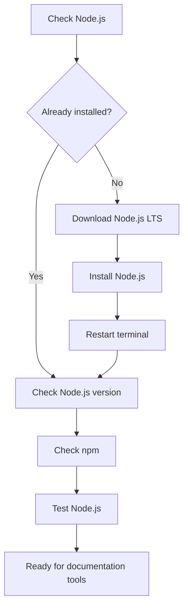

# Install Node.js

> **Lesson level:** Beginner
>
> **Time to complete:** 20–30 minutes
>
> **Prerequisites:** None

---

## Learning objectives

After you complete this lesson, you will be able to:

- Understand what Node.js is.
- Understand why technical writers use Node.js.
- Check whether Node.js is already installed.
- Understand the difference between Node.js and npm.
- Choose the appropriate Node.js release for a project.
- Install Node.js.
- Verify the Node.js installation.
- Verify that npm is available.
- Test Node.js from the terminal.
- Understand how Node.js supports documentation tools.
- Troubleshoot common Node.js installation problems.

---

## What is Node.js?

Node.js is a runtime environment that allows JavaScript applications to run outside a web browser.

You do not need to become a JavaScript developer to use Node.js.

For technical writers, Node.js is useful because many modern documentation tools are built using the Node.js ecosystem.

For example, Docusaurus uses Node.js and npm as part of its development environment.

You may also encounter Node.js when working with:

- Documentation websites
- Static site generators
- API documentation tools
- Build tools
- Automation
- GitHub Actions
- AI development tools
- Developer tooling

---

## Why do technical writers need Node.js?

Modern documentation is increasingly built using workflows that are similar to software development workflows.

A documentation project might use:

```text
Markdown
    +
Git
    +
GitHub
    +
Node.js
    +
npm
    +
Docusaurus
    +
GitHub Actions
```

As a technical writer, you do not need to understand every part of the software stack.

However, you should understand enough to work confidently with the environment.

For example, you should be able to answer questions such as:

- Is Node.js installed?
- Which version is installed?
- Is npm available?
- How do I install the project dependencies?
- How do I start the documentation website?
- Why does the documentation build fail?
- Does the project require a specific Node.js version?

These are practical skills for technical writers working in a Docs-as-Code environment.

> **Best Practice**
>
> Do not install tools simply because they are commonly used by developers.
>
> Understand why the documentation project needs each tool and how it fits into the workflow.

---

## How Node.js fits into this project

The basic workflow looks like this:

```text
Documentation source
        │
        ▼
Markdown / MDX
        │
        ▼
Documentation project
        │
        ▼
Node.js
        │
        ▼
npm packages
        │
        ▼
Docusaurus
        │
        ▼
Documentation website
```

Node.js provides the runtime used by many of the tools in this workflow.

npm manages the packages required by the project.

Docusaurus uses these tools to build and run the documentation website.

---

## Before you begin

You need:

| Requirement | Required |
| --- | --- |
| Computer | Yes |
| Internet connection | Yes |
| Terminal | Yes |
| Node.js | Installed during this lesson |
| npm | Installed with Node.js |
| Administrator access | May be required depending on your computer |

This lesson uses **Windows** for the installation steps.

Node.js is also available for macOS and Linux.

---

## Step 1 — Check whether Node.js is already installed

Before installing Node.js, check whether it is already available on your computer.

Open **PowerShell** or **Command Prompt**.

Run:

```bash
node --version
```

You may see a result similar to:

```text
v22.x.x
```

The exact version may be different.

Now check npm:

```bash
npm --version
```

You should see a version number.

For example:

```text
10.x.x
```

**Expected result**

Both commands return version numbers.

If they do, Node.js and npm are already installed.

If you see an error such as:

```text
node is not recognized
```

continue with the installation steps.

---

## Step 2 — Understand Node.js releases

Node.js has different release lines.

For a learning environment and most general documentation projects, the **LTS** release is normally the best starting point.

LTS means:

**Long-Term Support**

LTS releases are intended to provide a stable version for longer-term use.

However, always check the requirements of the project you are working on.

A project may require a specific Node.js version.

> **Best Practice**
>
> Do not assume that the newest Node.js version is always the correct version for a project.
>
> If the project specifies a Node.js version, follow the project requirement.

---

## Step 3 — Download Node.js

Open your web browser.

Go to the official Node.js website:

https://nodejs.org/

Select the **LTS** release.

Download the installer for your operating system.

For Windows, download the Windows installer.

:::important

Download Node.js from the official Node.js website.

Do not download Node.js from an unknown third-party website.

:::

---

## Step 4 — Start the Node.js installer

After the download finishes:

1. Open the downloaded installer.
2. Review the Windows security prompt if one appears.
3. Select **Yes** if you want to continue.
4. Read the license agreement.
5. Accept the agreement.
6. Select **Next**.

The exact installer screens may change between Node.js releases.

---

## Step 5 — Choose the installation location

The installer asks where you want to install Node.js.

For most users, keep the default installation location.

For example:

```text
C:\Program Files\nodejs\
```

Select **Next**.

:::tip

You normally do not need to change the installation location.

Keeping the default location makes troubleshooting easier.

:::

---

## Step 6 — Select the installation options

The installer displays the components that will be installed.

Keep the default options unless your organization has provided different instructions.

Node.js and npm are installed as part of the standard installation.

Select **Next**.

---

## Step 7 — Install Node.js

Review the installation settings.

Select **Install**.

Windows may ask for administrator permission.

If required, approve the installation.

Wait for the installation to finish.

Select **Finish** when the installation is complete.

---

## Step 8 — Restart the terminal

If PowerShell or Command Prompt was open while you installed Node.js, close it.

Open a new terminal window.

This is important because the existing terminal may not have the updated PATH information.

---

## Step 9 — Verify Node.js

Run:

```bash
node --version
```

Example:

```text
v22.x.x
```

The exact version may be different.

**Expected result**

You see a Node.js version number.

---

## Step 10 — Verify npm

Run:

```bash
npm --version
```

Example:

```text
10.x.x
```

**Expected result**

You see an npm version number.

:::note

If both commands work, your Node.js installation is working.

:::

---

## Step 11 — What is npm?

npm stands for:

**Node Package Manager**

npm is installed with Node.js.

It is used to install and manage packages required by Node.js projects.

For example, a Docusaurus project contains packages that are installed and managed through npm.

You will see commands such as:

```bash
npm install
```

and:

```bash
npm run start
```

throughout this course.

---

## Step 12 — Understand Node.js and npm

Node.js and npm work together, but they are not the same thing.

| Tool | Purpose |
| --- | --- |
| Node.js | Provides the runtime used to run JavaScript applications |
| npm | Installs and manages project packages |

Think of the relationship like this:

```text
Node.js
   │
   ├── Provides the runtime
   │
   └── Runs JavaScript-based tools

npm
   │
   ├── Installs packages
   ├── Manages dependencies
   └── Runs project commands
```

This distinction becomes useful when troubleshooting documentation projects.

---

## Step 13 — Check where Node.js is installed

On Windows, you can use:

```bash
where node
```

You may see a path similar to:

```text
C:\Program Files\nodejs\node.exe
```

The exact path may be different on your computer.

You can also check npm:

```bash
where npm
```

**Expected result**

Windows displays the location of the Node.js and npm executables.

---

## Step 14 — Test Node.js

You can test Node.js without creating a project.

Run:

```bash
node
```

You should see a Node.js prompt similar to:

```text
>
```

Enter:

```javascript
console.log("Node.js is working");
```

You should see:

```text
Node.js is working
```

To exit Node.js, press:

```text
Ctrl + C
```

You may need to press it twice.

**Expected result**

Node.js successfully runs the test command.

You do not need to learn JavaScript for this exercise.

The purpose of the test is simply to confirm that Node.js is working.

---

## Step 15 — Check Node.js from your documentation project

Open your documentation project in VS Code.

Open the integrated terminal.

Run:

```bash
node --version
```

Then:

```bash
npm --version
```

Both commands should work.

This confirms that your project environment can access Node.js and npm.

---

## Step 16 — Understand `package.json`

Node.js projects commonly use a file called:

```text
package.json
```

A Docusaurus project normally contains this file.

The file describes information about the project and its dependencies.

For example:

```json
{
  "name": "documentation-project",
  "version": "1.0.0"
}
```

Your actual `package.json` will contain more information.

It may include:

- Project name
- Project version
- Scripts
- Dependencies
- Development dependencies

Do not change values in `package.json` unless you understand why the change is required.

---

## Step 17 — Understand project dependencies

A documentation website can depend on many packages.

For example:

```text
Documentation project
        │
        ├── Docusaurus
        ├── React
        ├── React DOM
        └── Other packages
```

These dependencies are normally recorded in:

```text
package.json
```

The installed packages are normally stored in:

```text
node_modules/
```

You should not normally edit files inside `node_modules`.

The folder is generated from the project's package configuration.

---

## Step 18 — Install project dependencies

When you download or clone an existing Node.js project, the dependencies may not be installed yet.

Open the project folder in the terminal.

Run:

```bash
npm install
```

npm reads the project's package configuration and installs the required dependencies.

This can take several minutes depending on the project and your internet connection.

**Expected result**

npm completes without errors and creates the required dependency files.

You may see a new folder:

```text
node_modules/
```

You may also see or update:

```text
package-lock.json
```

---

## Step 19 — Understand `npm run`

Projects can define commands in `package.json`.

For example:

```json
{
  "scripts": {
    "start": "docusaurus start",
    "build": "docusaurus build"
  }
}
```

You can run these scripts with npm.

For example:

```bash
npm run start
```

or:

```bash
npm run build
```

You will learn more about these commands when you work with Docusaurus.

---

## Step 20 — Start a Docusaurus project

If you are working with the Docusaurus project used in this course, open the project folder in the terminal.

Run:

```bash
npm run start
```

Docusaurus should start a local development server.

The terminal normally displays a local address.

For example:

```text
http://localhost:3000/Start-Docs-as-Code-with-Me/
```

The exact address may be different depending on your configuration.

Open the address in your browser.

**Expected result**

Your documentation website opens locally.

:::important

Keep the terminal running while you use the local development server.

:::

To stop the server, return to the terminal and press:
>
> ```text
> Ctrl + C
> ```

---

## Step 21 — Understand the Node.js documentation workflow

At this point, you can see how Node.js fits into the documentation workflow.

```text
Technical Writer
       │
       ▼
VS Code
       │
       ▼
Markdown / MDX
       │
       ▼
Git
       │
       ▼
GitHub
       │
       ▼
Node.js / npm
       │
       ▼
Docusaurus
       │
       ▼
Published documentation
```

Node.js is therefore part of the tooling layer.

:::tip

It does not replace Markdown, Git, GitHub, or Docusaurus.

Each tool has a different role.

:::

---

## Node.js installation workflow



---

## Common installation problems

<details>
<summary><strong>1. Node.js is not recognized</strong></summary>

### Cause

Node.js may not be installed correctly, or the terminal may not have picked up the updated PATH.

### Solution

1. Close PowerShell or Command Prompt.
2. Open a new terminal window.
3. Run:

```bash
node --version
```

If Node.js is still not recognized:

1. Restart your computer.
2. Open a new terminal.
3. Run the command again.

If the problem continues, reinstall Node.js from the official Node.js website.

</details>

<details>
<summary><strong>2. npm is not recognized</strong></summary>

**Cause**

The Node.js installation may not have completed correctly, or the terminal may not have picked up the updated PATH.

**Solution**

Close the terminal.

Open a new PowerShell or Command Prompt window.

Run:

```bash
npm --version
```

If npm is still not recognized:

1. Restart your computer.
2. Open a new terminal.
3. Run the command again.

If the problem continues, reinstall Node.js.

</details>

<details>
<summary><strong>3. I installed Node.js but the old version is still displayed</strong></summary>

**Cause**

You may have an old terminal window open, or multiple Node.js installations may exist on your computer.

**Solution**

Close all terminal windows.

Open a new terminal.

Run:

```bash
node --version
```

If the old version is still displayed, check the installation locations:

```bash
where node
```

If more than one location is displayed, you may have multiple Node.js installations.

If this is a work computer, contact your IT team before removing an installation.

</details>

<details>
<summary><strong>4. The Node.js installer will not run</strong></summary>

**Cause**

Your computer may have security restrictions, or your organization may control software installation.

**Solution**

If this is a work computer:

1. Check your organization's software installation policy.
2. Contact your IT team if administrator permissions are required.
3. Use the approved installation method.

Do not bypass your organization's security controls.

</details>

<details>
<summary><strong>5. Node.js is installed but Docusaurus does not work</strong></summary>

**Cause**

Node.js is only one part of the Docusaurus environment.

The project dependencies may not have been installed, or the project may require a specific Node.js version.

**Solution**

Open the Docusaurus project folder.

Run:

```bash
npm install
```

Then try:

```bash
npm run start
```

If the project reports a Node.js version requirement, check the project documentation and use the required version.

</details>

<details>
<summary><strong>6. I have multiple Node.js versions installed</strong></summary>

**Cause**

Node.js may have been installed more than once, or another development tool may have installed another version.

**Solution**

Check your current version:

```bash
node --version
```

Then check the installation locations:

```bash
where node
```

If several locations are displayed, you may have multiple installations.

Do not remove installations without understanding which applications depend on them.

If you are using a company-managed computer, contact your IT team.

</details>

<details>
<summary><strong>7. npm displays a permissions error</strong></summary>

**Cause**

Windows permissions or your npm configuration may prevent npm from accessing a location.

**Solution**

Read the complete error message first.

Do not immediately run commands from random online sources as Administrator.

If the problem occurs inside a project, make sure you are working from the correct project folder.

Try:

```bash
npm install
```

If the problem continues, check your organization's development environment guidance or contact your IT team.

</details>

<details>
<summary><strong>8. npm install fails</strong></summary>

**Cause**

The project may have a dependency problem, network problem, incompatible Node.js version, or another configuration issue.

**Solution**

First check your Node.js version:

```bash
node --version
```

Then check npm:

```bash
npm --version
```

Check whether the project specifies a required Node.js version.

Read the npm error message carefully.

:::warning

Do not delete project files or change configuration settings until you understand what the error means.

:::

</details>

---

## Best practices

- Use the LTS release unless your project specifies another version.
- Check the project's required Node.js version before installing or updating Node.js.
- Restart the terminal after installing Node.js.
- Keep Node.js versions consistent across a project team where possible.
- Use the official Node.js website.
- Do not install software from unknown sources.
- Do not use Administrator privileges unless they are required.
- Read the complete error message before troubleshooting.
- Do not randomly delete `node_modules`.
- Do not manually edit files inside `node_modules`.
- Keep project dependencies defined in `package.json`.
- Review dependency changes before committing them to Git.
- Follow your organization's software installation policy.

---

## What technical writers should understand

You do not need to become a Node.js developer to work effectively with Docs-as-Code.

You should understand the role Node.js plays in the documentation toolchain.

You should be comfortable with basic commands such as:

```bash
node --version
```

```bash
npm --version
```

```bash
npm install
```

```bash
npm run start
```

You should also understand that different tools have different responsibilities.

```text
Markdown
   │
   └── Content

Git
   │
   └── Version control

GitHub
   │
   └── Collaboration and repository hosting

Node.js
   │
   └── Runtime

npm
   │
   └── Package management

Docusaurus
   │
   └── Documentation website
```

This understanding is enough to work confidently with the environment without turning the technical writer into a developer.

---

## Node.js and documentation maintenance

Node.js is not only relevant when you first install the documentation environment.

You may encounter Node.js when:

- Updating Docusaurus.
- Installing documentation packages.
- Running a local build.
- Running automated checks.
- Troubleshooting GitHub Actions.
- Updating dependencies.
- Supporting a new documentation project.
- Moving a documentation project between computers.

For this reason, understanding the basic Node.js workflow is useful for long-term documentation maintenance.

---

## Key terms

| Term | Definition |
| --- | --- |
| Node.js | A runtime environment used to run JavaScript applications outside a web browser. |
| npm | The Node Package Manager used to install and manage packages. |
| Package | A reusable software component that can be installed into a project. |
| Dependency | A package or software component that a project requires. |
| LTS | Long-Term Support; a release intended for longer-term stability and support. |
| Runtime | The environment in which software is executed. |
| PATH | An operating system setting that allows command-line applications to be found from a terminal. |
| Terminal | A text-based interface used to run commands. |
| PowerShell | A command-line shell available on Windows. |
| package.json | A project file that contains information about a Node.js project, including scripts and dependencies. |
| node_modules | The directory where project dependencies installed by npm are stored. |
| Docusaurus | A documentation website framework that uses the Node.js ecosystem. |
| npm install | An npm command used to install project dependencies. |
| npm run | An npm command used to run scripts defined by a project. |

---

## Summary

In this lesson, you learned how to:

- Understand what Node.js is.
- Understand why technical writers may need Node.js.
- Check whether Node.js is already installed.
- Understand LTS releases.
- Download Node.js.
- Install Node.js.
- Restart the terminal after installation.
- Verify Node.js.
- Verify npm.
- Understand the difference between Node.js and npm.
- Check where Node.js is installed.
- Test Node.js from the terminal.
- Understand `package.json`.
- Understand project dependencies.
- Install project dependencies with npm.
- Start a Docusaurus project.
- Understand how Node.js fits into the Docs-as-Code workflow.
- Troubleshoot common Node.js problems.

You now have the Node.js foundation required for the documentation tools used later in this course.

---

## Knowledge check

<details>
<summary><strong>1. What is Node.js?</strong></summary>

Node.js is a runtime environment that allows JavaScript applications to run outside a web browser.

</details>

<details>
<summary><strong>2. Why is Node.js useful for technical writers?</strong></summary>

Many modern documentation tools use the Node.js ecosystem.

For example, Docusaurus uses Node.js and npm as part of its development environment.

</details>

<details>
<summary><strong>3. Which command checks the Node.js version?</strong></summary>

```bash
node --version
```

</details>

<details>
<summary><strong>4. Which command checks the npm version?</strong></summary>

```bash
npm --version
```

</details>

<details>
<summary><strong>5. What is the difference between Node.js and npm?</strong></summary>

Node.js provides the runtime used to run JavaScript applications.

npm is used to install and manage packages and run project scripts.

</details>

<details>
<summary><strong>6. What does LTS mean?</strong></summary>

LTS means **Long-Term Support**.

An LTS release is intended for longer-term stability and support.

</details>

<details>
<summary><strong>7. Why should you restart the terminal after installing Node.js?</strong></summary>

A terminal that was already open during the installation may not have the updated PATH information.

Opening a new terminal allows it to detect the newly installed Node.js commands.

</details>

<details>
<summary><strong>8. Which command shows where Node.js is installed on Windows?</strong></summary>

```bash
where node
```

</details>

<details>
<summary><strong>9. What does <code>npm install</code> do?</strong></summary>

`npm install` installs the dependencies defined by the project's package configuration.

</details>

<details>
<summary><strong>10. What does <code>npm run start</code> do?</strong></summary>

`npm run start` runs the `start` script defined in the project's `package.json`.

In a Docusaurus project, this normally starts the local documentation development server.

</details>

<details>
<summary><strong>11. Why should you check the Node.js version required by a project?</strong></summary>

Different projects can require different Node.js versions.

Using an unsupported version can cause dependency, build, or runtime problems.

</details>

<details>
<summary><strong>12. Does a technical writer need to become a JavaScript developer to use Node.js?</strong></summary>

No.

A technical writer does not need to become a JavaScript developer.

You should understand the basic Node.js commands and how Node.js fits into the documentation toolchain.

</details>

---

## Practice exercise

Complete the following tasks:

1. Open PowerShell or Command Prompt.
2. Check whether Node.js is already installed.
3. Run:

```bash
node --version
```

4. Run:

```bash
npm --version
```

5. If Node.js is not installed, download the LTS release from the official Node.js website.
6. Install Node.js using the standard installation options.
7. Close your terminal.
8. Open a new terminal.
9. Run:

```bash
node --version
```

10. Run:

```bash
npm --version
```

11. Check the Node.js installation location:

```bash
where node
```

12. Start Node.js:

```bash
node
```

13. Test Node.js:

```javascript
console.log("Node.js is working");
```

14. Exit Node.js by pressing:

```text
Ctrl + C
```

15. Open the Docusaurus project used in this course.
16. Open the integrated terminal.
17. Check the Node.js version.
18. Check the npm version.
19. If the project dependencies are not installed, run:

```bash
npm install
```

20. Start the local documentation website:

```bash
npm run start
```

21. Open the local documentation site in your browser.
22. Stop the development server with:

```text
Ctrl + C
```

**Expected result**

You should have:

- A working Node.js installation.
- A working npm installation.
- A basic understanding of Node.js and npm.
- An understanding of how Node.js supports Docusaurus.
- A working local documentation environment.

---

# Next lesson

**Verify the Development Environment**

In the next lessons, you will check the tools installed during the Environment Setup module and confirm that your computer is ready for the Docs-as-Code workflow.

You will also start connecting the individual tools together instead of treating them as separate applications.

---

# References

- [Node.js](https://nodejs.org/)
- [Node.js Downloads](https://nodejs.org/en/download)
- [Node.js Documentation](https://nodejs.org/docs/latest/api/)
- [npm Documentation](https://docs.npmjs.com/)
- [Docusaurus](https://docusaurus.io/)

