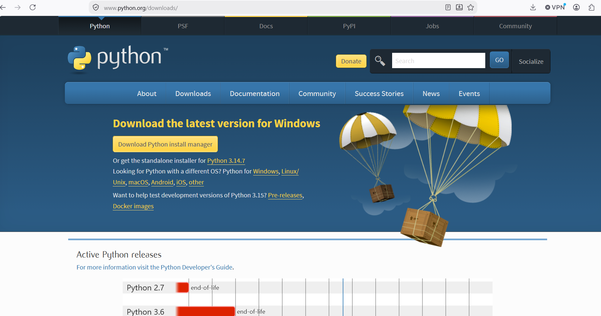
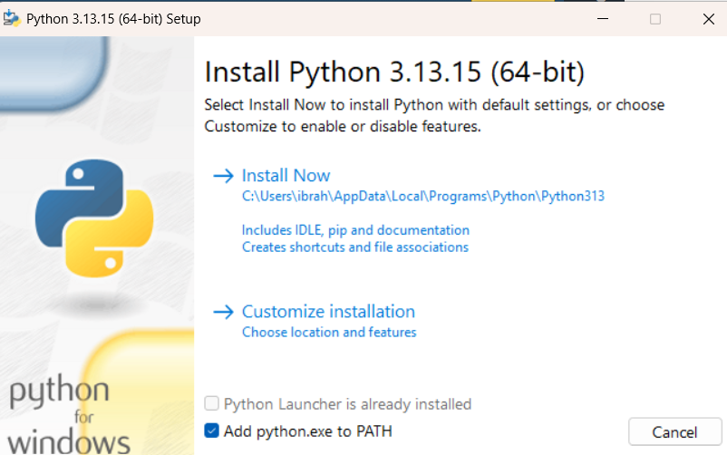
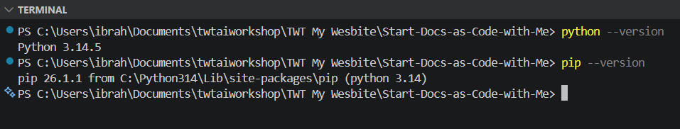
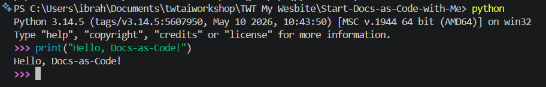
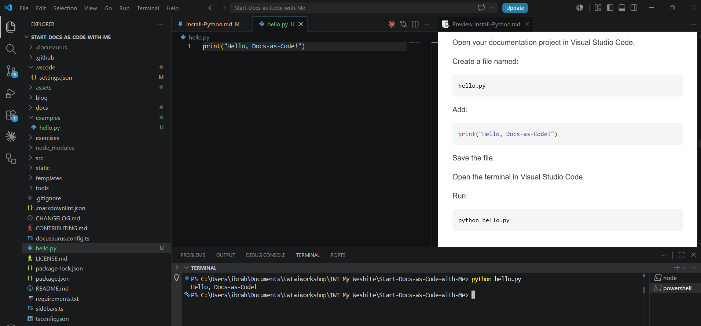
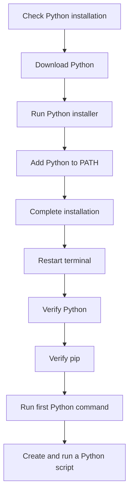

> **Lesson level:** Beginner
>
> **Time to complete:** 20–30 minutes
>
> **Prerequisites:** A Windows computer and administrator access if required by your organization.

---

## Learning objectives

After you complete this lesson, you will be able to:

- Understand what Python is.
- Understand why Technical Writers may use Python.
- Check whether Python is already installed.
- Download Python from the official source.
- Install Python on Windows.
- Configure Python correctly during installation.
- Verify the Python installation.
- Verify `pip`.
- Run your first Python command.
- Fix common Python installation problems.

---

## What is Python?

Python is a programming language used for many different types of work, including automation, data processing, testing, web development, and artificial intelligence.

For Technical Writers, Python can be useful when documentation work involves repetitive tasks or large amounts of content.

For example, you might use Python to:

- Process Markdown files.
- Check links.
- Rename or organize files.
- Extract information from structured data.
- Generate documentation.
- Validate documentation.
- Process API data.
- Automate repetitive documentation tasks.
- Support AI and automation workflows.

You do not need to become a software developer to benefit from Python.

The goal in this course is to understand enough Python to use it confidently as part of a modern documentation workflow.

---

## Why use Python for documentation?

Documentation teams often work with many files, APIs, repositories, and content sources.

Some tasks are easy to perform manually when you have a few files. They become much less practical when you have hundreds or thousands of files.

Python can help automate these tasks.

For example:

```text
Documentation files
        │
        ▼
     Python
        │
        ├── Check content
        ├── Process data
        ├── Generate files
        └── Report results
```

This is particularly useful when Python is combined with Git, GitHub Actions, APIs, and AI tools.

> **Best Practice**
>
> Start with small automation tasks.
>
> Make sure you understand what a script does before you use it on important documentation.

---

## Before you begin

You need:

| Requirement | Required |
| --- | --- |
| Windows computer | Yes |
| Internet connection | Yes |
| Administrator access | Recommended |
| Terminal | Yes |
| Python | No |
| Git | Recommended |
| Visual Studio Code | Recommended |

Python does not need to be installed before this lesson. Installing Python is the purpose of this lesson.

---

## Step 1 — Check whether Python is already installed

Before installing Python, check whether it is already available on your computer.

Open **PowerShell** or **Command Prompt**.

Run:

```bash
python --version
```

You can also try:

```bash
py --version
```

Expected result:

If Python is installed, you should see a version number.

For example:

```text
Python 3.13.x
```

The exact version may be different on your computer.

If you see a Python version, you may already have Python installed.

If the command is not recognized, continue with the installation.

:::note

Some Windows installations use the `py` command to start Python. This is why it is useful to check both `python` and `py`.

:::

---

## Step 2 — Download Python

Download Python from the official Python website.



Go to:

[Download Python](https://www.python.org/downloads/)

Select the Windows download that matches your computer.

The Python website may show a newer version than the examples in this lesson.

:::important

Download Python from the official Python website.

Avoid downloading Python from unknown websites.

:::

---

## Step 3 — Start the Python installer

After the download finishes:

1. Open the downloaded installer.
2. Review the installation options.
3. Make sure the option to add Python to your PATH is selected.

   

4. Select **Install Now**.

The installer may request administrator permission.

If Windows displays a security prompt, review the information before continuing.

---

## Step 4 — Add Python to PATH

This is an important step for Windows users.

The Python installer includes an option similar to:

```text
Add python.exe to PATH
```

Make sure this option is selected before you install Python.

### Why does PATH matter?

PATH is an operating system setting that tells Windows where to find programs when you run commands from a terminal.

For example, when you type:

```bash
python
```

Windows uses PATH to find the Python installation.

Without the correct PATH configuration, you may see an error such as:

```text
'python' is not recognized as an internal or external command
```

> **Best Practice**
>
> If you are installing Python for the first time on Windows, select the option to add Python to PATH during installation.

---

## Step 5 — Complete the installation

The installer will copy Python and its supporting files to your computer.

Wait for the installation to finish.

Expected result:

You should see a message indicating that the installation was successful.

Close the installer.

---

## Step 6 — Restart your terminal

If PowerShell or Command Prompt was already open while you installed Python, close it.

Open a new terminal window.

This is important because an existing terminal session may not have the updated PATH information.

---

## Step 7 — Verify Python

Open PowerShell or Command Prompt.

Run:

```bash
python --version
```

Expected result:

You should see a Python version.

For example:

```text
Python 3.14.x
```

The exact version may be different.

You can also run:

```bash
py --version
```

You should see a Python version here as well.



---

## Step 8 — Check where Python is installed

You can check which Python executable Windows is using.

Run:

```bash
where python
```

You may see one or more paths.

For example:

```text
C:\Users\YourName\AppData\Local\Programs\Python\Python313\python.exe
```

The exact path will depend on your installation.

### Why is this useful?

Knowing which Python installation your computer is using can help troubleshoot problems when you have more than one Python version installed.

---

## Step 9 — Verify pip

Python normally includes `pip`, the Python package installer.

Packages are reusable pieces of software that can extend what Python can do.

Check the `pip` version:

```bash
pip --version
```

You can also use:

```bash
python -m pip --version
```

Expected result:

You should see a version number and the location of the Python installation.

For example:

```text
pip 26.x from ... (python 3.14)
```


The exact version will vary.

> **Best Practice**
>
> Using `python -m pip` can make it clearer which Python installation is being used.

---

## Step 10 — Run your first Python command

You have now installed Python.

Let's make sure Python can execute a command.

Run:

```bash
python
```

You should see the Python interactive prompt.

It looks similar to:

```text
>>>
```

Enter:

```python
print("Hello, Docs-as-Code!")
```

Press **Enter**.

Expected result:

You should see:

```text
Hello, Docs-as-Code!
```



To exit Python, enter:

```python
exit()
```

Or press:

```text
Ctrl + Z
```

and then **Enter** on Windows.

---

## Step 11 — Create a simple Python file

Now create a small Python file.

Open your documentation project in Visual Studio Code.

Create a file named:

```text
hello.py
```

Add:

```python
print("Hello, Docs-as-Code!")
```

Save the file.

Open the terminal in Visual Studio Code.

Run:

```bash
python hello.py
```

Expected result:

The terminal displays:

```text
Hello, Docs-as-Code!
```



You have now created and executed your first Python script.

---

## Step 12 — Understand the Python file

The file contains:

```python
print("Hello, Docs-as-Code!")
```

The `print()` function tells Python to display information in the terminal.

This is a very simple example, but the same basic approach is used when Python scripts perform documentation automation tasks.

For example:

```text
Python script
     │
     ▼
Read files
     │
     ▼
Process information
     │
     ▼
Create or update output
```

Later in this learning journey, you will use similar concepts for automation and AI-assisted documentation workflows.

---

## Python and your documentation workflow

Python becomes more useful when you combine it with the other tools in this course.

For example:

```text
Markdown
   │
   ▼
Git
   │
   ▼
GitHub
   │
   ▼
Python automation
   │
   ▼
GitHub Actions
   │
   ▼
Published documentation
```

This is one of the reasons Python is included in the environment setup.

:::tip

You are not learning Python in isolation.

You are building a toolset that you can use as a Technical Writer.

:::

---

## Python packages

Python has a large ecosystem of packages.

A package provides functionality that you can add to your Python project instead of writing everything yourself.

For example, a project might use packages for:

- Reading files.
- Working with JSON.
- Calling APIs.
- Processing documents.
- Testing.
- Data analysis.
- AI applications.

You can install packages using `pip`.

For example:

```bash
python -m pip install requests
```

:::important

Do not install packages simply because they are available.

First understand what the package does and whether your project actually needs it.

:::

---

## Virtual environments

As you start working with Python projects, you will come across **virtual environments**.

A virtual environment creates an isolated Python environment for a project.

This helps prevent packages installed for one project from affecting another project.

A common command is:

```bash
python -m venv .venv
```

You do not need to create a virtual environment for this installation lesson.

You will learn about virtual environments when they become relevant to a Python project.

> **Documentation practice**
>
> When documenting Python projects, always explain whether users need to create and activate a virtual environment before installing project dependencies.

---

## Python installation workflow



---

## Common installation problems

<details>
<summary><strong>1. Python is not recognized</strong></summary>

Cause:

Python may not be installed, or Python may not have been added to the Windows PATH.

Solution:

Close PowerShell or Command Prompt.

Open a new terminal window.

Run:

```bash
python --version
```

If that does not work, try:

```bash
py --version
```

If neither command works:

1. Reinstall Python.
2. Make sure **Add python.exe to PATH** is selected during installation.
3. Complete the installation.
4. Close the terminal.
5. Open a new terminal.
6. Run the version command again.

</details>

<details>
<summary><strong>2. Python is installed but the terminal still cannot find it</strong></summary>

Cause:

The terminal may have been open while Python was installed.

The existing terminal session may not have the updated PATH information.

Solution:

Close PowerShell or Command Prompt.

Open a new terminal window.

Run:

```bash
python --version
```

If the problem continues, restart Windows and try again.

</details>

<details>
<summary><strong>3. The Microsoft Store opens when I run python</strong></summary>

Cause:

Windows may be using an app execution alias instead of the Python installation.

Solution:

First check whether the Python launcher works:

```bash
py --version
```

If `py` works, you can use:

```bash
py
```

or:

```bash
py hello.py
```

If you want the `python` command to work as well, check your Python installation and Windows app execution alias settings.

</details>

<details>
<summary><strong>4. pip is not recognized</strong></summary>

Cause:

The `pip` command may not be available directly from PATH.

Solution:

Try:

```bash
python -m pip --version
```

If this works, use:

```bash
python -m pip
```

instead of:

```bash
pip
```

For example:

```bash
python -m pip install requests
```

</details>

<details>
<summary><strong>5. Python installation is blocked by my organization</strong></summary>

Cause:

Your computer may be managed by your organization.

Your organization may restrict software installation or require administrator approval.

Solution:

Contact your IT team.

Ask whether Python can be installed on your computer.

Do not bypass your organization's security controls.

</details>

<details>
<summary><strong>6. I have more than one Python version installed</strong></summary>

Cause:

Python may have been installed more than once, or another application may have installed its own Python environment.

Solution:

Check which Python installations Windows can find:

```bash
where python
```

You can also check the Python launcher:

```bash
py --list
```

Review the results before removing or changing any installation.

Do not delete a Python installation simply because it is not the version you expected.

</details>

<details>
<summary><strong>7. A Python script does not run in Visual Studio Code</strong></summary>

Cause:

Visual Studio Code may not be using the Python installation you expect.

Solution:

Check that Python is installed:

```bash
python --version
```

Then check the Python interpreter selected in Visual Studio Code.

In Visual Studio Code:

1. Open the Command Palette.
2. Search for **Python: Select Interpreter**.
3. Select the Python installation you want to use.
4. Open a new terminal.
5. Run the script again.

</details>

---

## Best practices

- Download Python from the official Python website.
- Use a supported Python version for your project.
- Add Python to PATH when appropriate on Windows.
- Restart the terminal after installing Python.
- Verify Python before installing packages.
- Use `python -m pip` when you need to be certain which Python installation is being used.
- Use virtual environments for project-specific dependencies.
- Do not install unnecessary packages.
- Keep project dependencies documented.
- Review Python scripts before running them on important documentation files.

> **Best Practice**
>
> As a Technical Writer, treat automation scripts as part of your documentation tooling.
>
> Keep them in version control, document what they do, and review changes before using them on production content.

---

## Key terms

| Term | Definition |
| --- | --- |
| Python | A programming language used for automation, software development, data processing, and many other tasks. |
| Python interpreter | The software that reads and executes Python code. |
| pip | The package installer used to install Python packages. |
| Package | Reusable software that provides additional functionality for Python projects. |
| PATH | An operating system setting that tells Windows where to find executable programs. |
| Python script | A file containing Python code that can be executed by the Python interpreter. |
| Virtual environment | An isolated Python environment used to manage project-specific packages and dependencies. |
| Terminal | A text-based interface used to run commands and programs. |
| PowerShell | A Windows command-line shell used to run commands and scripts. |

---

## Summary

In this lesson, you learned how to:

- Understand what Python is.
- Understand how Python can support documentation work.
- Check whether Python is already installed.
- Download Python.
- Install Python on Windows.
- Add Python to PATH.
- Verify the Python installation.
- Verify `pip`.
- Run your first Python command.
- Create and run a Python script.
- Troubleshoot common installation problems.

You now have Python installed and are ready to use it as part of your documentation development environment.

---

## Knowledge check

<details>
<summary><strong>1. What is Python?</strong></summary>

Python is a programming language that can be used for automation, software development, data processing, artificial intelligence, and many other tasks.

</details>

<details>
<summary><strong>2. Why can Python be useful for Technical Writers?</strong></summary>

Python can automate repetitive documentation tasks, process files and data, work with APIs, validate content, and support larger documentation workflows.

</details>

<details>
<summary><strong>3. Which command checks the Python version?</strong></summary>

```bash
python --version
```

You can also use:

```bash
py --version
```

</details>

<details>
<summary><strong>4. Why should you restart the terminal after installing Python?</strong></summary>

A terminal that was already open may not have the updated PATH information. Opening a new terminal allows Windows to use the updated environment settings.

</details>

<details>
<summary><strong>5. What is pip?</strong></summary>

`pip` is the package installer used to install Python packages.

For example:

```bash
python -m pip install requests
```

</details>

<details>
<summary><strong>6. What does PATH do?</strong></summary>

PATH tells the operating system where to find executable programs when you run commands from a terminal.

</details>

<details>
<summary><strong>7. What command checks which Python executable Windows is using?</strong></summary>

```bash
where python
```

</details>

<details>
<summary><strong>8. What is a Python virtual environment?</strong></summary>

A virtual environment is an isolated Python environment used to manage packages and dependencies for a specific project.

</details>

<details>
<summary><strong>9. How can you run a Python script named hello.py?</strong></summary>

Run:

```bash
python hello.py
```

</details>

<details>
<summary><strong>10. Why should you review Python scripts before running them?</strong></summary>

A Python script can read, modify, create, or delete files. Reviewing the script helps you understand what it will do before you run it against important documentation or project files.

</details>

---

## Practice exercise

Complete the following tasks:

1. Check whether Python is already installed.
2. Download Python from the official Python website.
3. Install Python.
4. Make sure Python is added to PATH.
5. Open a new terminal.
6. Verify Python using `python --version`.
7. Verify the Python launcher using `py --version`.
8. Verify `pip` using `python -m pip --version`.
9. Open Visual Studio Code.
10. Create a file named `hello.py`.
11. Add a simple `print()` statement.
12. Run the Python script from the terminal.
13. Confirm that the expected message appears.
14. Add a short note to your project explaining the Python version you installed.

---

## Documentation exercise

As a Technical Writer, document the installation process you just completed.

Create a short Markdown file containing:

- The Python version you installed.
- Your operating system.
- The command you used to verify Python.
- The command you used to verify `pip`.
- Any installation problem you encountered.
- How you resolved the problem.

This is a small but useful Docs-as-Code exercise.

You are not only learning how to install a tool. You are practising how to document a technical procedure so that another person can repeat it.

---

## AI-assisted documentation practice

AI can help with technical documentation, but it should not replace your technical judgement.

Try asking an AI assistant:

```text
Explain the difference between Python, pip, and a Python package
for a beginner Technical Writer.
```

Then review the answer.

Check it for:

- Accuracy
- Completeness
- Terminology
- Style
- Audience
- Technical correctness

The purpose of this exercise is not simply to generate text.

It is to practice using AI as a documentation tool while applying your own editorial and technical judgement.

> **Documentation practice**
>
> AI can help you draft, explain, reorganize, and review content.
>
> The Technical Writer remains responsible for the final documentation.

---

In the next lessons, you will check that the tools installed during the Environment Setup module are working together correctly.

You will verify the development environment before moving on to Markdown, Git, GitHub, and the Docs-as-Code workflow.
