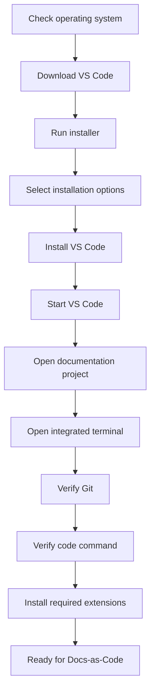

# Install Visual Studio Code

> **Lesson level:** Beginner
>
> **Time to complete:** 20–30 minutes
>
> **Prerequisites:** None

---

## Learning objectives

After you complete this lesson, you will be able to:

- Understand what Visual Studio Code is.
- Understand why technical writers use Visual Studio Code.
- Check whether your computer meets the basic requirements.
- Download Visual Studio Code.
- Install Visual Studio Code on Windows.
- Open a documentation project in Visual Studio Code.
- Open the integrated terminal.
- Verify that Git is available in Visual Studio Code.
- Use the `code` command from a terminal.
- Install extensions.
- Understand the basic VS Code interface.
- Prepare VS Code for Docs-as-Code work.
- Fix common installation problems.

---

## What is Visual Studio Code?

Visual Studio Code, commonly called **VS Code**, is a code editor developed by Microsoft.

Although VS Code is widely used by software developers, it is also a useful tool for technical writers working with documentation stored as files.

You can use VS Code to:

- Write Markdown.
- Edit configuration files.
- Work with Git repositories.
- Review changes.
- Work with documentation websites.
- Edit API specifications.
- Run terminal commands.
- Install extensions.
- Work with GitHub repositories.
- Work with AI-assisted documentation tools.

For a Docs-as-Code workflow, VS Code provides one place where you can edit content, work with files, run commands, and review changes.

---

## Why use VS Code for documentation?

Traditional documentation tools often separate writing, version control, and publishing.

A Docs-as-Code workflow brings these activities closer together.

For example, you might use VS Code to edit a Markdown file:

```text
docs/
│
├── introduction.md
├── getting-started.md
└── troubleshooting.md
```

You can then use the same environment to:

1. Edit the documentation.
2. Preview the changes.
3. Run a documentation build.
4. Review the Git changes.
5. Commit the changes.
6. Push the changes to GitHub.
7. Publish the documentation site.

This is one reason VS Code is useful for technical writers working in software teams.

:::tip

You do not need to become a software developer to use VS Code.

For this learning platform, you will use VS Code primarily as a documentation workspace.

:::

---

## VS Code and Git

VS Code includes built-in source control support for Git.

However, **Git must be installed separately**.

VS Code uses the Git installation on your computer.

If you completed the previous lesson, Git should already be installed.

You can check Git from the VS Code terminal by running:

```bash
git --version
```

You should see a Git version number.

For example:

```text
git version 2.55.0.windows.1
```

Your version may be different.

:::important

VS Code does not replace Git.

VS Code provides a graphical interface for working with Git, but Git itself must be installed on your computer.

:::

---

## Before you begin

You need:

| Requirement | Required |
| --- | --- |
| Computer | Yes |
| Internet connection | Yes |
| Windows, macOS, or Linux | Yes |
| Git | Recommended |
| Administrator access | Not normally required for Windows User setup |

This lesson uses **Windows** for the installation steps.

VS Code is also available for macOS and Linux.

---

### Step 1 — Check your operating system

VS Code supports Windows, macOS, and Linux.

For this lesson, check that you are using a supported version of Windows.

**Windows**

Press:

**Windows + R**

Type:

```text
winver
```

Select **OK**.

Windows displays information about your operating system.

**Expected result**

A window displays your Windows version.

You can close the window after checking it.

---

### Step 2 — Download Visual Studio Code

Open your web browser.

Go to the official Visual Studio Code website:

https://code.visualstudio.com/

Select **Download for Windows**.

The VS Code website provides different installation options.

For most Windows users, the **User Setup** installer is the recommended option.

The User Setup installation is installed for your Windows user account and normally does not require administrator permissions.

:::tip

Download Visual Studio Code from the official Visual Studio Code website.

Avoid downloading the installer from third-party websites.

:::

---

### Step 3 — Start the VS Code installer

After the download finishes:

1. Open the downloaded installer.
2. Review the Windows security prompt if one appears.
3. Select **Yes** if you want to continue.
4. Read the license agreement.
5. Accept the agreement.
6. Select **Next**.

The exact installer screens may change between VS Code releases.

---

### Step 4 — Choose the installation location

The installer asks where you want to install VS Code.

For a normal User Setup installation, you can keep the default location.

For example:

```text
C:\Users\<username>\AppData\Local\Programs\Microsoft VS Code
```

Select **Next**.

:::tip

You normally do not need to change the installation location.

Keeping the default location makes future troubleshooting easier.

:::

---

### Step 5 — Select additional tasks

The installer may display options for additional tasks.

These options can include creating shortcuts and adding VS Code to the PATH.

If the installer provides an option to add VS Code to your PATH, keep it selected.

Adding VS Code to PATH allows you to use the `code` command from a terminal.

For example:

```bash
code .
```

This command opens the current folder in VS Code.

Select **Next**.

---

### Step 6 — Install Visual Studio Code

Review the installation options.

Select **Install**.

Wait for the installation to finish.

When the installation is complete, select **Finish**.

VS Code may start automatically.

---

### Step 7 — Start Visual Studio Code

If VS Code did not start automatically:

1. Open the Windows Start menu.
2. Search for:

```text
Visual Studio Code
```

3. Select **Visual Studio Code**.

VS Code opens.

You should see the VS Code welcome or start screen.

---

### Step 8 — Understand the VS Code interface

The VS Code interface contains several areas that you will use regularly.

The names and appearance can change slightly between releases, but the main concepts remain similar.

| Area | Purpose |
| --- | --- |
| Activity Bar | Provides access to Explorer, Search, Source Control, Run and Debug, Extensions, and other views. |
| Explorer | Displays the files and folders in your project. |
| Editor | The main area where you edit files. |
| Panel | Displays terminals, problems, output, and other information. |
| Status Bar | Displays information about the current file, Git branch, errors, and other status information. |

You do not need to learn every VS Code feature before continuing.

The important thing is to become comfortable opening files, editing them, and using the terminal.

---

### Step 9 — Open your documentation project

The recommended way to work with documentation is to open the **project folder**, rather than opening individual files one at a time.

In VS Code:

1. Select **File**.
2. Select **Open Folder**.
3. Navigate to your project folder.
4. Select the folder.
5. Select **Select Folder**.

For example:

```text
C:\Projects\my-documentation-project
```

The project appears in the Explorer.

You should now be able to see the files and folders that make up the project.

---

### Step 10 — Open the integrated terminal

VS Code includes an integrated terminal.

This means you can run commands without opening a separate Command Prompt or PowerShell window.

To open the terminal:

1. Select **Terminal** from the top menu.
2. Select **New Terminal**.

A terminal panel opens at the bottom of the VS Code window.

Depending on your configuration, the terminal may use PowerShell, Command Prompt, Git Bash, or another available shell.

---

### Step 11 — Check Git from VS Code

Run:

```bash
git --version
```

### Expected result

You should see the Git version installed on your computer.

For example:

```text
git version 2.55.0.windows.1
```

If you see a Git version, VS Code can find your Git installation.

If you receive an error that Git is not recognized, see the **Common installation problems** section later in this lesson.

---

### Step 12 — Check the VS Code command-line interface

VS Code provides a command-line interface.

The main command is:

```bash
code
```

You can check whether the command is available by running:

```bash
code --version
```

**Expected result**

VS Code displays version information.

The output may contain the VS Code version, commit information, and architecture.

For example:

```text
1.130.0
xxxxxxxxxxxxxxxx
x64
```

Your version will probably be different.

---

### Step 13 — Open a folder using the `code` command

The `code` command can open a folder directly from a terminal.

Navigate to a project folder.

For example:

```bash
cd C:\Projects\my-documentation-project
```

Then run:

```bash
code .
```

The period means:

> Open the current folder.

**Expected result**

VS Code opens the folder as a project.

This command becomes useful when you work regularly from the terminal.

For example, you might use:

```bash
cd C:\Projects\my-documentation-project
code .
```

instead of opening VS Code first and then selecting the folder.

---

### Step 14 — Open a Markdown file

In the Explorer, find a Markdown file.

For example:

```text
README.md
```

Select the file.

VS Code opens the file in the editor.

You can now edit the Markdown content.

For example:

```md
# My Documentation

This is my first documentation project.
```

Save the file with:

```text
Ctrl + S
```

---

### Step 15 — Preview Markdown

VS Code provides Markdown preview functionality.

Open a Markdown file.

Then use:

```text
Ctrl + Shift + V
```

This opens the Markdown preview.

You can also use:

```text
Ctrl + K
```

followed by:

```text
V
```

to open the preview to the side.

:::important

VS Code's standard Markdown preview does not always behave exactly like Docusaurus.

Docusaurus uses **MDX**, which supports additional syntax and components.

If your documentation uses Docusaurus-specific features such as custom components, `<details>` blocks, or imported images, always check the final result in the Docusaurus site as well.

:::

---

### Step 16 — Install extensions

One of the useful features of VS Code is its extension system.

Extensions add functionality to VS Code.

For example, extensions can provide:

- Markdown support.
- Spell checking.
- Git improvements.
- API tools.
- Language support.
- Formatting.
- Documentation previews.
- AI-assisted development.

To open the Extensions view:

1. Select the **Extensions** icon in the Activity Bar.
2. Search for an extension.
3. Review the extension information.
4. Select **Install**.

---

## Which extensions should technical writers install?

Do not install a large number of extensions just because they are available.

Start with the tools you actually need.

For this learning platform, useful categories include:

| Category | Why it can help |
| --- | --- |
| Markdown | Write and preview Markdown documentation. |
| Spell checking | Find spelling mistakes in documentation. |
| Git | Review and manage documentation changes. |
| YAML | Edit configuration files. |
| JSON | Edit structured data and API examples. |
| REST/API | Work with API requests and specifications. |
| AI | Assist with documentation and development tasks. |

The specific extensions you use may change as your workflow develops.

:::tip

Keep your extension list manageable.

Every extension adds functionality to your development environment. Install extensions because they solve a real problem in your workflow.

:::

---

### Step 17 — Install a Markdown extension

VS Code already includes Markdown support.

You can use the built-in Markdown features without installing another extension.

Before adding an extension, try the built-in functionality:

1. Open a `.md` file.
2. Edit the Markdown.
3. Use the Markdown preview.
4. Check whether the built-in features meet your needs.

If you later need additional Markdown functionality, you can install an extension from the Visual Studio Marketplace.

---

### Step 18 — Check the Source Control view

VS Code includes a Source Control view for Git.

Select the **Source Control** icon in the Activity Bar.

If you opened a Git repository, VS Code should detect it.

You can use this view to:

- See changed files.
- Review file changes.
- Stage changes.
- Commit changes.
- Manage branches.
- Sync with a remote repository.

For example, if you change:

```text
README.md
```

VS Code can show that the file has been modified.

:::important

The Source Control view is an interface for Git.

The underlying version control system is still Git.

Understanding basic Git commands is important even if you prefer to use the VS Code interface.

:::

---

### Step 19 — Check your documentation workflow

At this point, you have the basic tools needed to work on a Docs-as-Code project.

Your workflow can look like this:

```text
Open project
     │
     ▼
Edit Markdown
     │
     ▼
Preview documentation
     │
     ▼
Review changes
     │
     ▼
Run documentation build
     │
     ▼
Commit changes with Git
     │
     ▼
Push to GitHub
     │
     ▼
Publish documentation
```

This workflow will become more detailed as you progress through the course.

---

### Step 20 — Configure VS Code for documentation work

You do not need to change many settings when you first install VS Code.

Start with the defaults.

As you become more familiar with the environment, you may want to adjust:

- Font size.
- Word wrapping.
- Editor appearance.
- Markdown preview settings.
- Auto-save.
- Terminal settings.
- File exclusions.
- Formatting.
- Accessibility settings.

You can open Settings by using:

```text
Ctrl + ,
```

You can also open the Command Palette with:

```text
Ctrl + Shift + P
```

The Command Palette is useful when you know what you want to do but do not remember where the command is located.

---

### Step 21 — Learn the Command Palette

The Command Palette provides access to many VS Code commands.

Open it with:

```text
Ctrl + Shift + P
```

Try searching for:

```text
Markdown
```

You will see available Markdown-related commands.

You can also search for:

```text
Git
```

or:

```text
Terminal
```

This is one of the easiest ways to discover VS Code features.

:::tip

You do not need to memorize every VS Code command.

Use the Command Palette when you know what you want to do but are not sure where to find the feature.

:::

---

## VS Code installation workflow



---

## Common installation problems

<details>
<summary><strong>1. VS Code does not start after installation</strong></summary>

**Cause**

The installation may not have completed correctly, or Windows may not have created the expected application entry.

**Solution**

Try the following:

1. Close the installer.
2. Open the Windows Start menu.
3. Search for **Visual Studio Code**.
4. Start VS Code again.

If VS Code is not listed:

1. Download the installer again from the official Visual Studio Code website.
2. Run the installer.
3. Complete the installation again.

If your organization manages your computer, contact your IT team if you cannot install the application.

</details>

<details>
<summary><strong>2. Windows displays a security warning</strong></summary>

**Cause**

Windows may display a security prompt when you install software downloaded from the internet.

**Solution**

Make sure you downloaded VS Code from the official Visual Studio Code website.

Check the publisher information shown by Windows.

If your organization manages your computer, contact your IT team before continuing.

Do not bypass your organization's security controls.

</details>

<details>
<summary><strong>3. The <code>code</code> command is not recognized</strong></summary>

**Cause**

The VS Code command-line tools may not have been added to your PATH, or your terminal was open before VS Code was installed.

**Solution**

First, close the terminal.

Open a new PowerShell or Command Prompt window.

Run:

```bash
code --version
```

If the command still does not work:

1. Restart your computer.
2. Open a new terminal.
3. Run the command again.

If the problem continues, reinstall VS Code and make sure the installer option to add VS Code to PATH is enabled.

</details>

<details>
<summary><strong>4. VS Code cannot find Git</strong></summary>

**Cause**

Git may not be installed, or VS Code may not be able to find the Git installation.

**Solution**

Open the VS Code integrated terminal.

Run:

```bash
git --version
```

If Git is not recognized:

1. Check that Git is installed.
2. Restart VS Code.
3. Open a new terminal.
4. Run:

```bash
git --version
```

If the problem continues, verify your Git installation before continuing.

</details>

<details>
<summary><strong>5. I cannot open my documentation project</strong></summary>

**Cause**

You may have selected an individual file instead of the project folder, or you may have selected the wrong folder.

**Solution**

In VS Code:

1. Select **File**.
2. Select **Open Folder**.
3. Navigate to the folder that contains your documentation project.
4. Select the project folder.
5. Select **Select Folder**.

For example:

```text
C:\Projects\my-documentation-project
```

You should see the project files and folders in the Explorer.

</details>

<details>
<summary><strong>6. My Markdown preview does not look like the Docusaurus site</strong></summary>

**Cause**

VS Code's standard Markdown preview and Docusaurus do not process exactly the same content.

Docusaurus uses MDX, which provides additional functionality on top of Markdown.

**Solution**

Use the VS Code Markdown preview for a quick check of standard Markdown.

For the final result, check the documentation in the running Docusaurus site.

This is particularly important when your page contains:

- MDX components.
- HTML.
- `<details>` elements.
- Imported images.
- Docusaurus-specific features.
- Custom React components.

</details>

<details>
<summary><strong>7. An extension does not work as expected</strong></summary>

**Cause**

The extension may be incompatible with your VS Code version, another extension, or your project configuration.

**Solution**

Try the following:

1. Open the Extensions view.
2. Find the extension.
3. Check whether an update is available.
4. Update the extension.
5. Restart VS Code.

If the problem continues, temporarily disable the extension and check whether the problem disappears.

Do not install several extensions to solve the same problem without first identifying what is causing the issue.

</details>

<details>
<summary><strong>8. VS Code looks different from the screenshots in this lesson</strong></summary>

**Cause**

VS Code changes over time as new versions are released.

The interface can also vary depending on your operating system, installed extensions, settings, and account configuration.

**Solution**

Do not worry if your screen does not look exactly like the screenshots.

Look for the equivalent:

- Explorer
- Search
- Source Control
- Run and Debug
- Extensions
- Editor
- Terminal
- Settings

The important thing is to understand what each part of the application is used for.

</details>

---

## Best practices for technical writers

Use VS Code as part of your documentation workflow rather than simply as a text editor.

Keep the following practices in mind:

- Open the entire project folder.
- Keep documentation files organized.
- Use Markdown consistently.
- Preview your documentation before committing changes.
- Review Git changes before committing.
- Keep extensions to a useful minimum.
- Keep VS Code updated.
- Keep Git updated.
- Do not store passwords or API keys in documentation files.
- Do not commit secrets to Git repositories.
- Check the final published documentation, not only the source Markdown.
- Follow your team's review and approval process before publishing.

:::tip

A good Docs-as-Code workflow is not about using as many tools as possible.

The goal is to create a workflow that makes documentation easier to write, review, maintain, version, translate, and publish.

:::

---

## VS Code in the Docs-as-Code workflow

VS Code is one part of the larger documentation workflow.

For this learning platform, the workflow will gradually develop into something like this:

```text
Technical Writer
       │
       ▼
Visual Studio Code
       │
       ▼
Markdown / MDX
       │
       ▼
Git
       │
       ▼
GitHub
       │
       ├── Pull Request
       │
       ├── Review
       │
       └── GitHub Actions
       │
       ▼
Docusaurus
       │
       ▼
Published Documentation
```

This is why we install VS Code early in the learning journey.

It becomes the main workspace where you create and maintain the documentation source files.

---

## Key terms

| Term | Definition |
| --- | --- |
| Visual Studio Code | A source-code editor that can also be used to create and maintain documentation. |
| VS Code | The common short name for Visual Studio Code. |
| Editor | The main area where you view and modify files. |
| Explorer | The VS Code view that displays files and folders in a project. |
| Integrated Terminal | A terminal built into VS Code. |
| Extension | An add-on that provides additional functionality in VS Code. |
| Source Control | The VS Code interface for working with version control systems such as Git. |
| Command Palette | A VS Code interface that provides access to commands and features. |
| PATH | An operating system setting that allows command-line applications to be found from a terminal. |
| Markdown | A lightweight markup language commonly used for documentation. |
| MDX | Markdown with support for JSX and React components. |
| Git | A version control system used to track changes to files. |
| GitHub | A platform for hosting Git repositories and collaborating on projects. |

---

## Summary

In this lesson, you learned how to:

- Understand what Visual Studio Code is.
- Understand why technical writers can use VS Code.
- Download VS Code from the official website.
- Install VS Code on Windows.
- Start VS Code.
- Open a documentation project.
- Use the integrated terminal.
- Verify Git from VS Code.
- Verify the `code` command.
- Open a project using `code .`.
- Edit Markdown files.
- Preview Markdown.
- Install extensions.
- Use the Source Control view.
- Use the Command Palette.
- Troubleshoot common installation problems.

You now have a working development environment for the documentation work in this course.

---

## Knowledge check

<details>
<summary><strong>1. What is Visual Studio Code?</strong></summary>

Visual Studio Code is a source-code editor that can also be used to create and maintain documentation.

</details>

<details>
<summary><strong>2. Why can technical writers use VS Code?</strong></summary>

Technical writers can use VS Code to write Markdown, manage documentation files, work with Git, run terminal commands, preview content, and work with documentation tools such as Docusaurus.

</details>

<details>
<summary><strong>3. Does VS Code include Git?</strong></summary>

VS Code includes built-in source control support for Git, but Git itself must be installed separately on your computer.

</details>

<details>
<summary><strong>4. Which command checks whether Git is available?</strong></summary>

```bash
git --version
```

</details>

<details>
<summary><strong>5. Which command checks the VS Code command-line interface?</strong></summary>

```bash
code --version
```

</details>

<details>
<summary><strong>6. What does <code>code .</code> do?</strong></summary>

`code .` opens the current folder in Visual Studio Code.

</details>

<details>
<summary><strong>7. What is the integrated terminal?</strong></summary>

The integrated terminal is a terminal built into VS Code. It allows you to run commands without opening a separate terminal application.

</details>

<details>
<summary><strong>8. What is a VS Code extension?</strong></summary>

An extension is an add-on that provides additional functionality, such as language support, formatting, spell checking, API tools, or AI features.

</details>

<details>
<summary><strong>9. Why should you open the project folder instead of only opening one Markdown file?</strong></summary>

Opening the project folder gives VS Code access to the complete project structure and allows features such as Git, search, extensions, and project-specific configuration to work correctly.

</details>

<details>
<summary><strong>10. Why should you check the Docusaurus site instead of relying only on the VS Code Markdown preview?</strong></summary>

Docusaurus uses MDX and may process content differently from the standard VS Code Markdown preview. The Docusaurus site shows the result that users will actually see.

</details>

---

## Practice exercise

Complete the following tasks:

1. Download Visual Studio Code.
2. Install Visual Studio Code.
3. Start VS Code.
4. Open a documentation project.
5. Open the integrated terminal.
6. Run:

```bash
git --version
```

7. Run:

```bash
code --version
```

8. Open a Markdown file.
9. Add a short paragraph.
10. Save the file.
11. Open the Markdown preview.
12. Open the Source Control view.
13. Open the Command Palette.
14. Search for `Markdown`.
15. Search for `Git`.
16. Open the Extensions view.
17. Review the available Markdown extensions.
18. Install only the extensions you actually need.

When you finish, you should be comfortable using VS Code as your documentation workspace.

---

# Next lesson

In the next lessonS, you will install Cursor and learn how an AI-assisted development environment can support technical writing and documentation work.

You will also compare Cursor with VS Code and understand how the two tools can fit into an AI-assisted Docs-as-Code workflow.

---

# References

- [Visual Studio Code](https://code.visualstudio.com/)
- [Installing Visual Studio Code on Windows](https://code.visualstudio.com/docs/setup/windows)
- [Visual Studio Code requirements](https://code.visualstudio.com/docs/supporting/requirements)
- [Visual Studio Code command-line interface](https://code.visualstudio.com/docs/configure/command-line)
- [Source Control in VS Code](https://code.visualstudio.com/docs/sourcecontrol/overview)
- [Getting started with the VS Code terminal](https://code.visualstudio.com/docs/terminal/getting-started)
