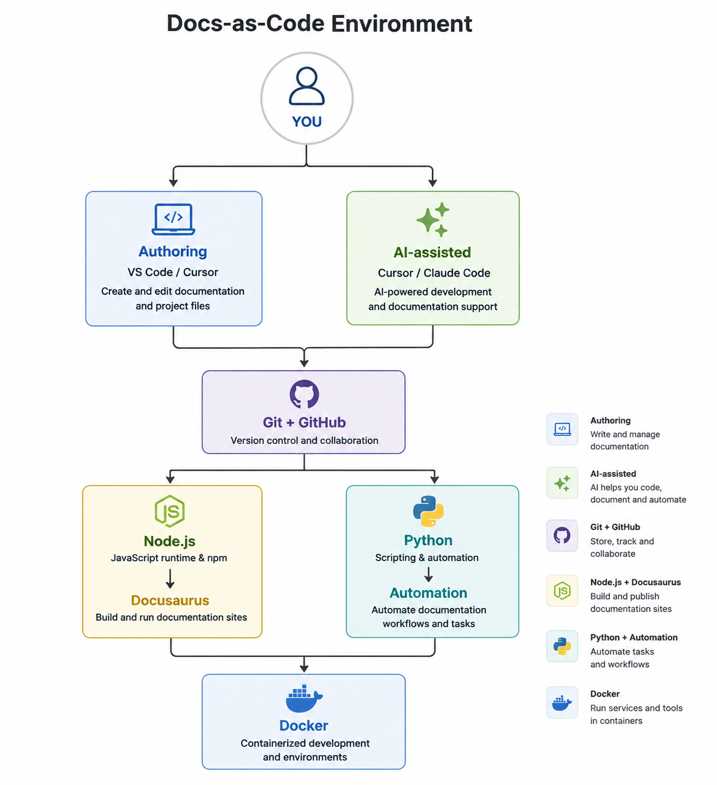

# Module 2 · Environment Setup

Before you start building documentation, you need a working development environment.

In this module, you will install the tools used throughout this learning journey. You will also verify each installation so that your environment is ready for the documentation, Git, automation, and AI-assisted workflows introduced in later modules.

---

## Learning Objectives

After completing this module, you will be able to:

* Install and configure the required development tools.
* Use Git for version control.
* Connect your local environment to GitHub.
* Install the tools required to build Docusaurus sites.
* Set up Python for documentation automation.
* Set up Docker for containerized development.
* Configure Cursor for AI-assisted development.
* Install and verify Claude Code.
* Verify that your complete development environment is working.

---

## Lessons

Complete the lessons in the order shown below.

| Lesson              | What you will do                                                   |
| ------------------- | ------------------------------------------------------------------ |
| Install VS Code     | Install the code editor used throughout the learning journey.      |
| Install Git         | Install Git and verify that it works from the terminal.            |
| Install GitHub      | Set up GitHub Desktop and connect it to your GitHub account.       |
| Install Node.js     | Install Node.js and npm for Docusaurus development.                |
| Install Python      | Install Python for documentation automation and scripting.         |
| Install Docker      | Install Docker and verify the Docker installation.                 |
| Install Cursor      | Install Cursor and prepare it for AI-assisted development.         |
| Install Claude Code | Install Claude Code and verify the command-line installation.      |
| Verify Installation | Check that the required tools are installed and working correctly. |

## Estimated Time

**45–60 minutes**

The time depends on your operating system, download speeds, and whether you already have any of the tools installed.

---

## Prerequisites

Complete **Module 1 · Welcome** before starting this module.

You should also have:

* A computer where you can install software.
* Permission to install applications on your computer.
* A GitHub account.

---

## Tools Used

You will install and use the following tools:

* **VS Code** — code editor
* **Git** — version control
* **GitHub** — remote repository and collaboration platform
* **Node.js** — JavaScript runtime and npm package manager
* **Python** — scripting and automation
* **Docker** — containerized development
* **Cursor** — AI-assisted code editor
* **Claude Code** — AI coding assistant

You do not need to become an expert in these tools during this module. You only need to install them and confirm that they work.

---

## Your Development Environment

By the end of this module, your local environment will contain the tools needed for the workflows used later in the learning journey.

The tools have different roles:

The diagram below shows how the tools introduced in this module fit into the development environment you will use throughout the learning journey.

| Area                    | Tools               | Purpose                                                      |
| ----------------------- | ------------------- | ------------------------------------------------------------ |
| Authoring               | VS Code, Cursor     | Create and edit documentation and project files.             |
| Version control         | Git, GitHub         | Track changes and collaborate on documentation projects.     |
| Build and publishing    | Node.js             | Build and run Docusaurus documentation sites.                |
| Automation              | Python              | Create scripts and automate documentation tasks.             |
| Containers              | Docker              | Run applications and development environments in containers. |
| AI-assisted development | Cursor, Claude Code | Support coding, documentation, and automation workflows.     |

:::note

You will learn how these tools work together as you progress through the later modules. You do not need to understand the complete Docs-as-Code workflow before completing this module.

:::

---

## Verify Your Environment

After completing the installation lessons, use **Verify Installation** to check your environment.

The verification step confirms that the required tools are available from your development environment before you continue to Module 2.

If a tool does not work as expected, use the troubleshooting information in the relevant installation lesson before continuing.

## Skills You'll Gain

By completing this module, you will gain practical experience with:

* Setting up a documentation development environment.
* Installing development tools.
* Working with command-line tools.
* Connecting local tools to GitHub.
* Verifying software installations.
* Preparing an environment for Docs-as-Code development.

## Next Module

Continue to **Module 3 · Markdown**.

In the next module, you will create and work with Markdown files. You will use the development environment configured in this module to create documentation content and see how Markdown becomes part of a Docs-as-Code workflow.

---

**Module 1 complete:** Your development environment is ready for the next stage of the learning journey.
