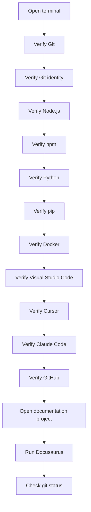

# Verify Installation

> **Lesson level:** Beginner
>
> **Time to complete:** 20–30 minutes
>
> **Prerequisites:** Complete the Environment Setup lessons before starting this lesson.

---

## Learning objectives

After you complete this lesson, you will be able to:

- Check that the required development tools are installed.
- Verify that the tools can be accessed from a terminal.
- Confirm that Git is configured correctly.
- Check that Node.js and npm are available.
- Check that Python and pip are available.
- Confirm that Docker Desktop is running.
- Confirm that Visual Studio Code is installed.
- Confirm that Cursor is installed.
- Confirm that GitHub can be accessed.
- Identify common installation problems.
- Record your development environment for future reference.

---

## Why verify your installation?

Installing a tool is only the first step.

Before you start building documentation, it is worth checking that the tools work from your development environment.

This is especially important when several tools depend on each other.

For example:

```text
Visual Studio Code
        │
        ├── Git
        ├── Node.js
        ├── npm
        ├── Python
        └── Documentation project
                 │
                 ▼
             Docusaurus
                 │
                 ▼
              GitHub
```

If one part of the environment is not working, you can usually fix it now rather than discovering the problem halfway through a documentation project.

> **Documentation practice**
>
> A good installation guide should not stop at "the software is installed."
>
> It should also explain how the reader can verify that the software works.

---

## Before you begin

Make sure you have completed the Environment Setup lessons.

You should have installed, where required:

| Tool | Purpose |
| --- | --- |
| Git | Version control |
| GitHub | Repository hosting and collaboration |
| Node.js | Runtime used by Docusaurus and other JavaScript tools |
| npm | Node.js package manager |
| Python | Automation and scripting |
| Docker Desktop | Containers and development environments |
| Visual Studio Code | Code and documentation editor |
| Cursor | AI-assisted development and documentation |
| Claude Code | AI-assisted command-line development |

You do not need to have every tool running at the same time.

The purpose of this lesson is to confirm that the required tools are available before you continue.

---

## Step 1 — Open a terminal

You can use either **PowerShell** or **Command Prompt** on Windows.

You can also use the integrated terminal in Visual Studio Code or Cursor.

In Visual Studio Code:

1. Open Visual Studio Code.
2. Select **Terminal** from the top menu.
3. Select **New Terminal**.

You should see a terminal window at the bottom of the application.

**Expected result**

You can enter commands in the terminal.

For example:

```bash
echo "Environment check"
```

You should see:

```text
Environment check
```

---

## Step 2 — Verify Git

Git is the version control system used throughout this learning project.

Run:

```bash
git --version
```

**Expected result**

You should see a Git version.

For example:

```text
git version 2.x.x
```

The exact version will depend on your installation.

If Git is not recognized, return to the **Install Git** lesson and troubleshoot the installation.

---

## Step 3 — Verify your Git identity

Git needs a name and email address to identify the author of commits.

Check your configured name:

```bash
git config --global user.name
```

Check your configured email:

```bash
git config --global user.email
```

**Expected result**

Both commands return the values you configured.

For example:

```text
Riffat Wyne
```

and:

```text
you@example.com
```

:::warning

Do not copy the example values into your own configuration.

Use the name and email address you want associated with your Git commits.

:::

---

## Step 4 — Verify Node.js

Node.js is required by Docusaurus and other JavaScript-based development tools used in this project.

Run:

```bash
node --version
```

**Expected result**

You should see a Node.js version.

For example:

```text
v22.x.x
```

The exact version may be different.

---

## Step 5 — Verify npm

npm is the package manager that comes with Node.js.

Run:

```bash
npm --version
```

**Expected result**

You should see an npm version.

For example:

```text
10.x.x
```

If `node` works but `npm` does not, check your Node.js installation before continuing.

---

## Step 6 — Verify Python

Python is used for scripting, automation, data processing, and AI-related workflows.

Run:

```bash
python --version
```

You can also try:

```bash
py --version
```

**Expected result**

You should see a Python version.

For example:

```text
Python 3.x.x
```

The exact version depends on your installation.

---

## Step 7 — Verify pip

`pip` is the Python package installer.

Run:

```bash
python -m pip --version
```

**Expected result**

You should see the installed pip version and the Python installation it belongs to.

For example:

```text
pip 25.x from ... (python 3.x)
```

Using:

```bash
python -m pip
```

helps make it clear which Python installation is being used.

---

## Step 8 — Verify Docker Desktop

Docker Desktop is used to run containers on your local computer.

First, make sure Docker Desktop is running.

Open the Windows Start menu.

Search for:

```text
Docker Desktop
```

Start the application.

Wait until Docker Desktop indicates that it is running.

Then open a terminal and run:

```bash
docker --version
```

**Expected result**

You should see a Docker version.

For example:

```text
Docker version xx.x.x
```

You can also check whether Docker is responding:

```bash
docker info
```

If Docker is running correctly, the command returns information about your Docker environment.

:::note

`docker --version` only confirms that the Docker command is available.

`docker info` provides a stronger check because it also confirms that the Docker engine is running.

:::

---

## Step 9 — Verify Visual Studio Code

Open Visual Studio Code.

Check that you can:

- Start the application.
- Open a folder.
- Open a Markdown file.
- Edit the file.
- Open the integrated terminal.

You can also check the command-line installation.

Run:

```bash
code --version
```

**Expected result**

Visual Studio Code displays version information.

If the `code` command is not available, you can still use Visual Studio Code normally.

The command-line integration is useful but is not required for every workflow.

---

## Step 10 — Verify Cursor

Open Cursor.

Check that you can:

- Start Cursor.
- Open your project folder.
- Open a Markdown file.
- Edit the file.
- Open the integrated terminal.
- Access the AI features available with your account.

You can also try:

```bash
cursor --version
```

If the command is available, Cursor should display its version.

If the command is not recognized, this does not necessarily mean that Cursor is not installed. The command-line integration may not be configured.

---

## Step 11 — Verify Claude Code

If you installed Claude Code, open a terminal and run:

```bash
claude --version
```

**Expected result**

Claude Code displays its installed version.

Then move into a project folder.

For example:

```bash
cd C:\Projects\my-documentation-project
```

Start Claude Code:

```bash
claude
```

Follow the authentication instructions if prompted.

:::important

AI tools can read and modify project files depending on the permissions and commands you provide.

Always review AI-generated changes before committing them to Git.

:::

---

## Step 12 — Verify GitHub access

GitHub is used to host the repository and collaborate on documentation.

Open your browser and sign in to GitHub.

You should be able to:

- Sign in.
- Open your repositories.
- Open the repository for this learning project.
- View files.
- View commits.
- View branches.

If you are working with Git from the command line, you can also verify your Git remote.

Move into your project folder:

```bash
cd C:\Projects\my-documentation-project
```

Run:

```bash
git remote -v
```

**Expected result**

You should see the remote repository address.

For example:

```text
origin  https://github.com/your-account/your-repository.git (fetch)
origin  https://github.com/your-account/your-repository.git (push)
```

Your repository address will be different.

---

## Step 13 — Verify your project folder

Now check that your documentation project is accessible from your development environment.

Open the project folder in Visual Studio Code or Cursor.

You should be able to see your project structure.

For example:

```text
Start-Docs-as-Code-with-Me/
│
├── docs/
├── src/
├── static/
├── .github/
├── package.json
├── docusaurus.config.ts
└── sidebars.ts
```

Your project may contain additional folders and files.

The important point is that the project opens without errors.

---

## Step 14 — Verify Markdown

Open one of your Markdown files.

For example:

```text
README.md
```

Make a small temporary change.

For example, add:

```markdown
## Environment verified
```

Save the file.

Confirm that the Markdown editor displays the file correctly.

If you are using Docusaurus, also check the generated documentation site after starting the development server.

---

## Step 15 — Verify Docusaurus

If your Docusaurus project is already configured, open a terminal in the project folder.

Install dependencies if required:

```bash
npm install
```

Then start the development server:

```bash
npm run start
```

Docusaurus should start the local development server.

The terminal normally displays a local address.

Open that address in your browser.

**Expected result**

Your documentation website opens locally.

You should be able to:

- Open the home page.
- Open the documentation.
- Navigate through the sidebar.
- Open Markdown pages.
- Use the search feature if it has been configured.
- Check that images load correctly.
- Check that links work.

Press:

```text
Ctrl + C
```

in the terminal when you want to stop the development server.

> **Best Practice**
>
> Run the local site before pushing major documentation changes to GitHub.
>
> It is much easier to fix a broken page locally than after publishing it.

---

## Step 16 — Check the Git status

From the project folder, run:

```bash
git status
```

**Expected result**

Git displays the current repository status.

If you made the temporary Markdown change earlier, you may see that file listed as modified.

For example:

```text
modified: docs/...
```

You can remove the temporary change or keep it if it is useful.

Do not commit test changes simply because you were checking whether Git works.

---

## Verification workflow



---

## Verification checklist

Use this checklist to record your results.

| Tool or check | Command or action | Result |
| --- | --- | --- |
| Git | `git --version` | ☐ Passed |
| Git name | `git config --global user.name` | ☐ Passed |
| Git email | `git config --global user.email` | ☐ Passed |
| Node.js | `node --version` | ☐ Passed |
| npm | `npm --version` | ☐ Passed |
| Python | `python --version` | ☐ Passed |
| pip | `python -m pip --version` | ☐ Passed |
| Docker | `docker --version` | ☐ Passed |
| Docker engine | `docker info` | ☐ Passed |
| Visual Studio Code | Open application | ☐ Passed |
| Cursor | Open application | ☐ Passed |
| Claude Code | `claude --version` | ☐ Passed |
| GitHub | Sign in and open repository | ☐ Passed |
| Documentation project | Open project folder | ☐ Passed |
| Docusaurus | `npm run start` | ☐ Passed |
| Git repository | `git status` | ☐ Passed |

---

## Common verification problems

<details>
<summary><strong>1. A command is not recognized</strong></summary>

**Cause**

The software may not be installed, or the terminal may not have the correct PATH information.

**Solution**

Close the terminal.

Open a new terminal window.

Run the command again.

For example:

```bash
git --version
```

If the command still does not work, return to the installation lesson for that tool.

</details>

<details>
<summary><strong>2. The version is different from the lesson</strong></summary>

**Cause**

Software versions change over time.

The version shown in a lesson may not be the version installed on your computer.

**Solution**

Do not assume that a different version means the installation failed.

Check whether the command works and whether the version is supported by your project.

For project-specific requirements, follow the version documented by the project.

</details>

<details>
<summary><strong>3. Docusaurus does not start</strong></summary>

**Cause**

There may be a dependency, configuration, or content problem in the project.

**Solution**

First make sure you are in the correct project folder.

Run:

```bash
npm install
```

Then try:

```bash
npm run start
```

Read the error message carefully.

If Docusaurus reports a problem with a specific Markdown file, check that file first.

</details>

<details>
<summary><strong>4. npm install reports errors</strong></summary>

**Cause**

The project dependencies may not have installed correctly.

**Solution**

Check that Node.js and npm are available:

```bash
node --version
```

```bash
npm --version
```

Then try:

```bash
npm install
```

If the problem continues, read the error message before deleting project files or reinstalling dependencies.

Do not remove the `node_modules` folder unless you understand why it is necessary.

</details>

<details>
<summary><strong>5. Docker is installed but docker info fails</strong></summary>

**Cause**

Docker Desktop may not be running.

**Solution**

Start Docker Desktop.

Wait until Docker Desktop indicates that it is running.

Then run:

```bash
docker info
```

If the command still fails, check the Docker Desktop status and review the error message.

</details>

<details>
<summary><strong>6. Git status shows unexpected changes</strong></summary>

**Cause**

You may have modified files while testing the environment.

Other changes may also have been made by your editor or development tools.

**Solution**

Run:

```bash
git status
```

Review the files carefully.

Do not delete or discard changes until you know what they are.

If you are unsure, leave the changes untouched and investigate them before committing.

</details>

<details>
<summary><strong>7. The documentation site works locally but not after publishing</strong></summary>

**Cause**

The local environment and publishing environment may not be identical.

The problem may also be related to paths, configuration, broken links, images, or the build process.

**Solution**

Run a production build:

```bash
npm run build
```

Review any errors reported by Docusaurus.

Fix the reported problem before pushing the change.

</details>

---

## Troubleshooting approach

When something does not work, avoid changing several things at once.

Use this approach:

```text
1. Read the error
      ↓
2. Identify the affected tool
      ↓
3. Check the version
      ↓
4. Check the installation
      ↓
5. Reproduce the problem
      ↓
6. Make one change
      ↓
7. Test again
```

This approach is useful beyond this course.

It is also a good habit when troubleshooting documentation builds and CI/CD pipelines.

> **Documentation Manager's Tip**
>
> When troubleshooting with developers, provide the exact command you ran and the exact error message.
>
> "It doesn't work" is difficult to investigate.
>
> "I ran `npm run build` and received this error" gives the team something concrete to work with.

---

## Record your environment

Create a short note about your development environment.

For example:

```markdown
## Development environment

- Operating system: Windows
- Git: [version]
- Node.js: [version]
- npm: [version]
- Python: [version]
- Docker: [version]
- Visual Studio Code: [version]
- Cursor: [version]
```

You do not need to publish personal or sensitive information.

The purpose is to create a useful reference when troubleshooting later.

---

## Why this matters for Technical Writers

Technical Writers often work between several systems.

A documentation change may involve:

```text
Authoring
   ↓
Markdown
   ↓
Git
   ↓
Pull Request
   ↓
Review
   ↓
Automated checks
   ↓
Build
   ↓
Publishing
```

If you understand the tools involved in this process, you can work more effectively with developers, DevOps teams, and documentation teams.

You also become better equipped to troubleshoot documentation problems yourself.

This is one of the main goals of learning Docs-as-Code.

---

# AI-assisted troubleshooting

AI tools can be useful when you are troubleshooting an installation or development problem.

For example, you can provide an AI assistant with:

- The command you ran.
- The exact error message.
- Your operating system.
- The tool version.
- What you expected to happen.
- What happened instead.

Example:

```text
I am using Windows and Node.js version [version].

I ran:

npm run start

Docusaurus returned this error:

[paste the exact error]

What does the error mean, and what should I check first?
```

This gives the AI enough context to provide a useful starting point.

:::important

Do not blindly follow troubleshooting instructions generated by AI.

Review the proposed solution, understand what it changes, and verify the result before continuing.

:::

Always review AI-generated content and recommendations for:

- Accuracy
- Completeness
- Terminology
- Style
- Audience
- Technical correctness

---

## Best practices

- Verify each tool after installation.
- Keep the exact error message when troubleshooting.
- Check the tool version before investigating a problem.
- Use a new terminal after installing software.
- Make one troubleshooting change at a time.
- Review Git changes before committing.
- Test Docusaurus locally before pushing changes.
- Keep your development environment documented.
- Do not delete files simply because a troubleshooting guide suggests it.
- Review AI-generated troubleshooting advice before applying it.

---

## Key terms

| Term | Definition |
| --- | --- |
| Verification | The process of checking that a tool or system works as expected. |
| Terminal | A text-based interface used to run commands. |
| PATH | An operating system setting that allows commands to find executable programs. |
| Git repository | A folder managed by Git that contains files and their version history. |
| Dependency | Software or a package that another application or project requires. |
| Build | The process of generating the output required to publish or run a project. |
| Docusaurus | A framework used to build documentation websites from content such as Markdown and React components. |
| Runtime | Software that provides the environment required to execute a program. |
| CI/CD | Automated processes used to build, test, and deliver software or documentation changes. |
| Troubleshooting | The process of identifying and resolving a problem. |

---

## Summary

In this lesson, you verified the development environment required for the learning journey.

You learned how to:

- Verify Git.
- Check your Git identity.
- Verify Node.js.
- Verify npm.
- Verify Python.
- Verify pip.
- Check Docker Desktop.
- Check Visual Studio Code.
- Check Cursor.
- Verify Claude Code.
- Check GitHub access.
- Open your documentation project.
- Start Docusaurus.
- Check Git status.
- Troubleshoot common environment problems.

Your development environment is now ready for the next stage of the learning journey.

---

## Knowledge check

<details>
<summary><strong>1. Why should you verify a tool after installing it?</strong></summary>

Installation alone does not always confirm that a tool is available and configured correctly.

Verification confirms that the tool can be accessed and used from your development environment.

</details>

<details>
<summary><strong>2. Which command checks the Git version?</strong></summary>

```bash
git --version
```

</details>

<details>
<summary><strong>3. Which commands check Node.js and npm?</strong></summary>

Check Node.js:

```bash
node --version
```

Check npm:

```bash
npm --version
```

</details>

<details>
<summary><strong>4. Which command checks the Python version?</strong></summary>

```bash
python --version
```

You can also use:

```bash
py --version
```

</details>

<details>
<summary><strong>5. Why is `docker info` useful in addition to `docker --version`?</strong></summary>

`docker --version` checks that the Docker command is available.

`docker info` also checks whether the Docker engine is running and provides information about the Docker environment.

</details>

<details>
<summary><strong>6. Which command checks the Git repository status?</strong></summary>

```bash
git status
```

</details>

<details>
<summary><strong>7. Which command starts the Docusaurus development server?</strong></summary>

```bash
npm run start
```

</details>

<details>
<summary><strong>8. What should you provide when asking for help with a technical problem?</strong></summary>

Provide useful context such as:

- The operating system.
- The tool and version.
- The command you ran.
- The exact error message.
- What you expected to happen.
- What happened instead.

</details>

<details>
<summary><strong>9. Why should you avoid changing several things at the same time when troubleshooting?</strong></summary>

Changing one thing at a time makes it easier to identify which change resolved the problem and reduces the risk of introducing additional problems.

</details>

<details>
<summary><strong>10. Should you blindly follow AI-generated troubleshooting instructions?</strong></summary>

No.

Review AI-generated recommendations before applying them. Make sure the proposed solution is appropriate for your environment and understand what the change will do.

</details>

---

## Practice exercise

Complete the following tasks:

1. Open PowerShell or Command Prompt.
2. Verify Git.
3. Verify your Git name and email.
4. Verify Node.js.
5. Verify npm.
6. Verify Python.
7. Verify pip.
8. Start Docker Desktop.
9. Verify Docker.
10. Open Visual Studio Code.
11. Open your documentation project.
12. Open Cursor.
13. Verify Claude Code if installed.
14. Sign in to GitHub.
15. Check your Git remote.
16. Start your Docusaurus site.
17. Open the site in your browser.
18. Check that the documentation pages load.
19. Run `git status`.
20. Record the versions of your main development tools.

---

## Environment verification record

Use the following template if you want to keep a record in your project.

```markdown
# Development Environment

## Operating system

Windows [version]

## Tools

| Tool | Version |
| --- | --- |
| Git | |
| Node.js | |
| npm | |
| Python | |
| pip | |
| Docker | |
| Visual Studio Code | |
| Cursor | |
| Claude Code | |

## Project verification

- [ ] Project opens in Visual Studio Code.
- [ ] Project opens in Cursor.
- [ ] Git repository is recognized.
- [ ] Git remote is configured.
- [ ] Docusaurus starts locally.
- [ ] Documentation pages load.
- [ ] Images load correctly.
- [ ] Links work.
- [ ] `git status` works.
```

---

## You are ready to continue

You have now completed the Environment Setup module.

The next part of the learning journey focuses on **Markdown**.

You will learn how Markdown works, how to structure documentation, how Docusaurus interprets Markdown, and how to write content that can move through a modern Docs-as-Code workflow.

Before moving on, make sure your environment is working.

It is much easier to learn the next topic when the tools underneath it are already in place.