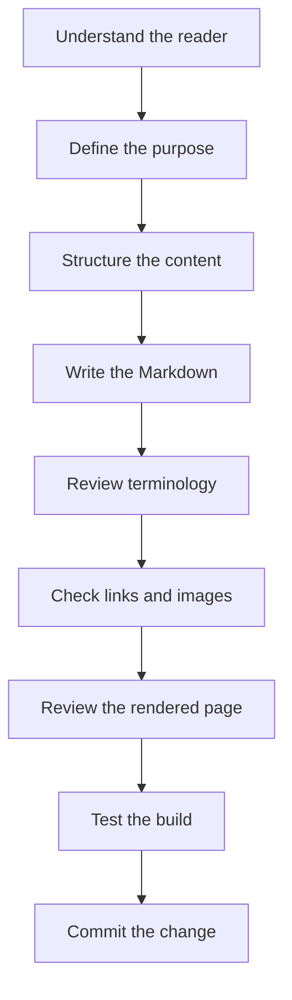

# Markdown Best Practices

> **Lesson level:** Beginner
>
> **Time to complete:** 15–20 minutes
>
> **Prerequisites:** Complete [Markdown Basics](./Basics.md).

---

## Learning objectives

After you complete this lesson, you will be able to:

- Structure Markdown pages logically.
- Choose appropriate headings.
- Write clear and focused paragraphs.
- Use lists appropriately.
- Keep Markdown source readable.
- Use consistent terminology.
- Write procedures that are easy to follow.
- Avoid unnecessary formatting.
- Review the rendered page as well as the Markdown source.
- Maintain Markdown that another technical writer can easily update.

---

## Why Markdown best practices matter

Knowing Markdown syntax is only the starting point.

A technically correct Markdown file can still produce poor documentation.

For example, this is valid Markdown:

```markdown
# Things

## More things

### Other things

This is some information about things.
```

There is nothing technically wrong with the syntax.

However, it does not tell the reader much.

Good documentation uses Markdown to create a structure that helps the reader find information and complete a task.

As Technical Writers, we should think about two audiences:

1. The person reading the published documentation.
2. The writer who will maintain the source later.

Both matter.

> **Documentation Manager's Tip**
>
> When reviewing a Markdown page, ask two questions:
>
> **Can the reader understand it?**
>
> **Can another writer maintain it?**

---

## Write for the reader

Start with the reader's task or question.

Avoid starting a procedure with background information that the reader does not need.

For example, instead of:

```markdown
# Git

Git is a distributed version control system that was originally
created to support software development projects.
```

if the reader needs to install Git, start with the task:

```markdown
# Install Git

Git is used to track changes to files in this project.

## Before you begin

You need:

- A Windows computer.
- An internet connection.
- Permission to install software if required.
```

The second example gets the reader closer to the task.

Background information can still be useful, but it should support the reader's goal.

---

## Use a clear page structure

A documentation page should have a clear beginning, middle, and end.

For a procedure, a useful structure is:

```text
Title
  ↓
Purpose
  ↓
Prerequisites
  ↓
Steps
  ↓
Expected result
  ↓
Troubleshooting
```

For a conceptual topic, the structure may be:

```text
Title
  ↓
What it is
  ↓
Why it matters
  ↓
How it works
  ↓
Example
  ↓
Summary
```

Do not force every page into the same structure.

Choose the structure that best supports the content.

---

## Use meaningful headings

A heading should tell the reader what they will find in that section.

Prefer:

```markdown
## Install Git

## Verify the installation

## Troubleshoot installation problems
```

Avoid vague headings such as:

```markdown
## Information

## More information

## Other things
```

A reader should be able to scan the headings and understand what the page contains.

---

## Keep heading levels logical

Use headings in a logical hierarchy.

For example:

```markdown
# Install Git

## Before you begin

## Install Git

### Download Git

### Run the installer

## Verify Git

## Troubleshooting
```

Do not jump between heading levels simply because one heading looks better.

For example, avoid:

```markdown
# Install Git

### Download Git

## Verify Git
```

The problem is not the appearance.

The problem is that the document structure is unclear.

> **Best Practice**
>
> Heading levels describe relationships between sections. They are not a tool for choosing font sizes.

---

## Keep the main heading clear

Use one main heading for the page.

For example:

```markdown
# Install Git
```

The page title should describe the main subject or task.

Avoid titles such as:

```markdown
# Welcome

# Information

# Getting Started
```

unless the page genuinely covers that broad topic.

A specific title is usually more useful:

```markdown
# Install Git
```

or:

```markdown
# Create a GitHub repository
```

---

## Keep paragraphs focused

A paragraph should normally communicate one main idea.

For example:

```markdown
Git tracks changes to files in a repository.

Technical writers can use Git to review documentation changes
and maintain a history of previous versions.
```

This is easier to scan than one large paragraph containing several different ideas.

> **Writing practice**
>
> If a paragraph is trying to explain several unrelated things, consider splitting it.

---

## Avoid unnecessary repetition

Do not repeat the same information simply to make a page look complete.

For example, if you already explained that Git tracks changes, you do not need to repeat the same definition in every section.

Instead, link to the relevant explanation when appropriate.

Good documentation is not measured by the number of words on the page.

It is measured by how effectively it helps the reader.

---

## Use lists when they improve readability

Lists are useful when information contains several related items.

For example:

```markdown
You need:

- Git
- Node.js
- Visual Studio Code
```

This is easier to scan than:

```markdown
You need Git, Node.js, and Visual Studio Code.
```

However, do not turn every sentence into a list.

Use a list when the structure helps the reader.

---

## Use numbered lists for procedures

Use numbered steps when the reader must complete actions in order.

For example:

```markdown
1. Open Visual Studio Code.
2. Open your project folder.
3. Open the terminal.
4. Run the command.
5. Verify the result.
```

The sequence is important.

If the order does not matter, use bullets instead.

---

## Start procedure steps with an action

Make the action clear at the beginning of a step.

Prefer:

```markdown
1. Open Visual Studio Code.
2. Select **File → Open Folder**.
3. Select your project folder.
```

Avoid:

```markdown
1. Visual Studio Code should now be opened.
2. The File menu can then be selected.
3. Your project folder can then be selected.
```

The first version is shorter and easier to follow.

> **Documentation practice**
>
> Procedures should tell the reader what to do, not simply describe what happens.

---

## Include the expected result

When a procedure contains a command or important action, tell the reader what should happen.

For example:

Run:

```bash
git --version
```

**Expected result**

You should see the installed Git version.

This gives the reader a way to confirm that the step worked.

It also makes troubleshooting easier.

---

## Separate instructions from results

Make it clear which text tells the reader what to do and which text explains what they should see.

For example:

```markdown
## Verify Git

Run:

```bash
git --version
```

### Expected result

The terminal displays the installed Git version.

```

This is easier to follow than placing the command and explanation into one large paragraph.

---

## Use code formatting consistently

Use inline code for technical values such as:

- Commands
- File names
- Folder names
- Variables
- Configuration values
- Code elements

For example:

```markdown
Run `git status` from the project folder.
```

Use a code block when the reader needs to copy or read multiple lines.

```markdown
```bash
git status
git branch
git log
```
```

This distinction makes technical content easier to scan.

---

## Do not use code formatting for normal words

Avoid unnecessary inline code.

For example:

```markdown
Select `Next` to continue.
```

If **Next** is a button label, bold may be more appropriate:

```markdown
Select **Next** to continue.
```

Use code formatting when the reader needs to treat something as a technical value or command.

---

## Use consistent terminology

Choose one term and use it consistently.

For example, if the documentation uses:

```text
project folder
```

do not switch between:

```text
project folder
project directory
project location
project files folder
```

unless there is a meaningful technical difference.

Terminology consistency is particularly important when several technical writers contribute to the same documentation set.

> **Documentation Manager's Tip**
>
> If a product has an official term, use that term consistently.
>
> Do not replace product terminology with a synonym simply to make the writing sound different.

---

## Use the glossary

This project includes a glossary for important technical terms.

When you introduce a term that readers may not know, consider whether it should be added to the glossary.

For example:

```text
repository
branch
commit
dependency
runtime
API
```

The glossary should grow with the documentation.

It should not become a dictionary containing every word in the project.

The purpose is to provide a shared vocabulary for the documentation and the people who maintain it.

---

## Use links instead of repeating information

If information already exists elsewhere, consider linking to it instead of copying the entire explanation.

For example:

```markdown
For more information, see [Install Git](../01-Environment-Setup/Install-Git.md).
```

This gives the reader one source of truth.

It also reduces maintenance.

If the information changes, the writer updates one page instead of several copies.

> **Docs-as-Code practice**
>
> Good documentation is not only about writing new content.
>
> It is also about managing existing content so that information remains accurate and maintainable.

---

## Avoid unnecessary links

Do not add links simply because you can.

Every link should help the reader move forward.

Too many links can make a page difficult to read.

For example, avoid turning every technical term into a link.

Use links when the reader is likely to need additional information or another step in the workflow.

---

## Keep links meaningful

The link text should tell the reader where the link goes.

Prefer:

```markdown
See [Install Git](../01-Environment-Setup/Install-Git.md).
```

Avoid:

```markdown
Click [here](../01-Environment-Setup/Install-Git.md).
```

Meaningful link text is easier to scan and provides better context.

---

## Use images with purpose

Screenshots and diagrams can help readers understand a procedure.

Use an image when it communicates something more effectively than text.

For example:

- A screenshot can show where to select a setting.
- A diagram can explain a workflow.
- A visual can show the result of a configuration.

Do not add an image simply to make the page look more interesting.

For every image, ask:

:::tip

Does this image help the reader complete the task or understand the concept?

:::

---

## Write useful alternative text

Images should include meaningful alternative text.

For example:

```html

```

The `alt` text should describe the purpose or useful content of the image.

Avoid:

```html
alt="image"
```

or:

```html
alt="screenshot"
```

These descriptions do not provide enough information.

You will learn more about images in the **Markdown Images** lesson.

---

## Keep source Markdown readable

Remember that Markdown source is part of the documentation project.

A future writer may need to edit it.

Prefer:

**Verify the installation**

Run:

```bash
git --version
```

You should see the installed Git version.

Readable source makes code review and maintenance easier.

---

## Use blank lines

Blank lines make Markdown source easier to read.

For example:

**Install Git**

Download Git from the official website.

Run the installer.

**Verify Git**

Run:

```bash
git --version
```

The structure is immediately visible.

Do not remove blank lines simply to reduce the number of lines in a file.

---

## Keep formatting simple

Markdown provides many ways to format content.

That does not mean you need to use all of them.

For most technical documentation, a small set of elements does most of the work:

- Headings
- Paragraphs
- Lists
- Links
- Code
- Tables
- Images
- Callouts

Simple formatting is easier to maintain and less likely to create rendering problems.

---

## Review the source and the rendered page

Always review both.

### Source review

Check:

- Heading structure.
- Markdown syntax.
- Links.
- File paths.
- Code formatting.
- Image paths.
- Spelling.
- Terminology.

### Rendered page review

Check:

- Page layout.
- Headings.
- Lists.
- Images.
- Links.
- Tables.
- Code blocks.
- Callouts.
- Overall readability.

A Markdown file can look correct in the editor and still produce an unexpected result when rendered.

---

## Test before you commit

If you are working with Docusaurus, run the local documentation site before committing significant changes.

For example:

```bash
npm run start
```

Open the affected page in your browser.

Check the result.

For larger changes, run a build:

```bash
npm run build
```

If the build reports an error, fix it before pushing the change.

> **Best Practice**
>
> Treat documentation builds as part of your review process.
>
> A successful Markdown edit is not enough if the published documentation does not work.

---

## Avoid unnecessary Markdown complexity

Markdown supports extensions and additional syntax.

This project also uses MDX through Docusaurus.

That gives us more options, but it also means there are more ways to introduce a build error.

For example, HTML and JSX-style elements must be correctly opened and closed.

This:

```markdown
<details>
<summary><strong>Example</strong></summary>

Content.

</details>
```

works correctly.

An unclosed element can cause a Docusaurus build error.

> **Documentation Manager's Tip**
>
> Use the simplest syntax that meets the documentation requirement.
>
> More syntax does not automatically mean better documentation.

---

## Keep procedures maintainable

Software changes.

Screenshots change.

Menu names change.

Commands change.

Documentation therefore needs maintenance.

When writing a procedure, avoid unnecessary details that are likely to become outdated.

For example, if a version number is not important to the task, do not hard-code it into every instruction.

Instead of:

```markdown
Install Node.js 22.18.0.
```

consider:

```markdown
Install the current supported LTS version of Node.js.
```

However, if the project requires a specific version, document that requirement clearly.

---

## Document what the reader needs

Do not assume the reader knows what you know.

For example, instead of:

```markdown
Run the build.
```

tell the reader what to run:

From the project folder, run:

```bash
npm run build
```

Then explain the expected result.

:::info

The goal is not to explain every technical detail.

The goal is to provide enough information for the reader to complete the task successfully.

:::

---

## Avoid unnecessary background information

Background information can be useful, but it should have a purpose.

Ask:

> Does the reader need this information to understand the topic or complete the task?

If not, consider moving it to another page or removing it.

This is particularly important for procedures.

Readers who are trying to complete a task usually want to get to the steps quickly.

---

## Keep examples realistic

Use examples that reflect how the documentation will actually be used.

For example, instead of:

```text
foo
bar
example
```

use realistic documentation examples:

```text
documentation-project
Install-Git.md
npm run build
```

Realistic examples make it easier for readers to connect the lesson to their own work.

---

## Review AI-assisted Markdown carefully

AI tools can help generate Markdown, explain syntax, suggest structures, and identify potential problems.

They can also introduce mistakes.

For example, AI-generated Markdown may contain:

- Incorrect links.
- Invalid paths.
- Inconsistent terminology.
- Incorrect commands.
- Unclosed HTML or MDX elements.
- Unnecessary sections.
- Repeated information.
- Writing that does not match the documentation team's style.

If AI has been used to create or edit content, review the result before committing it.

Always check:

- Accuracy
- Completeness
- Terminology
- Style
- Audience
- Technical correctness

> **Documentation practice**
>
> AI can speed up documentation work.
>
> It does not remove the Technical Writer's responsibility for the final content.

---

## A practical review checklist

Before you commit a Markdown page, ask:

```text
□ Is the page title clear?

□ Is the heading structure logical?

□ Does the page answer the reader's question?

□ Are the procedures in the correct order?

□ Are commands formatted correctly?

□ Are links meaningful and working?

□ Are images useful and accessible?

□ Is terminology consistent?

□ Is unnecessary information removed?

□ Is the Markdown source readable?

□ Does the rendered page look correct?

□ Does the local build work?

□ Have AI-generated changes been reviewed?
```

You can use this checklist during your own reviews or when reviewing another writer's contribution.

---

## Markdown best-practices workflow



---

# Common mistakes

<details>
<summary><strong>1. The page contains too much information</strong></summary>

**Cause**

The writer may have tried to answer every possible question on one page.

**Solution**

Identify the main purpose of the page.

Keep information that supports that purpose.

Move related but separate topics to their own pages and link to them.

</details>

<details>
<summary><strong>2. The headings do not make sense</strong></summary>

**Cause**

Headings may have been chosen based on appearance rather than document structure.

**Solution**

Review the heading hierarchy.

Start with one main heading and use lower-level headings for sections and subsections.

</details>

<details>
<summary><strong>3. The procedure is difficult to follow</strong></summary>

**Cause**

Steps may contain several actions or may not be in the correct order.

**Solution**

Break complex steps into smaller actions.

Use numbered steps.

Include an expected result where useful.

</details>

<details>
<summary><strong>4. The same information appears in several pages</strong></summary>

**Cause**

Writers may have copied content instead of linking to an existing source.

**Solution**

Identify the source of truth.

Remove unnecessary duplicates and link to the existing content.

</details>

<details>
<summary><strong>5. The Markdown looks correct but the page does not</strong></summary>

**Cause**

The publishing tool may interpret the Markdown differently from the editor preview.

The page may also contain invalid MDX, HTML, or another syntax problem.

**Solution**

Check the build output.

Review the affected section of the Markdown source.

Look for:

- Unclosed tags.
- Incorrect indentation.
- Broken links.
- Incorrect code fences.
- Invalid MDX syntax.

</details>

---

## Key terms

| Term | Definition |
| --- | --- |
| Accessibility | Designing content so that people with different abilities can use and understand it. |
| Consistency | Using the same terminology, structure, and conventions throughout a documentation set. |
| Maintainability | How easily documentation can be updated and kept accurate over time. |
| Source of truth | The authoritative location where information should be maintained. |
| Procedure | A set of instructions that helps a reader complete a task. |
| Rendered content | The formatted documentation produced from the source Markdown. |
| Terminology | The words and terms used to describe a product, feature, process, or concept. |
| MDX | A format that extends Markdown with JSX and additional capabilities. |
| Review | The process of checking documentation for quality, accuracy, consistency, and completeness. |

---

## Summary

In this lesson, you learned that good Markdown is about more than correct syntax.

You learned how to:

- Write for the reader.
- Create a clear page structure.
- Use meaningful headings.
- Keep paragraphs focused.
- Use lists appropriately.
- Write clear procedures.
- Include expected results.
- Format technical content consistently.
- Maintain consistent terminology.
- Use links instead of unnecessary duplication.
- Use images when they add value.
- Keep Markdown source readable.
- Review both source and rendered content.
- Test documentation before committing changes.
- Keep procedures maintainable.
- Review AI-assisted Markdown carefully.

The aim is simple:

**Write documentation that is clear for the reader and easy for another Technical Writer to maintain.**

---

## Knowledge check

<details>
<summary><strong>1. Why is Markdown syntax alone not enough to create good documentation?</strong></summary>

Correct Markdown syntax does not guarantee that the content is clear, useful, consistent, or easy to maintain.

Technical writers also need to consider the reader, structure, terminology, and maintenance.

</details>

<details>
<summary><strong>2. Why should you use meaningful headings?</strong></summary>

Meaningful headings help readers scan the page and understand what information each section contains.

</details>

<details>
<summary><strong>3. When should you use a numbered list?</strong></summary>

Use a numbered list when the reader needs to complete actions in a specific order.

</details>

<details>
<summary><strong>4. Why should procedures include expected results?</strong></summary>

Expected results help readers confirm that they completed a step correctly and make troubleshooting easier.

</details>

<details>
<summary><strong>5. Why is terminology consistency important?</strong></summary>

Consistent terminology makes documentation easier to understand and helps writers, developers, and readers use a shared vocabulary.

</details>

<details>
<summary><strong>6. Why should you link to existing information instead of copying it?</strong></summary>

Linking helps maintain a single source of truth and reduces duplicate content that can become inconsistent over time.

</details>

<details>
<summary><strong>7. Why should you review both Markdown source and rendered content?</strong></summary>

The source shows how the content is structured and maintained. The rendered page shows what the reader will actually see.

Both need to be checked.

</details>

<details>
<summary><strong>8. Why should you keep Markdown source readable?</strong></summary>

Other writers may need to review, update, troubleshoot, or maintain the content.

Readable source makes collaboration easier.

</details>

<details>
<summary><strong>9. What should you check when reviewing AI-generated Markdown?</strong></summary>

Check the content for:

- Accuracy
- Completeness
- Terminology
- Style
- Audience
- Technical correctness

</details>

<details>
<summary><strong>10. What is the main goal of Markdown best practices?</strong></summary>

The goal is to create documentation that is clear for the reader, consistent across the documentation set, and easy for the documentation team to maintain.

</details>

---

## Practice exercise

Choose one of the Markdown files you created during the previous lesson.

Review it using the checklist below.

### Structure

- [ ] Does the page have a clear title?
- [ ] Is the heading hierarchy logical?
- [ ] Are related topics grouped together?

### Writing

- [ ] Is the content written for the intended reader?
- [ ] Are paragraphs focused?
- [ ] Is unnecessary information removed?
- [ ] Is terminology consistent?

### Procedures

If the page contains steps:

- [ ] Are the steps in the correct order?
- [ ] Does each step begin with a clear action?
- [ ] Are commands easy to identify?
- [ ] Is the expected result clear?

### Markdown

- [ ] Are lists used appropriately?
- [ ] Is inline code used consistently?
- [ ] Are links meaningful?
- [ ] Is the source Markdown readable?

### Review

- [ ] Does the rendered page look correct?
- [ ] Do links work?
- [ ] Do images work?
- [ ] Does the local site build successfully?

Finally, make one improvement to the page based on your review.

This is the same process you will use when maintaining documentation in a real Docs-as-Code project.

---

## Next lesson

**Markdown Callouts**

In the next lesson, you will learn how to highlight information such as notes, tips, important information, warnings, and other guidance without interrupting the main flow of the documentation.