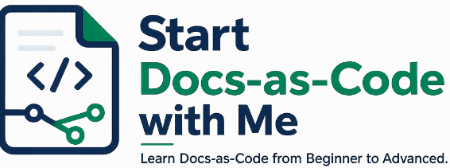

# 

Welcome to **Start Docs-as-Code with Me**—a hands-on learning platform designed for Technical Writers, Documentation Engineers, Software Engineers, and anyone who wants to master modern Docs-as-Code practices.

Unlike traditional tutorials, this course focuses on **learning by building**. Every module helps you create a real project while learning the tools and workflows used by modern documentation teams.

---

# 🎯 What You'll Learn

Throughout this course, you'll gain practical experience with:

- 📝 Markdown
- 🌿 Git
- 🐙 GitHub
- 📚 Docs-as-Code
- 🌐 Static Site Generators
- 🦖 Docusaurus
- 🔌 API Documentation
- 🤖 Artificial Intelligence
- ⚙️ Automation
- 🚀 Real-world Documentation Projects

---

# 🏗️ What You'll Build

By the end of this course, you'll have created:

- ✅ A professional documentation website
- ✅ A GitHub-hosted Docs-as-Code project
- ✅ API reference documentation
- ✅ AI-assisted documentation workflows
- ✅ GitHub Actions automation
- ✅ A technical writing portfolio project

---

# 🛠️ Tools You'll Use

| Category | Tools |
|----------|-------|
| Documentation | Markdown, Docusaurus |
| Version Control | Git, GitHub |
| Development | Visual Studio Code, Cursor |
| AI | Claude Code, ChatGPT |
| APIs | Swagger, OpenAPI, Postman |
| Automation | GitHub Actions |
| Runtime | Node.js, Docker |

---

# 📚 Learning Path

| Module | Topic |
|--------|-------|
| 👋 Module 1 | Welcome |
| 💻 Module 2 | Environment Setup |
| 📝 Module 3 | Markdown |
| 🌿 Module 4 | Git |
| 🐙 Module 5 | GitHub |
| 📚 Module 6 | Docs-as-Code Workflow |
| 🌐 Module 7 | Static Site Generators |
| 🦖 Module 8 | Docusaurus |
| 🔌 Module 9 | API Documentation |
| 🤖 Module 10 | AI |
| ⚙️ Module 11 | Automation |
| 🎓 Module 12 | AI for Technical Writers |
| 🚀 Module 13 | Real-World Projects |

---

# 👥 Who Is This Course For?

This course is designed for:

- Technical Writers
- Documentation Engineers
- Software Engineers
- Developer Advocates
- API Writers
- Documentation Managers
- Students interested in Docs-as-Code

No prior experience with Docs-as-Code is required.

---

# 🎓 Learning Approach

This course follows a **Learn → Practice → Build** approach.

Each module includes:

- 📖 Concept explanations
- 💡 Best practices
- 🛠️ Hands-on exercises
- ✅ Practical examples
- 🚀 Real-world projects

---

# 🚀 Ready to Start?

Begin your journey with:

👉 **👋 Module 1 · Welcome**

Happy learning!
