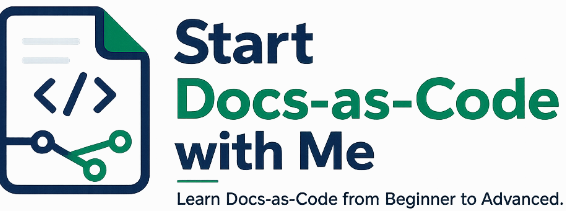

# 

# Welcome to Start Docs-as-Code with Me

Welcome to **Start Docs-as-Code with Me** — a practical learning platform for Technical Writers and documentation professionals who want to build confidence with modern documentation tools and workflows.

I created this project to bring together the things I use and continue to learn as a Technical Writer: structured content, Git, GitHub, Docs-as-Code, API documentation, automation, and AI.

The focus is simple: **learn by doing**.

Rather than working through tools in isolation, you will build a documentation project as you progress through the modules. You will write Markdown, work with Git and GitHub, build and publish a documentation website, explore API documentation, and gradually introduce automation and AI into the workflow.

The aim is not to turn Technical Writers into developers. It is to help documentation professionals become more comfortable working alongside development teams and with the tools that support modern software documentation.

---

# What You'll Learn

Throughout the learning path, you will work with:

- Markdown
- Git
- GitHub
- Docs-as-Code
- Static Site Generators
- Docusaurus
- API Documentation
- Artificial Intelligence
- Documentation Automation
- Real-world documentation projects

Each topic builds on the previous one, so you can start with the basics and gradually work towards more advanced workflows.

---

# What You'll Build

The best way to learn these tools is to use them.

As you work through the course, you will build:

- A professional documentation website
- A GitHub-hosted Docs-as-Code project
- API reference documentation
- AI-assisted documentation workflows
- GitHub Actions automation
- Practical projects that can become part of your technical writing portfolio

You will also see how the individual tools fit together rather than treating each one as a separate skill.

---

# Tools You'll Use

| Area | Tools |
| --- | --- |
| Documentation | Markdown, Docusaurus |
| Version control | Git, GitHub |
| Development environment | Visual Studio Code, Cursor |
| AI | Claude Code, ChatGPT |
| API documentation | OpenAPI, Swagger, Postman |
| Automation | GitHub Actions |
| Runtime and development | Node.js, Docker |

The tools may change as the project develops. The important part is understanding the workflow and knowing how to apply the tools to documentation work.

---

# Learning Path

| Module | Topic |
| --- | --- |
| Module 1 | Welcome |
| Module 2 | Environment Setup |
| Module 3 | Markdown |
| Module 4 | Git |
| Module 5 | GitHub |
| Module 6 | Docs-as-Code Workflow |
| Module 7 | Static Site Generators |
| Module 8 | Docusaurus |
| Module 9 | API Documentation |
| Module 10 | AI |
| Module 11 | Automation |
| Module 12 | AI for Technical Writers |
| Module 13 | Real-World Projects |

The modules are designed to build on one another. You can follow the learning path from the beginning or use individual modules when you need to learn a specific topic.

---

# Who Is This For?

This learning platform is primarily aimed at:

- Technical Writers
- Documentation Engineers
- API Writers
- Documentation Managers
- Developer Advocates
- Software Engineers who work with documentation
- Students and professionals who want to learn Docs-as-Code

You do not need previous Docs-as-Code experience to get started.

If you already work with documentation, you can also use the modules to fill gaps in your existing skills.

---

# How You'll Learn

The learning approach is straightforward:

**Learn → Practice → Build**

Each module combines explanation with practical work.

You will find:

- Concepts explained in plain language
- Step-by-step instructions
- Practical examples
- Hands-on exercises
- Best practices
- Troubleshooting guidance
- Knowledge checks
- Real-world projects

The intention is that you should be able to follow an instruction, understand why you are doing it, and troubleshoot it when something does not work as expected.

---

# AI and This Project

AI is deliberately part of this learning journey.

As documentation professionals, we are already seeing AI change how we research, write, review, structure, and maintain documentation. Learning how to use these tools responsibly is becoming an important part of modern technical writing.

AI has also been used to help build this documentation portfolio.

I have used AI tools during the development of this project to explore ideas, create and refine content, troubleshoot code, develop components, and experiment with AI-assisted documentation workflows.

The purpose is not to present AI-generated content as finished work.

The Technical Writer still has to make the decisions.

That means reviewing the output, checking technical accuracy, improving the writing, considering the audience, and deciding what belongs in the final documentation.

This project is therefore also a practical demonstration of **AI skills applied to technical documentation**.

You will see examples of this approach throughout the learning path, particularly in the modules covering AI, automation, and real-world projects.

---

# A Note for Other Technical Writers

This project is also my way of sharing what I am learning.

Documentation tools and practices continue to change, and none of us needs to know everything before we start. The goal here is to learn in public, try things out, document what works, and share the lessons along the way.

If you are a Technical Writer who has mostly worked with traditional documentation tools, some of these topics may initially feel unfamiliar.

That's okay.

**Start with Markdown. Learn Git. Create a repository.**
> **Make a change. Build something. Break it. Fix it.**

That is how this project is being built too.

---

# Ready to Start?

Start with:

**Module 1 · Welcome**

Then follow the learning path and build your Docs-as-Code skills one step at a time.

**Learn it. Build it. Document it. Share it.**