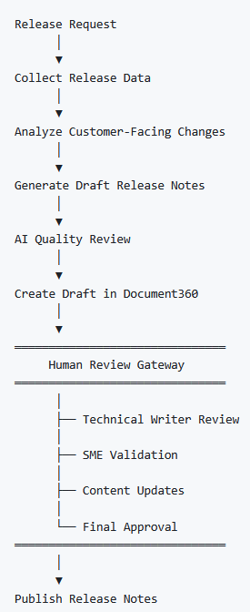
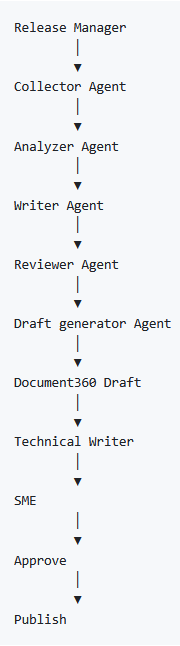

# AI Release Note Generator

> **An AI-powered workflow that transforms Azure DevOps work items into customer-ready release notes using AI agents, Python automation, and Docs-as-Code practices.**

## Project Information

| | |
|---|---|
| **Status** | ✅ Completed |
| **Project Type** | Proof of Concept (POC) |
| **Focus area** | Documentation Automation |
| **Documentation Style** | Docs-as-Code |
| **Repository** | GitHub |
| **Programming Language** | Python |
| **AI**    | Claude Code, MCP |
| **CI/CD** | GitHub Actions |

## Skills Demonstrated

- AI Agents
- Prompt Engineering
- Python Automation
- GitHub Actions
- Docs-as-Code
- Markdown
- Azure DevOps
- ServiceNow Integration
- Technical Writing
- Documentation Architecture

---

*Continue below to learn about the business problem this project solves.*

---

## Project Overview

The **AI Release Note Generator** is a proof-of-concept (POC) that demonstrates how AI agents can automate the creation of customer-ready release notes from engineering work items.

The project uses a multi-agent workflow to collect, analyze, summarize, review, and prepare release documentation for publishing. Instead of manually reviewing Azure DevOps work items, AI agents perform repetitive documentation tasks while maintaining a structured review process.

The solution combines **Python**, **GitHub Actions**, **Markdown**, and **AI prompt engineering** to implement a modern Docs-as-Code workflow.

---

### Objectives

This project aims to:

- Automate the release note creation process.
- Reduce manual documentation effort.
- Improve consistency and quality.
- Demonstrate AI-assisted documentation workflows.
- Apply Docs-as-Code best practices.
- Showcase end-to-end documentation automation.

---

## Business Problem

Creating release notes is often a manual and time-consuming process.

Development teams record feature updates, bug fixes, and technical changes in work items, but this information is not written for end users. Technical writers or product teams must review each work item, identify customer-facing changes, rewrite the content, and organize it into release notes.

This manual approach presents several challenges:

- Reviewing a large number of work items takes significant time.
- Technical descriptions must be rewritten in customer-friendly language.
- Important changes can be missed or inconsistently documented.
- Release note quality depends on individual experience and review.
- Documentation teams spend valuable time on repetitive tasks instead of higher-value work.

As software projects grow, manually creating release notes becomes increasingly difficult to scale.

---

## Solution

The AI Release Note Generator automates the release note creation process using a multi-agent workflow.

Each AI agent performs a specific task, allowing the workflow to process engineering data into structured, customer-ready documentation.

The workflow:

1. Collects release information from engineering sources.
2. Analyzes and classifies work items.
3. Generates customer-friendly release notes.
4. Reviews the generated content for quality and consistency.
5. Creates a publication-ready draft for Document360.

By separating the workflow into specialized AI agents, the solution improves maintainability, consistency, and scalability while keeping a human review step before publication.

## System Architecture
The following diagram shows the overall architecture of the AI Release note generator. 

---

## Demo videos

<video width="100%" controls> <source src={require('./images/demo-video-1.mp4').default} type="video/mp4" /> Your browser does not support the video tag. </video>

