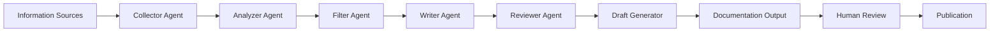
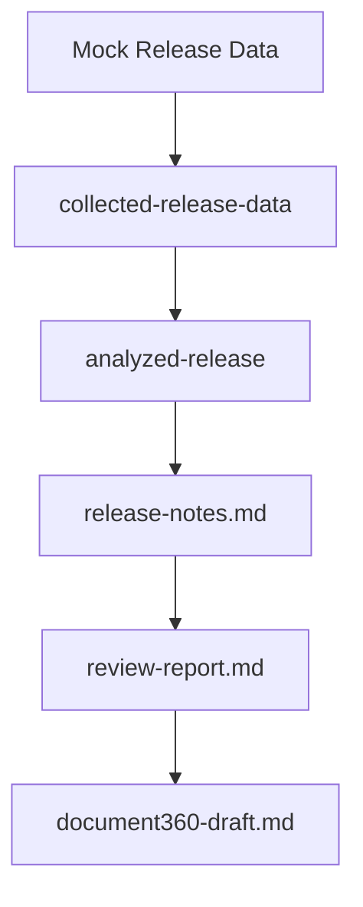
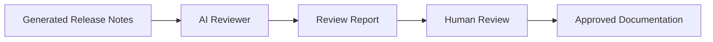
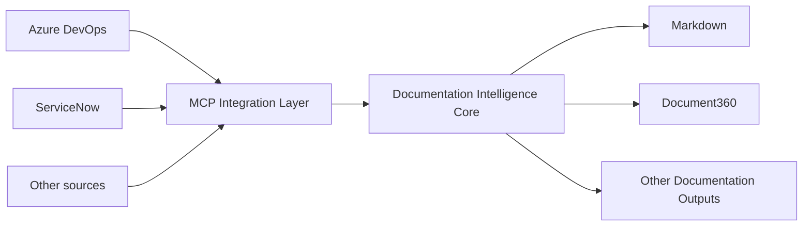

## Purpose

The AI Release Note Generator is designed as a **modular documentation intelligence workflow** that transforms engineering information into structured, reviewable documentation.

The architecture began as a focused proof-of-concept using **mock release data representing sources such as Azure DevOps and ServiceNow**.

The design deliberately separates data collection, analysis, writing, review, and publishing so that individual components can be replaced or extended without redesigning the complete workflow.

---

## Architecture Principles

The architecture is based on five principles:

1. **Modularity** — each processing stage has a defined responsibility.
2. **Source independence** — the processing workflow should not depend on one specific information source.
3. **Artifact-based processing** — each stage produces a structured output that can be inspected and passed to the next stage.
4. **Human oversight** — AI-generated documentation requires review before publication.
5. **Replaceable publishing layer** — documentation outputs can be adapted to different publishing destinations.

---

## High-Level Architecture



The workflow separates the collection of information from the transformation and publication of documentation.

---

## Input Layer

The architecture does not require the processing stages to know how the original information was produced.

Potential information sources include:

* Azure DevOps
* ServiceNow
* Structured JSON
* APIs
* Other engineering systems
* Future MCP-connected sources

### Initial POC Input

The initial POC uses **mock release data**.

This allows the architecture and documentation workflow to be developed without requiring direct access to organizational production systems.

The mock data represents the type of engineering information that could later be collected from systems such as Azure DevOps and ServiceNow.

---

### Current Input

The current implementation extends the original POC by using **MCP to connect Azure DevOps as an engineering information source**.

The MCP integration separates the external source from the core documentation-processing workflow.

Conceptually:

```text
Azure DevOps
      ↓
MCP Integration
      ↓
Documentation Intelligence Core
      ↓
Agent Processing Workflow
```

---

## Agent Processing Layer

The processing layer is divided into focused stages.

### Collector Agent

Collects and structures the available release information.

**Input:** Source data

**Output:** Collected release data artifact

---

### Analyzer Agent

Analyzes the collected information and identifies the characteristics of the release items.

**Input:** Collected release data

**Output:** Analyzed release data

---

### Filter Agent

Determines which information is relevant to the intended documentation audience.

This stage helps separate potentially useful engineering information from content that should not appear in customer-facing release documentation.

---

### Writer Agent

Transforms the selected information into structured release-note content.

The writer follows defined documentation guidance, including:

* Release-note structure
* Customer-friendly language
* Documentation style
* Content requirements

**Output:** Release notes

---

### Reviewer Agent

Reviews the generated release notes against defined quality criteria.

The review process evaluates areas such as:

* Completeness
* Clarity
* Customer relevance
* Consistency
* Technical accuracy
* Documentation quality

The reviewer produces a separate review artifact.

---

### Draft Generator

Transforms the reviewed release notes into a format suitable for the target documentation publishing workflow.

The current implementation can generate a **Document360 draft** as a publishing output.

---

## Artifact Flow

A key architectural feature is that each stage produces a persistent artifact.



This makes the workflow observable and easier to validate.

The artifacts can also be inspected independently when troubleshooting or reviewing the output.

---

## Repository Artifact Structure

The POC stores intermediate and final artifacts in structured directories.

```text
output/
└── artifacts/
    ├── ai/
    │   ├── analyzed-release.json
    │   ├── release-notes.md
    │   └── review-report.md
    │
    └── publishing/
        └── document360-draft.md
```

The initial collected release data is also retained as a structured JSON artifact.

This artifact-oriented approach creates traceability between input, processing stages, review, and publishing.

---

## Quality Review Architecture

The workflow does not treat AI-generated release notes as automatically publishable.

The review architecture is:



The AI reviewer provides a structured quality assessment, while human review remains part of the publication process.

This creates a **human-in-the-loop documentation workflow**.

---

## Automation Layer

The workflow is supported by Python automation and GitHub Actions.

The repository includes automation for stages such as:

* Generating release notes
* Reviewing release notes
* Creating the publishing draft
* Validating repository structure and artifacts

GitHub Actions provides an automated validation layer for the repository.

Conceptually:

```text
Git Repository
      ↓
GitHub Actions
      ↓
Repository Validation
      ↓
Artifact Validation
      ↓
Workflow Completion
```

---

## MCP Integration 

MCP provides the integration layer between the Documentation Intelligence Platform and external information sources.

The current implementation uses **MCP to connect Azure DevOps** to the documentation workflow.

This allows engineering information to enter the documentation-processing pipeline without tightly coupling the core agents to Azure DevOps-specific implementation details.

Conceptually:



---

## Source-Agnostic Design

The architecture is intentionally designed so that the core processing workflow can remain stable while information sources change.

For example:

```text
Azure DevOps ─────┐
ServiceNow ───────┤
JSON ─────────────┤
API ──────────────┤
MCP Source ───────┘
         ↓
Documentation Intelligence Core
         ↓
Markdown ──────────┐
Document360 ───────┤
PDF ───────────────┤
Documentation Site ┘
```

The same principle applies to output destinations.

Additional sources can be introduced without requiring every agent in the processing pipeline to be redesigned.

---

## Separation of Responsibilities

The architecture separates responsibilities into distinct layers.

| Layer          | Responsibility                      |
| -------------- | ----------------------------------- |
| Input          | Obtain engineering information      |
| Collection     | Normalize source information        |
| Analysis       | Understand and classify information |
| Filtering      | Select relevant content             |
| Writing        | Generate documentation              |
| Review         | Evaluate documentation quality      |
| Human approval | Validate final content              |
| Publishing     | Prepare and deliver documentation   |

This separation makes individual stages easier to test, replace, and improve.

---

## Current Implementation and Future Extensions

The architecture evolved from the initial mock-data proof-of-concept into a Documentation Intelligence Platform with MCP-based Azure DevOps integration.

| Capability | Current Implementation | Future Extension |
|---|---|---|
| Release data | Engineering information from Azure DevOps via MCP | Additional connected sources |
| Azure DevOps | MCP integration implemented | Expanded capabilities |
| ServiceNow | Architecture supports integration | MCP integration |
| Agent workflow | Implemented | Extensible |
| Artifact generation | Implemented | Extensible |
| AI review | Implemented | Additional quality controls |
| Human review | Part of workflow | Expanded governance |
| Document360 draft | Implemented | Additional publishing outputs |
| MCP | Azure DevOps integration implemented | Additional MCP-connected sources |
| Multiple sources | Architecture supports it | Expandable |
| Multiple outputs | Architecture supports it | Expandable |

The original mock-data workflow remains useful as a controlled development and testing approach, while the MCP-connected implementation demonstrates how the architecture can operate with real engineering information.

---

## Architectural Outcome

The project evolved from a release-note generation proof-of-concept using mock engineering data into a **Documentation Intelligence Platform with MCP-based Azure DevOps integration**.

The evolution demonstrates how a focused documentation automation problem can develop into a reusable architecture without discarding the original processing workflow.

The central idea is:

:::important

The documentation workflow should remain stable even when the information sources and publishing destinations change.

:::

This allows the same architecture to support documentation use cases beyond release notes.

Potential future applications could include:

* Product documentation generation
* Documentation change analysis
* Support knowledge generation
* API documentation workflows
* Documentation quality analysis
* Content classification
* Documentation maintenance workflows

These represent potential extensions of the current Documentation Intelligence Platform rather than capabilities claimed as fully implemented today.

---

## Related Documentation

* [AI Release Note Generator Case Study](/portfolio/case-studies/ai-release-note-generator/)
* [Docs-as-Code Documentation Platform](/portfolio/case-studies/docs-as-code-platform/)

The detailed implementation, repository structure, and project demonstration are available through the site's Showcase and GitHub repository.
