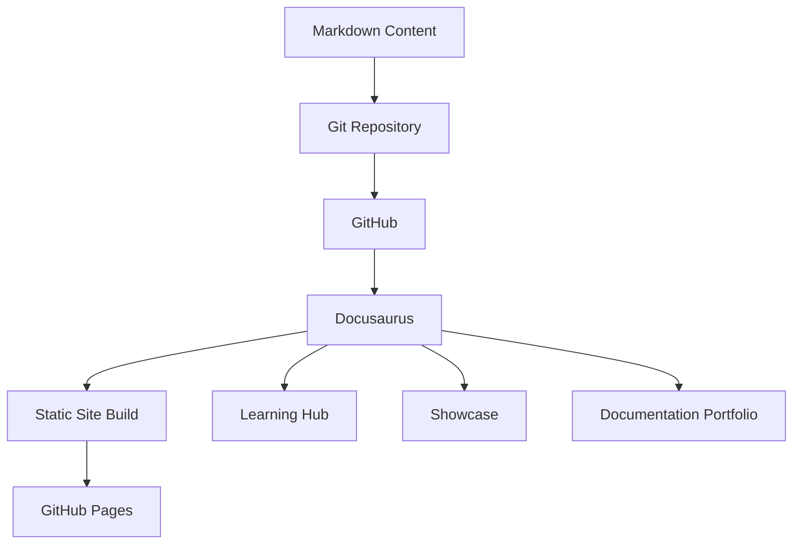

## Purpose

This document describes the technical architecture of the **Start Docs-as-Code with Me** documentation platform.

The platform uses **Docusaurus** as the static site generator and GitHub as the source-controlled repository for documentation content, configuration, and site components.

The architecture separates the site's learning content from its professional Documentation Portfolio while keeping both experiences within the same Docusaurus project.

---

## Architecture Overview

At a high level, the platform follows this model:



The repository acts as the source of truth for the documentation and the configuration required to build the published site.

---

## Core Architecture

The project combines several layers:

```text
GitHub Repository
│
├── Documentation Content
│   ├── Learning Hub
│   ├── Showcase
│   └── Documentation Portfolio
│
├── Docusaurus Configuration
│   └── docusaurus.config.ts
│
├── Navigation
│   ├── sidebars.ts
│   └── sidebarsPortfolio.ts
│
├── Site Components
│   └── src/
│
├── Styling
│   └── src/css/
│
└── Static Assets
    └── static/
```

Docusaurus combines these sources during the build process to produce the published documentation site.

---

## Content Architecture

The main documentation content is stored under `docs/`.

The current structure contains the Learning Hub, supporting reference content, and the project Showcase.

```text
docs/
├── 00-Welcome
├── 01-Environment-Setup
├── 02-Markdown
├── 03-Git
├── 04-GitHub
├── 05-Docs-as-Code-Workflow
├── 06-Static-Site-Generators
├── 07-Docusaurus
├── 08-API-Documentation
├── 09-AI
├── 10-Automation
├── 11-AI-For-Technical-Writers
├── 12-Real-World-Projects
├── appendix
├── glossary
└── showcase
```

The directory structure is reflected in the Learning Hub navigation through the Docusaurus sidebar configuration.

---

## Learning Hub

The primary Docusaurus documentation instance provides the Learning Hub.

Its purpose is to provide a structured learning path for Technical Writers developing modern documentation skills.

The learning path progresses from foundational subjects to more advanced topics:

```text
Welcome
   ↓
Environment Setup
   ↓
Markdown
   ↓
Git
   ↓
GitHub
   ↓
Docs-as-Code
   ↓
Static Site Generators
   ↓
Docusaurus
   ↓
API Documentation
   ↓
AI
   ↓
Automation
   ↓
AI for Technical Writers
   ↓
Real-World Projects
```

The sidebar configuration uses categories and autogenerated directory structures to maintain this hierarchy.

---

## Showcase Layer

The Learning Hub also contains a Showcase area for demonstrating completed or developing projects.

The current Showcase includes the **AI Release Note Generator**.

The Showcase answers the question:

> **What have I built?**

It provides project demonstrations and implementation-oriented content.

The Documentation Portfolio provides a complementary experience focused on the technical documentation surrounding these projects.

---

## Documentation Portfolio

The Documentation Portfolio is implemented as a **separate Docusaurus documentation plugin instance**.

This allows the portfolio to have its own:

* Content directory
* URL route
* Sidebar
* Information architecture

The portfolio is stored separately from the main `docs/` content:

```text
portfolio/
├── index.md
│
├── case-studies/
│   ├── ai-release-note-generator/
│   │   └── index.md
│   └── docs-as-code-platform/
│       └── index.md
│
├── architecture/
│   ├── ai-documentation-intelligence.md
│   └── docusaurus-documentation-architecture.md
│
├── adrs/
│   ├── adr-001-github-as-single-source.md
│   └── adr-002-human-in-the-loop-ai-review.md
│
└── technical-guides/
    ├── ai-release-note-generator-ci-validation.md
    ├── docusaurus-configuration.md
    └── documentation-publishing-workflow.md
```

The portfolio is published under:

```text
/portfolio/
```

while the primary documentation remains under:

```text
/docs/
```

This separation allows the Learning Hub and professional portfolio to evolve independently.

---

## Multiple Documentation Instances

The Docusaurus configuration contains the standard documentation instance and an additional portfolio documentation instance.

Conceptually:

```text
Docusaurus
│
├── Primary Docs Instance
│   │
│   ├── path: docs
│   ├── route: /docs/
│   └── sidebar: sidebars.ts
│
└── Portfolio Docs Instance
    │
    ├── path: portfolio
    ├── route: /portfolio/
    └── sidebar: sidebarsPortfolio.ts
```

The portfolio plugin is configured separately using:

```ts
{
  id: 'portfolio',
  path: 'portfolio',
  routeBasePath: 'portfolio',
  sidebarPath: './sidebarsPortfolio.ts',
}
```

:::important

This is an important architectural feature because it allows the same site to provide different documentation experiences without merging all content into a single navigation hierarchy.

:::

---

## Sidebar Architecture

The primary Learning Hub uses:

```text
sidebars.ts
```

The Documentation Portfolio uses:

```text
sidebarsPortfolio.ts
```

The separation allows each documentation experience to have its own navigation model.

### Learning Hub

The Learning Hub sidebar organizes content into modules such as:

* Welcome
* Environment Setup
* Markdown
* Git
* GitHub
* Docs-as-Code Workflow
* Static Site Generators
* Docusaurus
* API Documentation
* AI
* Automation
* AI for Technical Writers
* Real-World Projects

### Documentation Portfolio

The portfolio sidebar is organized around professional documentation artifacts:

```text
Documentation Portfolio
│
├── Case Studies
│
├── Architecture
│
├── Architecture Decision Records
│
└── Technical Guides
```

This reflects a different information architecture from the Learning Hub.

---

## Site Configuration

The central Docusaurus configuration is:

```text
docusaurus.config.ts
```

The configuration defines key site-level settings including:

* Site title
* Tagline
* Favicon
* Production URL
* GitHub Pages base URL
* Organization name
* Repository name
* Internationalization
* Markdown configuration
* Docusaurus presets
* Documentation plugin configuration
* Theme configuration
* Custom CSS
* Navigation
* Code highlighting

The GitHub Pages configuration uses the repository as the project site:

```text
organizationName: 'Riffat786'
projectName: 'Start-Docs-as-Code-with-Me'
```

The site uses the repository base path:

```text
/Start-Docs-as-Code-with-Me/
```

---

## Markdown and Mermaid

The platform uses Markdown as the primary documentation authoring format.

Mermaid support is enabled so architecture and workflow diagrams can be represented as text within the documentation source.

The Docusaurus configuration enables Mermaid through:

```ts
markdown: {
  mermaid: true,
},
```

and the Mermaid theme is included through:

```ts
themes: ['@docusaurus/theme-mermaid']
```

This allows diagrams to remain part of the version-controlled documentation source.

---

## Publishing Architecture

The documentation is published as a static website through GitHub Pages.

The conceptual publishing workflow is:

```text
Author Markdown
      ↓
Commit Changes
      ↓
GitHub Repository
      ↓
GitHub Actions
      ↓
Docusaurus Build
      ↓
Static Website
      ↓
GitHub Pages
```

:::tip

GitHub Actions provides the automation layer that builds and deploys the Docusaurus site when the configured workflow is triggered.

:::

This supports a Docs-as-Code workflow in which documentation changes can be version controlled alongside configuration and site code.

---

## Publishing Flexibility

Docusaurus is the current publishing implementation for this project, but the underlying Docs-as-Code approach is not dependent on Docusaurus.

The broader model is:

```text
Markdown
   ↓
Git
   ↓
Version Control
   ↓
CI/CD
   ↓
Documentation Build
   ↓
Publishing Platform
```

:::tip

Depending on project requirements, Technical Writers working with a similar source-controlled documentation model could evaluate other publishing technologies

:::

Including:

* MkDocs
* Fern
* Mintlify
* Other static site generators or developer documentation platforms

The exact Markdown syntax, front matter, navigation model, components, and integrations may differ between platforms. The transferable skill is understanding the **source → version control → build → publish** architecture.

This is an important principle of the Learning Hub: Technical Writers learn a documentation engineering approach rather than becoming dependent on one publishing tool.

---

## Information Architecture

The platform deliberately separates content according to user intent.

| Area                    | Primary purpose                                  |
| ----------------------- | ------------------------------------------------ |
| Learning Hub            | Learn Docs-as-Code                               |
| Showcase                | Explore projects                                 |
| Documentation Portfolio | Evaluate technical documentation work            |
| Insights & Articles     | Explore broader topics                           |
| About Me                | Learn about the author's professional background |

This prevents the site from becoming a single undifferentiated collection of pages.

---

## Why Docusaurus?

Docusaurus was selected for this implementation because it provides capabilities useful for the project, including:

* Markdown-based documentation
* Structured documentation navigation
* Static site generation
* Customizable React-based site components
* Theme customization
* Mermaid support
* Multiple documentation instances
* Git-based workflows
* Integration with GitHub Pages

The choice of Docusaurus is therefore an implementation decision within the broader Docs-as-Code approach.

The underlying documentation architecture remains transferable to other publishing technologies.

---

## Architectural Boundaries

The project deliberately separates several concerns:

```text
Content
  ↓
Markdown files

Navigation
  ↓
Sidebar configuration

Presentation
  ↓
Docusaurus theme + React components + CSS

Build
  ↓
Docusaurus

Source Control
  ↓
Git + GitHub

CI/CD
  ↓
GitHub Actions

Publishing
  ↓
GitHub Pages
```

This separation makes individual parts of the documentation platform easier to change without restructuring the entire content repository.

---

## Future Evolution

The architecture can evolve as the documentation portfolio grows.

Potential future evolution includes:

* Additional technical documentation projects
* Additional publishing implementations such as MkDocs, Fern, or Mintlify
* API documentation demonstrations
* Expanded CI/CD automation
* Additional documentation automation
* Additional AI-powered documentation workflows

The architecture is intentionally designed so that new documentation content can be added without restructuring the existing Learning Hub.

---

## Architectural Outcome

The resulting platform demonstrates that a Technical Writer can move beyond document authoring into **documentation engineering**.

The project combines:

* Content architecture
* Information architecture
* Docs-as-Code
* Git-based workflows
* Static site generation
* Docusaurus configuration
* Multiple documentation instances
* Navigation design
* Mermaid architecture diagrams
* GitHub Pages publishing
* Technical portfolio development

:::note

The platform is therefore both the **subject of the documentation** and a **working example of the Docs-as-Code principles it teaches**.

:::

---

## Related Documentation

### Documentation Portfolio

* [Documentation Portfolio](/portfolio/index.md)

### Architecture

* [AI Documentation Intelligence](/portfolio/ai-documentation-intelligence/)

### Architecture Decision Records

* [ADR 001: GitHub as the Single Source of Truth](/portfolio/adrs/adr-001-github-as-single-source/)
* [ADR 002: Human-in-the-Loop AI Review](/portfolio/adrs/adr-002-human-in-the-loop-ai-review/)

### Technical Guides

* [Docusaurus Configuration](/portfolio/technical-guides/docusaurus-configuration/)
* [Documentation Publishing Workflow](/portfolio/technical-guides/documentation-publishing-workflow/)
