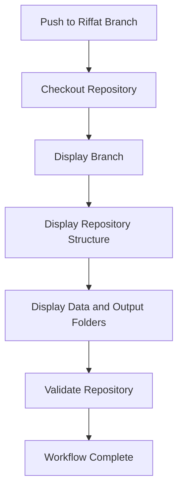

---

id: ai-release-note-generator-ci-validation
title: AI Release Note Generator CI validation
sidebar_label: AI Release Note Generator CI validation
description: Technical guide documenting the GitHub Actions validation workflow used in the AI Release Note Generator project.
------------------------------------------------------------------------------------------------------------------------------

## Purpose

This guide documents the GitHub Actions workflow used to validate the **AI Release Note Generator** repository.

The workflow demonstrates how documentation-related automation can be integrated into a Git-based development process.

The pipeline validates the repository structure and expected project artifacts after changes are pushed to the designated branch.

---

## Workflow Overview

The workflow follows this general sequence:



The workflow provides visibility into the repository and then executes automated validation.

---

## Trigger

The workflow is configured to run when changes are pushed to the **Riffat** branch.

Conceptually:

```yaml
on:
  push:
    branches:
      - Riffat
```

This reflects the project's development workflow in which changes are pushed to the designated working branch before they are considered for further integration.

---

## Pipeline Stages

### 1. Checkout Repository

The workflow first checks out the repository so that the GitHub Actions runner has access to the project files.

This allows subsequent validation steps to inspect the repository.

---

### 2. Display Branch

The workflow displays the branch on which the pipeline is executing.

This provides a simple verification that the workflow is running against the expected branch.

---

### 3. Display Repository Structure

The workflow displays the repository structure.

This provides visibility into the project layout and helps identify unexpected changes or missing directories.

---

### 4. Display Data and Output Folders

The workflow displays the contents of important project directories, including:

```text
data/
output/
```

These directories are important because the release-note workflow uses structured input data and generated artifacts.

---

### 5. Validate Repository

The main validation step executes:

```bash
python ci/validate_repository.py
```

The validation script checks that the repository contains the expected project structure and required artifacts.

This provides an automated quality gate before the workflow is considered successful.

---

### 6. Workflow Complete

The workflow reports completion after the validation stage succeeds.

The completion message provides a simple visual indication that all configured pipeline steps have finished.

---

## Repository Validation

The validation script is located at:

```text
ci/validate_repository.py
```

Its purpose is to verify that the repository contains the expected files and directories required by the project.

The validation step helps prevent incomplete or incorrectly structured changes from passing through the workflow unnoticed.

---

## Artifact Validation

The project produces a series of documentation artifacts during the AI release-note workflow.

Examples include:

```text
output/
└── artifacts/
    ├── ai/
    │   ├── analyzed-release.json
    │   ├── release-notes.md
    │   └── review-report.md
    │
    └── publishing/
        └── document360-draft.md
```

:::note

Validating the presence and structure of these artifacts provides an additional layer of workflow reliability.

:::

---

## Why CI/CD Matters for Documentation

A Docs-as-Code workflow treats documentation as a version-controlled engineering asset.

That means documentation repositories can benefit from automated checks similar to software repositories.

For example:

```text
Documentation Change
       ↓
Git Commit
       ↓
GitHub
       ↓
GitHub Actions
       ↓
Validation
       ↓
Build / Publish
```

:::tip

Automated validation can identify structural problems before they reach the published documentation.

:::

---

## Documentation Quality Gates

CI/CD does not replace editorial review.

Instead, different controls can address different risks:

| Control               | Purpose                          |
| --------------------- | -------------------------------- |
| Git                   | Version history                  |
| Pull request          | Change review                    |
| Repository validation | Structural validation            |
| AI review             | Content-quality assessment       |
| Human review          | Editorial and technical approval |
| Build                 | Publishing validation            |
| Deployment            | Delivery to the target platform  |

This creates multiple quality layers rather than relying on a single review mechanism.

---

## Relationship to the AI Workflow

The GitHub Actions pipeline is part of the wider AI Release Note Generator architecture.

The project separates:

**AI documentation processing**

from:

**Repository and workflow validation**

This means the AI agents can generate and review documentation artifacts while GitHub Actions provides an independent mechanism for validating the repository and workflow structure.

Conceptually:

```text
AI Workflow
    ↓
Generate Artifacts
    ↓
Store in Repository
    ↓
GitHub Actions
    ↓
Validate Repository
```

---

## Troubleshooting

### Workflow does not start

Check:

1. The change was pushed to the expected branch.
2. The workflow file exists under `.github/workflows/`.
3. The GitHub Actions workflow is enabled.
4. The branch name matches the workflow trigger.

---

### Repository validation fails

Check:

1. Required directories exist.
2. Required artifacts have been generated.
3. Expected filenames have not changed unexpectedly.
4. `ci/validate_repository.py` runs successfully locally.

Testing the validation script locally can help isolate repository problems before pushing another change.

---

### Expected artifacts are missing

Check the preceding AI workflow stages.

The repository validation stage should not be used to hide problems originating earlier in the pipeline.

Instead, trace the artifact flow backward:

```text
Missing Output
     ↓
Writer / Reviewer / Draft Generator
     ↓
Analyzer
     ↓
Collector
     ↓
Input Data
```

This artifact-oriented approach makes troubleshooting more systematic.

---

## Local Validation

Before pushing changes, the validation script can be executed locally:

```bash
python ci/validate_repository.py
```

If the validation succeeds locally, the same validation step can then be executed by GitHub Actions in the repository workflow.

This provides consistency between local development and CI validation.

---

## Documentation Engineering Value

The workflow demonstrates how documentation teams can adopt engineering practices without treating documentation as software development.

The objective is to automate appropriate quality checks while keeping human judgment where it provides the most value.

The resulting model is:

```text
Automation
    +
AI assistance
    +
Human review
    +
Version control
    +
CI/CD
    =
Controlled documentation workflow
```

---

## Related Documentation

* [AI Release Note Generator Case Study](/portfolio/case-studies/ai-release-note-generator/)
* [AI Documentation Intelligence Architecture](/portfolio/architecture/ai-documentation-intelligence/)
* [ADR 002: Human-in-the-Loop AI Review](/portfolio/adrs/adr-002-human-in-the-loop-ai-review/)

The repository contains the implementation of the GitHub Actions workflow and its validation script.
