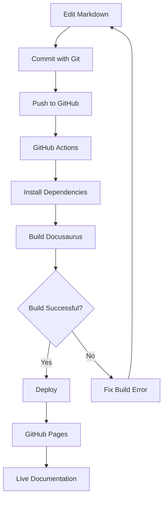

## Purpose

This guide documents the publishing workflow used by the **Start Docs-as-Code with Me** documentation platform.

The site demonstrates how documentation can move from Markdown source files in a Git repository through an automated Docusaurus build and into a published GitHub Pages website.

The workflow is based on the principle that documentation can be managed as a version-controlled engineering asset.

---

## Workflow Overview

The publishing workflow is:

```text
Markdown
   ↓
Git
   ↓
GitHub
   ↓
GitHub Actions
   ↓
Docusaurus Build
   ↓
GitHub Pages
   ↓
Live Documentation Site
```

---

## 1. Author Documentation

Documentation is primarily authored in Markdown.

The repository contains documentation content under directories such as:

```text
docs/
portfolio/
```

Markdown files contain the actual documentation content, while Docusaurus configuration controls how that content is built and presented.

For example:

```text
docs/
└── 07-Docusaurus/
    └── ...
```

and:

```text
portfolio/
├── case-studies/
├── architecture/
├── adrs/
└── technical-guides/
```

This keeps documentation content separate from the publishing configuration.

---

## 2. Version Control with Git

Changes to documentation are managed using Git.

A typical workflow is:

```text
Edit
 ↓
Save
 ↓
Git status
 ↓
Git add
 ↓
Git commit
 ↓
Git push
```

Git provides a history of documentation changes and allows the documentation source to be managed using the same version-control principles used for software projects.

---

## 3. GitHub as the Repository

The GitHub repository acts as the source-controlled home for the documentation platform.

The repository contains:

- Markdown documentation
- Docusaurus configuration
- Sidebar configuration
- Site components
- CSS
- Static assets
- Build configuration
- GitHub Actions workflows

This means the published website can be regenerated from the repository source.

---

## 4. GitHub Actions

GitHub Actions provides the automation layer between the repository and the published site.

When the configured workflow is triggered, GitHub Actions can:

- Check out the repository.
- Install the required dependencies.
- Build the Docusaurus site.
- Validate the build.
- Publish the generated site.

Conceptually:

```text
GitHub Repository
       ↓
GitHub Actions
       ↓
Install Dependencies
       ↓
Docusaurus Build
       ↓
Build Validation
       ↓
Deployment
```

The exact workflow configuration is maintained in:

```text
.github/workflows/
```

---

## 5. Docusaurus Build

Docusaurus transforms the Markdown documentation and site configuration into a static website.

The build uses:

```text
Markdown
+
Docusaurus Configuration
+
Sidebar Configuration
+
Theme
+
CSS
+
Static Assets
```

to generate the final website.

The Docusaurus configuration is maintained in:

```docusaurus.config.ts```

The primary Learning Hub navigation is maintained in:

```sidebars.ts```

The Documentation Portfolio navigation is maintained separately in:

```sidebarsPortfolio.ts```

---

## 6. Multiple Documentation Experiences

The site currently contains more than one documentation experience.

The primary documentation instance provides:

```text
/docs/
```

The separate portfolio documentation instance provides:

```text
/portfolio/
```

Conceptually:

```text

                 Docusaurus
                     │
          ┌──────────┴──────────┐
          ↓                     ↓
     Learning Hub          Documentation
                            Portfolio
          │                     │
       /docs/               /portfolio/
```

> Both are built as part of the same Docusaurus project while maintaining separate content structures and sidebars.

---

## 7. GitHub Pages

The generated static site is published through GitHub Pages.

The Docusaurus configuration identifies the GitHub repository and the project site path.

The relevant configuration includes:

```TypeScript

url: 'https://riffat786.github.io',
baseUrl: '/Start-Docs-as-Code-with-Me/',
organizationName: 'Riffat786',
projectName: 'Start-Docs-as-Code-with-Me',
```

The ```baseUrl``` is particularly important for a GitHub Pages project site because the site is published below the repository-specific path.

The resulting public site is:

```text
https://riffat786.github.io/Start-Docs-as-Code-with-Me/
```

---

## 8. From Change to Published Documentation

A documentation change follows this general lifecycle:



This creates a repeatable publishing process rather than requiring the documentation to be manually copied into a web publishing system.

---

## 9. Build Validation

The build process provides an important quality gate.

A successful local build is useful before changes are pushed to the repository.

For example:

```bash
npm run build
```

If the build succeeds locally, the documentation and configuration have passed the local Docusaurus build process.

Build errors can identify problems such as:

- Broken links
- Invalid configuration
- Missing files
- Incorrect sidebar references
- Invalid Markdown
- Component or theme problems

The project uses:

```TypeScript
onBrokenLinks: 'throw',
```

so broken links are treated as build errors rather than being silently ignored.

---

## 10. Local Development

Before publishing a change, the site can be tested locally e.g:

```text
http://localhost:3000/Start-Docs-as-Code-with-Me/
```

The Docusaurus development server provides a local version of the site for checking:

- Content
- Navigation
- Sidebar structure
- Links
- Layout
- Styling
- Diagrams
- Portfolio pages

A typical development workflow is:

```text
Edit
 ↓
npm start
 ↓
Preview locally
 ↓
Fix issues
 ↓
Build
 ↓
Commit
 ↓
Push
```

This makes local validation an important part of the documentation workflow.

---

## 11. Troubleshooting the Publishing Pipeline

The site does not build

First run the build locally using bash command:

```bash
npm run build
```

Review the error reported by Docusaurus.

Common causes include:

- Broken links
- Incorrect document IDs
- Incorrect sidebar references
- Missing files
- Invalid configuration
- Markdown syntax problems

---

### A page works locally but not after deployment

Check:

- The production url.
- The baseUrl.
- Relative links.
- Asset paths.
- GitHub Actions build output.
- GitHub Pages deployment status.

:::important

The GitHub Pages project path must be reflected correctly in the Docusaurus configuration.

:::

### A new document does not appear in the sidebar

Check:

- The document is inside the expected directory.
- The sidebar points to the correct directory.
- Autogenerated navigation is configured correctly.
- The document contains valid front matter.
- The development server has rebuilt the site.

For example, the Documentation Portfolio uses:

```text
portfolio/
```

with:

```text
sidebarsPortfolio.ts
```

to generate its navigation.

---

## 12. Why This Workflow Matters for Technical Writers

The value of this workflow is not simply that it produces a website.

It changes how documentation can be managed.

Instead of:

```text
Write
 ↓
Copy into publishing tool
 ↓
Publish
```

the workflow becomes:

```text
Author
 ↓
Version
 ↓
Review
 ↓
Validate
 ↓
Build
 ↓
Publish
```

:::tip

This creates opportunities for automation and quality controls throughout the documentation lifecycle.'

:::

---

## 13. Publishing Layer Is Replaceable

Docusaurus is the publishing technology currently used by this project.

However, the broader workflow is not dependent on Docusaurus.

The transferable model is:

```text
Markdown
   ↓
Git
   ↓
GitHub
   ↓
CI/CD
   ↓
Documentation Build
   ↓
Publishing Platform
```

Depending on project requirements, the publishing layer could potentially use other documentation technologies such as:

- MkDocs
- Fern
- Mintlify
- Other static site generators
- Developer documentation platforms

:::tip

Each platform has its own configuration, features, Markdown extensions, and publishing requirements.

:::

:::important

The important Docs-as-Code skill is understanding how the source, version control, build, and publishing layers fit together.

:::

---

## 14. Documentation as an Engineering Workflow

The complete model demonstrated by this project is:

```text

                 Documentation
                      │
                  Markdown
                      │
                     Git
                      │
                   GitHub
                      │
                GitHub Actions
                      │
              Docusaurus Build
                      │
                Build Validation
                      │
                GitHub Pages
                      │
               Published Site
```

This approach allows documentation to benefit from practices commonly used in software engineering while retaining documentation-specific review and editorial processes.

---

## Outcome

The result is a repeatable publishing workflow in which:

- Markdown is the primary content source.
- Git provides version control.
- GitHub provides the repository.
- GitHub Actions provides automation.
- Docusaurus generates the static documentation site.
- GitHub Pages publishes the site.

:::tip

The same principles can be adapted to other Docs-as-Code publishing environments.

:::

---

## Related Documentation

[Docs-as-Code Documentation Platform](/portfolio/case-studies/docs-as-code-platform/)
[Docusaurus Documentation Architecture](/portfolio/architecture/docusaurus-documentation-architecture.md)
[ADR 001: GitHub as the Single Source of Truth](/portfolio/adrs/adr-001-github-as-single-source.md)